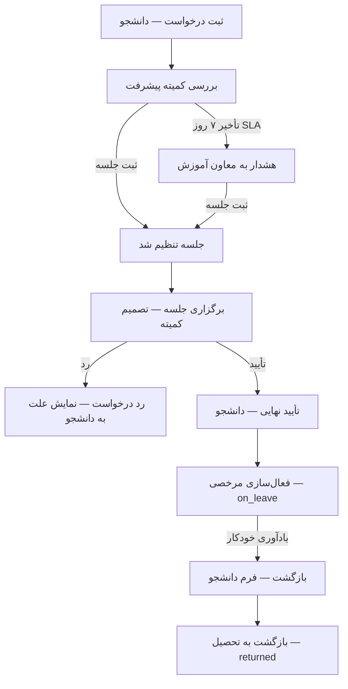

# راهنمای تست و پذیرش UI — فرایند مرخصی آموزشی موقت

**مخاطب:** اپروتور / کاربر آزمایشی / QA (بدون نیاز به دانش فنی عمیق)  
**فرایند:** `educational_leave` — مرخصی آموزشی موقت از ثبت‌نام در کلاس‌ها  
**نسخه سند:** ۱.۰ — ۱۴۰۵/۰۴/۰۲  
**مرجع SOP:** `metadata/process_registry/processes/educational_leave/SOP_document.txt`

---

## اطلاعات تست (پر کنید)

| مورد | مقدار |
|------|--------|
| نام اپروتور / تست‌کننده | |
| تاریخ تست | |
| محیط (لوکال / سرور) | |
| آدرس سامانه | `http://localhost:3000` یا آدرس سرور |
| نتیجه کلی | ☐ تأیید ☐ تأیید مشروط ☐ رد |

---

## هدف این سند

این راهنما برای **بررسی عملی** رابط کاربری فرایند مرخصی آموزشی است: آیا دانشجو، کمیته پیشرفت، معاون آموزش و (در صورت نیاز) کارمند می‌توانند مسیر SOP را از ابتدا تا بازگشت به تحصیل — یا رد درخواست — **بدون ابزار فنی** و فقط از طریق پنل وب طی کنند؟

پس از اتمام، چک‌لیست پایانی را پر کنید و در صورت نیاز `docs/فرم_بازخورد_تست_UI.md` را هم تکمیل کنید.

---

## خلاصهٔ مسیر فرایند



---

## پیش‌نیازها

### ۱. اجرای سامانه (از مدیر فنی بخواهید)

```text
python scripts/seed_all_roles.py
uvicorn app.main:app --reload --port 3000
```

**علامت آماده بودن:** با `admin` وارد شوید؛ صفحهٔ ورود `http://localhost:3000/login` باز شود.

> فرایند `educational_leave` هنگام بالا آمدن سرور از `metadata/processes/educational_leave.json` بارگذاری می‌شود.

### ۲. حساب‌های آزمایشی

| نقش | نام کاربری | رمز | کاربرد در این تست |
|-----|------------|-----|-------------------|
| دانشجو (غیر انترن) | `student1` | `demo123` | سناریوی تأیید عادی |
| دانشجو (انترن — در صورت وجود در seed) | از مدیر فنی بپرسید | `demo123` | هشدار ۲ ترم + مسیر انترن |
| کمیته پیشرفت | `progress_committee1` | `demo123` | تعیین جلسه و تصمیم |
| معاون آموزش | `deputy_education1` | `demo123` | مشاهده هشدار SLA |
| مدیر / کارمند | `admin` یا `staff1` | `admin123` / `demo123` | پشتیبان بررسی پرونده |

### ۳. آدرس‌های کلیدی UI

| نقش | مسیر |
|-----|------|
| ورود | `/login` |
| پورتال دانشجو | `/panel/portal/student` |
| کمیته پیشرفت | `/panel/portal/committee/progress` |
| معاون آموزش (هشدار SLA) | `/panel/portal/committee/education` |
| راهنمای درون‌برنامه | `/panel/guide` (بخش مرخصی آموزشی) |

### ۴. خارج از محدودهٔ این تست

موارد زیر **عمداً** در این سند پوشش داده نمی‌شوند (فرایند یا UI جدا دارند):

- `full_education_leave` — مرخصی از کل آموزش
- `violation_registration` — زیرفرایند پس از رد یا عدم بازگشت
- `patient_referral` — ارجاع بیماران انترن ۲ ترم
- ارسال واقعی SMS/ایمیل (در دمو ممکن است فقط در لاگ ثبت شود)

---

## قواعد مهم قبل از شروع سناریوها

1. **ترتیب کار در پنل کمیته:** ابتدا فرم مرحله را **تکمیل و ثبت** کنید، سپس دکمهٔ انتقال (trigger) را بزنید. برعکس، پیام خطا می‌بینید.
2. **یک درخواست فعال:** هر دانشجو فقط یک پروندهٔ مرخصی باز هم‌زمان دارد؛ قبل از تست جدید، پروندهٔ قبلی باید تکمیل یا لغو شده باشد.
3. **تعویض نقش:** بعد از هر مرحله خروج (`خروج`) و با حساب نقش بعدی دوباره وارد شوید.

---

## سناریو ۱ — مسیر اصلی تأیید (دانشجو غیر انترن)

**هدف:** تأیید کامل از درخواست تا فعال‌سازی مرخصی.

### گام ۱ — شروع درخواست (دانشجو)

| # | کار | انتظار |
|---|-----|--------|
| ۱.۱ | با `student1` وارد `/panel/portal/student` شوید | داشبورد دانشجو باز شود |
| ۱.۲ | دکمهٔ **شروع درخواست جدید** (یا میان‌بر) → **درخواست مرخصی** | فرایند `educational_leave` شروع شود |
| ۱.۳ | در کارت «مسیر فعلی» / تب فرایندها، فرم **درخواست مرخصی آموزشی** را ببینید | فیلد «تعداد ترم وقفه»: یک ترم / دو ترم |
| ۱.۴ | «یک ترم» را انتخاب کنید؛ توضیح اختیاری بنویسید؛ فرم را **ثبت** کنید | پیام موفقیت ثبت فرم |
| ۱.۵ | دکمهٔ ادامه (ارسال درخواست / `student_submitted`) را بزنید | وضعیت به «بررسی کمیته پیشرفت» برود |

**چک:** در لیست فرایندها، وضعیت فعلی `committee_review` یا معادل فارسی «بررسی و تعیین جلسه…» باشد.

---

### گام ۲ — تعیین جلسه (کمیته پیشرفت)

| # | کار | انتظار |
|---|-----|--------|
| ۲.۱ | خروج؛ ورود با `progress_committee1` | پنل کمیته پیشرفت |
| ۲.۲ | بروید به `/panel/portal/committee/progress` → تب **بررسی‌ها** | پروندهٔ مرخصی دانشجو در لیست «منتظر» |
| ۲.۳ | پرونده را باز کنید | بلوک راهنما + بخش **فرم مرحله** |
| ۲.۴ | فرم **تعیین جلسه بررسی مرخصی** را ببینید | فیلدهای readonly: مدت وقفه، وضعیت بالینی (پیش‌پر شده) |
| ۲.۵ | تاریخ/ساعت جلسه، نحوهٔ برگزاری (حضوری یا آنلاین) و لینک/آدرس را پر کنید | فیلدهای شرطی: آنلاین → لینک؛ حضوری → آدرس |
| ۲.۶ | دکمهٔ **ثبت فرم** را بزنید | فرم ذخیره شود |
| ۲.۷ | دکمهٔ **ثبت جلسه** (`committee_set_meeting`) را بزنید | وضعیت → «جلسه تنظیم شد» (`session_scheduled`) |

**چک منفی (همین مرحله):** بدون ثبت فرم، دکمهٔ ثبت جلسه را بزنید → toast:  
*«ابتدا فرم «تعیین جلسه» را تکمیل و ثبت کنید…»*

---

### گام ۳ — مشاهدهٔ زمان جلسه (دانشجو)

| # | کار | انتظار |
|---|-----|--------|
| ۳.۱ | ورود مجدد `student1` → داشبورد | کارت مسیر فعلی مرخصی |
| ۳.۲ | جزئیات پرونده را ببینید | بلوک آبی **جزئیات مرخصی و جلسه**: تاریخ، حضوری/آنلاین، لینک یا محل |

---

### گام ۴ — برگزاری جلسه و تصمیم تأیید (کمیته)

| # | کار | انتظار |
|---|-----|--------|
| ۴.۱ | `progress_committee1` → همان پرونده | وضعیت `session_scheduled` یا `committee_decision` |
| ۴.۲ | در صورت `session_scheduled`: دکمه **جلسه برگزار شد** (`meeting_held`) | انتقال به `committee_decision` |
| ۴.۳ | فرم **ثبت نتیجهٔ نهایی جلسه** را ببینید | فیلد علت رد (اختیاری تا زمان رد) + یادداشت داخلی |
| ۴.۴ | فرم را ثبت کنید (یادداشت داخلی اختیاری) | ثبت موفق |
| ۴.۵ | دکمه **تأیید درخواست** (`committee_approved`) | وضعیت تأیید غیر انترن (`approved_non_intern`) |

---

### گام ۵ — فعال‌سازی مرخصی (دانشجو)

| # | کار | انتظار |
|---|-----|--------|
| ۵.۱ | `student1` → داشبورد | راهنمای «تأیید نهایی مرخصی» |
| ۵.۲ | دکمه **تأیید نهایی: فعال‌سازی مرخصی و مسدود کردن ثبت‌نام** (`leave_activated`) | وضعیت `on_leave` |
| ۵.۳ | جزئیات کارت را ببینید | نمایش زمان تقریبی یادآوری بازگشت و مهلت ثبت‌نام (در صورت تنظیم در context) |

**چک SOP:** ثبت‌نام کلاس برای دانشجو مسدود شود (در تست بعدی ثبت‌نام ترم جامع، پیام مانع دیده شود).

---

## سناریو ۲ — رد درخواست

**هدف:** ثبت علت رد، نمایش به دانشجو، پایان پرونده.

| # | نقش | کار | انتظار |
|---|------|-----|--------|
| ۲.۱ | دانشجو | درخواست جدید (ترم ۱) ارسال کند | `committee_review` |
| ۲.۲ | کمیته | جلسه را ثبت کند → جلسه برگزار شد | `committee_decision` |
| ۲.۳ | کمیته | **بدون** پر کردن علت رد، مستقیم دکمه رد را بزنید | خطا: علت رد الزامی |
| ۲.۴ | کمیته | در فرم، **علت رد** را بنویسید، فرم را ثبت کنید، سپس **رد درخواست** (`committee_rejected`) | `rejected` — پرونده تکمیل |
| ۲.۵ | دانشجو | داشبورد را باز کند | بنر قرمز **علت رد درخواست مرخصی** با همان متن |

---

## سناریو ۳ — هشدار انترن + وقفه ۲ ترم (در صورت دانشجوی انترن)

**هدف:** نمایش هشدار SOP قبل از ارسال.

| # | کار | انتظار |
|---|-----|--------|
| ۳.۱ | با حساب دانشجوی **انترن** (از مدیر فنی) وارد شوید | پروفایل انترن فعال |
| ۳.۲ | درخواست مرخصی → انتخاب **دو ترم** | قبل یا هنگام ارسال، متن هشدار توقف انترنی و ارجاع بیماران |
| ۳.۳ | درخواست را ارسال کنید | انتقال به کمیته |
| ۳.۴ | کمیته پس از تأیید (`committee_approved`) | مسیر `approved_intern_2term` (در صورت شرایط پرونده) |

> اگر دانشجوی انترن در seed نیست، این سناریو را **مشاهده‌ای** از راهنمای `/panel/guide` یا SOP تأیید کنید و در گزارش بنویسید «نیاز به حساب انترن دمو».

---

## سناریو ۴ — هشدار SLA به معاون آموزش (اختیاری / پیشرفته)

**هدف:** پس از ۷ روز بدون ثبت جلسه، پرونده به معاون برود.

| # | کار | انتظار |
|---|-----|--------|
| ۴.۱ | درخواست ارسال شود اما کمیته **جلسه ثبت نکند** | وضعیت `committee_review` |
| ۴.۲ | پس از گذشت SLA (۷ روز — در دمو ممکن است نیاز به شبیه‌سازی زمان یا ابزار مدیر فنی باشد) | انتقال خودکار به `deputy_alerted` |
| ۴.۳ | ورود `deputy_education1` → `/panel/portal/committee/education` | پرونده در کارتابل |
| ۴.۴ | کمیته (نه معاون) فرم **تعیین جلسه** را در همان state پر کند و `committee_set_meeting` بزند | `session_scheduled` |

**نکته اپروتور:** اگر در محیط دمو SLA فوراً رخ نداد، در چک‌لیست بنویسید «نیاز به تنظیم زمان / scheduler» — این محدودیت محیط است، نه لزوماً باگ UI.

---

## سناریو ۵ — بازگشت از مرخصی

**هدف:** فرم تأیید بازگشت دانشجو و بستن پرونده.

**پیش‌شرط:** پرونده در `return_reminder_sent` باشد. در دمو ممکن است مدیر فنی با ابزار داخلی یا scheduler (`send_return_reminder`) این مرحله را فعال کند.

| # | نقش | کار | انتظار |
|---|------|-----|--------|
| ۵.۱ | دانشجو | در `return_reminder_sent` فرم **تأیید بازگشت به تحصیل** را ببینید | چک‌باکس «ثبت‌نام ترم آینده را انجام داده‌ام» |
| ۵.۲ | دانشجو | چک‌باکس را بزنید، فرم را ثبت کنید | ثبت موفق |
| ۵.۳ | دانشجو | دکمه **ثبت بازگشت: تأیید دستی ثبت‌نام ترم آینده** (`student_registered`) | `returned` — پرونده تکمیل |
| ۵.۴ | دانشجو | — | راهنمای دکمه توضیح دهد که اتصال خودکار به سیستم ثبت‌نام وجود ندارد |

**چک منفی:** بدون تیک چک‌باکس یا بدون ثبت فرم، دکمه بازگشت → خطای اعتبارسنجی.

---

## چک‌لیست فرم‌ها و UI (تأیید پیاده‌سازی)

برای هر مورد: ☐ بله ☐ خیر — در ستون توضیح بنویسید.

### فرم‌های متادیتا

| کد فرم | state | نقش | دیده می‌شود؟ | ثبت می‌شود؟ | prefill درست؟ |
|--------|-------|-----|--------------|-------------|----------------|
| `leave_request` | `request_form` | دانشجو | | | — |
| `leave_committee_meeting` | `committee_review` | کمیته | | | مدت وقفه + وضعیت بالینی |
| `leave_committee_meeting` | `deputy_alerted` | کمیته / معاون | | | همان فرم |
| `leave_committee_decision` | `committee_decision` | کمیته | | | — |
| `leave_return_confirmation` | `return_reminder_sent` | دانشجو | | | — |

### دکمه‌ها و اعتبارسنجی

| مورد | درست کار کرد؟ | توضیح |
|------|---------------|--------|
| `committee_set_meeting` فقط پس از ثبت فرم جلسه | | |
| لینک اجباری برای جلسه آنلاین | | |
| آدرس اجباری برای جلسه حضوری | | |
| `committee_rejected` بدون `rejection_reason_fa` مسدود است | | |
| نمایش علت رد در پورتال دانشجو | | |
| نمایش جزئیات جلسه در کارت دانشجو | | |
| `leave_activated` توسط دانشجو | | |
| `student_registered` با چک‌باکس بازگشت | | |
| متن‌های راهنما فارسی و قابل فهم | | |

### پنل کمیته

| مورد | درست کار کرد؟ |
|------|---------------|
| پرونده در تب بررسی‌های کمیته پیشرفت | |
| `OperatorStepFormsSection` (بدون فرم سخت‌کد قدیمی) | |
| ادغام دادهٔ فرم در payload هنگام trigger | |
| بستن / باز کردن مجدد پرونده بدون از دست رفتن داده | |

---

## چک‌لیست پذیرش نهایی (امضای اپروتور)

| سؤال | بله | خیر | توضیح |
|------|-----|-----|--------|
| مسیر تأیید (سناریو ۱) بدون کمک فنی قابل طی بود | | | |
| مسیر رد (سناریو ۲) و نمایش علت به دانشجو درست بود | | | |
| فرم‌های کمیته مطابق SOP هستند (جلسه + تصمیم) | | | |
| دانشجو زمان جلسه و بازگشت را در کارت می‌بیند | | | |
| پیام‌های خطا قبل از trigger واضح و فارسی هستند | | | |
| این فرایند با `full_education_leave` اشتباه گرفته نمی‌شود | | | |
| سه مشکل مهم (در صورت وجود): | | | |

```
۱.

۲.

۳.
```

**امضا / تاریخ:**

---

## پیوست — تأیید فنی (اختیاری — برای تیم توسعه)

اگر اپروتور به ابزار خط فرمان دسترسی دارد:

```text
python -m pytest tests/processes/test_educational_leave_flow.py tests/processes/test_operator_step_forms.py -q
python scripts/audit_process_implementation.py
```

**انتظار audit:** برای `educational_leave` مقدار `forms_pct` و `total_pct` برابر **۱۰۰٪**.

گزارش: `scripts/process_implementation_report.json`

---

## منابع مرتبط

| سند | مسیر |
|-----|------|
| SOP فرایند | `metadata/process_registry/processes/educational_leave/SOP_document.txt` |
| متادیتا (states/forms) | `metadata/processes/educational_leave.json` |
| وضعیت پیاده‌سازی | `metadata/process_registry/processes/educational_leave/04_status.md` |
| راهنمای عمومی تست UI | `docs/ui_acceptance_tester_guide_fa.md` |
| فرم بازخورد | `docs/فرم_بازخورد_تست_UI.md` |

---

*پایان سند — در صورت سؤال، به مدیر فنی یا تیم محصول ارجاع دهید.*
