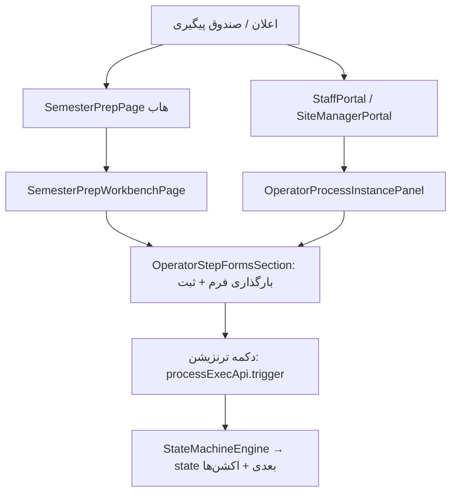

# کمبودهای UI فرایندهای آماده‌سازی ترم — چک‌لیست اتوماسیون اپراتورها

**نسخه:** 1.0
**تاریخ:** 2026-06-22
**دامنه:** فرایندهای آماده‌سازی ترم (پاییز/زمستان) — UI کارمندان اتوماسیون (نه دانشجو)
**مکمل:** `docs/student_lifecycle_ui_gaps_automation.md` (آن سند روی مسیر دانشجو متمرکز است؛ این سند روی کار اپراتورها)
**مرجع متادیتا:** `metadata/processes/fall_semester_preparation.json`، `metadata/processes/winter_semester_preparation.json`

---

## نحوهٔ استفاده

هر **مرحله (state)** یک کار قابل تحویل برای یک کارمند اتوماسیون است. وضعیت UI را علامت بزنید:

| نماد | معنی |
|------|------|
| ✅ | UI کامل — اپراتور می‌تواند فرم را پر کند و فرایند را جلو ببرد |
| 🟡 | UI جزئی — کار می‌کند ولی فاقد امکانات کمکی (یادداشت/رول‌بک/اعتبارسنجی واضح) |
| 🔴 | UI ناقص — باید ساخته/تکمیل شود |
| ⚪ | سیستمی — UI اپراتور لازم نیست (scheduler/backend) |

---

## ۱. معماری UI موجود (آنچه هست)

**نقاط ورود اپراتور:**

| لایه | فایل | وضعیت |
|------|------|-------|
| هاب آماده‌سازی | `admin-ui/src/pages/SemesterPrepPage.jsx` | ✅ کامل |
| میز کار اجرای مرحله | `admin-ui/src/pages/SemesterPrepWorkbenchPage.jsx` | ✅ کامل (یادداشت/رول‌بک/مدیریت داده) |
| بخش فرم‌های مرحله | `admin-ui/src/components/OperatorStepFormsSection.jsx` | ✅ کامل (stepper + اسلات مصاحبه) |
| راهنمای مرحله | `admin-ui/src/components/OperatorInstanceGuidanceBlock.jsx` | ✅ کامل |
| خلاصهٔ فقط‌خواندنی پاییز | `admin-ui/src/components/FallSemesterPrepReadonlySummary.jsx` | ✅ کامل |
| اسلات مصاحبه | `admin-ui/src/components/InterviewSlotsAdmin.jsx` | ✅ کامل |
| پنل عمومی اپراتور | `admin-ui/src/components/OperatorProcessInstancePanel.jsx` | ✅ کامل (در StaffPortal/SiteManager) |
| صندوق پیگیری | `admin-ui/src/components/OperatorFollowupSection.jsx` + `utils/operatorFollowupDeepLinks.js` | ✅ کامل |
| هوک داده | `admin-ui/src/hooks/useSemesterPrepWorkbench.js` | ✅ کامل |
| مسیر redirect قدیمی | `SemesterPrepCalendarPage.jsx` / `SemesterPrepCourseListReviewPage.jsx` | ⚪ فقط redirect |
| روتینگ + گارد نقش | `admin-ui/src/App.jsx` (`RequireSemesterPrepRole`) | ✅ |

**نقش‌های مجاز (RequireSemesterPrepRole):** `admin`, `staff`, `deputy_education`, `site_manager`.

---

## ۲. جدول گام‌به‌گام — ترم پاییز (`fall_semester_preparation`)

۸ مرحلهٔ اپراتوری + انتشار سیستمی. هر مرحله یک فرم در متادیتا دارد که توسط `OperatorStepFormsSection` رندر می‌شود.

| # | مرحله (state) | نقش مسئول | فرم متادیتا | UI لازم | موجود؟ | کمبود مشخص |
|---|---------------|-----------|-------------|---------|--------|-------------|
| ۲.۱ | `calendar_entry` | course_committee_executive | `academic_calendar_form` (۱۲ فیلد تاریخ + `date_range_list`) | فرم تاریخ شمسی + ویجت `date_range_list` تعطیلات | ✅ | `ShamsiDatePicker` + اعتبارسنجی پایان > شروع |
| ۲.۲ | `tuition_entry` | deputy_education_director | `tuition_form` (۴ فیلد عددی ریالی) | فرم عددی + جداکنندهٔ هزار ریال | ✅ | قالب‌بندی ریال + `note_fa` |
| ۲.۳ | `license_check` | deputy_education_director | `license_check_form` (radio + `visible_if`) | فرم با فیلد شرطی | ✅ | `visible_if` در `formConditions.js` |
| ۲.۴ | `course_list_creation` | scientific_officer_course_committee | `course_list_form` (فیلد `table` با ۶ ستون) | ویرایشگر جدول دروس (افزودن/حذف ردیف، select روز، time) | ✅ | `EditableTableField` + اعتبارسنجی ردیف |
| ۲.۵ | `course_finalization` | scientific_officer_course_committee | `course_finalization_form` (`table` با `auto_fill` از مرحله قبل) | جدول با پیش‌پرشدن از `course_list` + ستون مکان/چک‌باکس | ✅ | `auto_fill` فقط‌خواندنی + pre-fill از `courses` |
| ۲.۶ | `marketing_campaign` | admissions_officer | `marketing_campaign_form` (checkbox + multi_select) | فرم تأیید + چندانتخابی کانال | ✅ | `multi_select` با options متادیتا |
| ۲.۷ | `interviewer_assignment` | deputy_education_director | `interviewer_assignment_form` (`multi_select` مصاحبه‌گر + بازه‌ها) | چندانتخابی از فهرست مصاحبه‌گران + تاریخ | ✅ | `options_source` → `GET /admin/users?role=interviewer` |
| ۲.۸ | `interview_scheduling` | site_manager | `interview_scheduling_form` + `InterviewSlotsAdmin` | فرم زمان‌بندی + ادمین اسلات | ✅ | کامل (`editable_anytime`) |
| ۲.۹ | `published` | system | — | — | ⚪ | انتشار خودکار تقویم (`publish_academic_calendar_to_profiles`) + SMS |

---

## ۳. جدول گام‌به‌گام — ترم زمستان (`winter_semester_preparation`)

۶ مرحله + انتشار. مراحل تقویم و شهریه را ندارد و از `license_check` شروع می‌شود. فیلدهای لیست دروس از پاییز پیش‌پر می‌شوند (`pre_filled_from: fall_semester_preparation.course_list_form`).

| # | مرحله (state) | نقش مسئول | فرم | UI لازم | موجود؟ | کمبود مشخص |
|---|---------------|-----------|-----|---------|--------|-------------|
| ۳.۱ | `license_check` | deputy_education_director | `license_check_form` | همان مرحله ۲.۳ | ✅ | مشترک با پاییز |
| ۳.۲ | `course_list_review` | scientific_officer_course_committee | فرم بازبینی لیست دروس (pre-fill از پاییز) | جدول دروس + بنر «منبع: پاییز» | ✅ | بنر pre-fill + جدول قابل‌ویرایش |
| ۳.۳ | `course_finalization` | scientific_officer_course_committee | `course_finalization_form` | همان مرحله ۲.۵ | ✅ | همان ویجت جدول + auto_fill |
| ۳.۴ | `marketing_campaign` | admissions_officer | `marketing_campaign_form` | همان مرحله ۲.۶ | ✅ | مشترک |
| ۳.۵ | `interviewer_assignment` | deputy_education_director | `interviewer_assignment_form` | همان مرحله ۲.۷ | ✅ | مشترک |
| ۳.۶ | `interview_scheduling` | site_manager | `interview_scheduling_form` + اسلات | همان مرحله ۲.۸ | ✅ | کامل |
| ۳.۷ | `published` | system | — | — | ⚪ | انتشار خودکار |

> نکته: `FallSemesterPrepReadonlySummary.jsx` خلاصهٔ پاییز را نشان می‌دهد؛ بنر pre-fill در `OperatorStepFormsSection` برای فرم زمستان نیز اضافه شد.

---

## ۴. کمبودهای متقاطع (همهٔ مراحل)

| # | کمبود | جزئیات | وضعیت |
|---|-------|--------|--------|
| ۴.۱ | `DecisionNotesBlock` در workbench | یادداشت تصمیم هنگام ترنزیشن | ✅ |
| ۴.۲ | `ProcessRollbackSection` | بازگشت به مرحلهٔ قبل | ✅ |
| ۴.۳ | `ProcessDataManager` | ویرایش دادهٔ ثبت‌شده | ✅ |
| ۴.۴ | ویجت `table` پویا | جدول دروس با select/time و auto_fill | ✅ |
| ۴.۵ | ویجت `date_range_list` | تعطیلات + اعتبارسنجی بازه | ✅ |
| ۴.۶ | منبع `multi_select` مصاحبه‌گر | `options_source` + API کاربران | ✅ |
| ۴.۷ | اعتبارسنجی پیش از ثبت | `validateUnifiedAnswers` در save | ✅ |
| ۴.۸ | نمای SLA در هاب | `sla_hours` + مهلت تقویم | ✅ |
| ۴.۹ | pre-fill زمستان | بنر + ویرایش جدول | ✅ |

---

## ۵. فهرست اولویت‌بندی‌شده (ترتیب پیشنهادی تکمیل)

| # | کار | تلاش | اثر |
|---|-----|------|-----|
| ۱ | ۴.۴ ویجت جدول دروس (`table`) | بالا | بدون آن مراحل ۲.۴/۲.۵/۳.۲/۳.۳ مسدودند |
| ۲ | ۴.۶ منبع دادهٔ مصاحبه‌گران | متوسط | مرحلهٔ ۲.۷/۳.۵ قابل‌اعتماد می‌شود |
| ۳ | ۴.۵ ویجت `date_range_list` | متوسط | فرم تقویم کامل می‌شود |
| ۴ | ۴.۹ pre-fill قابل‌ویرایش زمستان | متوسط | جلوگیری از دوباره‌کاری |
| ۵ | ۴.۷ نمایش خطای اعتبارسنجی | کم | کاهش خطای اپراتور |
| ۶ | ۴.۱ یادداشت تصمیم در workbench | کم | ثبت دلیل تصمیم |
| ۷ | ۴.۸ نمای SLA در هاب | کم | شفافیت مدیریتی |
| ۸ | ۴.۲ رول‌بک در workbench | کم | اصلاح اشتباه |
| ۹ | ۴.۳ ProcessDataManager در workbench | کم | ویرایش دادهٔ ثبت‌شده |
| ۱۰ | ۲.۲/۲.۳/۲.۶ بهبود ویجت‌های ساده | کم | تکمیل جزئیات |

---

## ۶. رویهٔ پس از هر گام تکمیل‌شده

1. تیک زدن ردیف مربوطه در این سند و تغییر نماد به ✅.
2. اجرای تست‌های مرتبط:
   - `tests/processes/test_fall_semester_preparation_flow.py`
   - `tests/processes/test_winter_semester_preparation_flow.py`
   - `tests/test_process_ui_api.py`
   - `tests/processes/test_operator_step_forms.py`
3. در صورت تغییر متادیتا یا رفع وابستگی: به‌روزرسانی `metadata/process_registry/INDEX.json` و `metadata/process_registry/GAPS.json` (طبق قانون process-registry).
4. (در صورت مسیر UI جدید) ثبت در `metadata/customer_acceptance_alternate_paths.json`.

---

## ۷. خلاصهٔ وضعیت

| فرایند | مراحل اپراتوری | کامل (✅) | جزئی (🟡) | ناقص (🔴) |
|--------|----------------|-----------|-----------|-----------|
| پاییز | ۸ | ۸ | ۰ | ۰ |
| زمستان | ۶ | ۶ | ۰ | ۰ |

**نتیجه (به‌روز ۲۰۲۶-۰۶-۲۲):** UI اپراتوری آماده‌سازی ترم (ویجت‌های فرم پیشرفته + workbench + هاب SLA) تکمیل شد.

---

## ۸. هم‌ترازی زمستان با پاییز (به‌روز ۲۰۲۶-۰۷-۱۶)

UI اصلی زمستان از قبل مشترک بود؛ این به‌روزرسانی **میانبرها، RBAC و تست‌ها** را با پاییز هم‌تراز کرد.

### UI و میانبرها

| مورد | فایل | وضعیت |
|------|------|--------|
| quick-action هوشمند workbench | `StaffPortal.jsx` + `semesterPrepPortalLinks.js` | ✅ زمستان فعال → workbench زمستان |
| شروع زمستان از پنل کمیته | `CourseCommitteePrepPanel.jsx` | ✅ دکمهٔ «شروع آماده‌سازی زمستان» پس از publish پاییز |
| شروع زمستان توسط staff | `SemesterPrepWorkbenchPage.jsx` | ✅ وقتی پاییز منتشر شده باشد |
| deep-link صندوق پیگیری | `operatorFollowupDeepLinks.js` | ✅ `course_list_review` در مسیر کمیته |

### تست‌ها

| فایل | پوشش زمستان |
|------|-------------|
| `test_winter_semester_preparation_flow.py` | ۱۲ تست: RBAC، prefill، SLA، publish تقویم، اسلات مصاحبه |
| `test_semester_prep_marketing_handoff.py` | marketing handoff end-to-end زمستان |
| `test_process_scheduler.py` | auto-start زمستان (۳۰ روز قبل از شروع ترم) |
| `test_portal_role_inbox.py` | کارتابل معاون پس از بازاریابی زمستان |
| `test_process_restart.py` | restart فرایند زمستان |

### عمداً متفاوت (نیازی به هم‌ترازی ندارد)

- مراحل `calendar_entry` و `tuition_entry` فقط در پاییز
- gate ثبت‌نام دانشجو فقط به publish پاییز وابسته است
- PDF مارکتینگ زمستان: فعالیت‌های ۲ و ۳ (نه ۱، ۲ و ۵)
