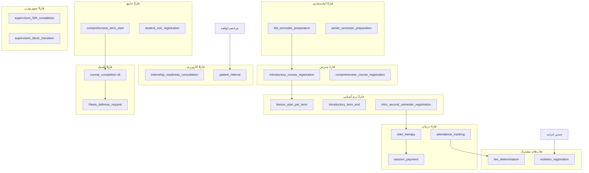
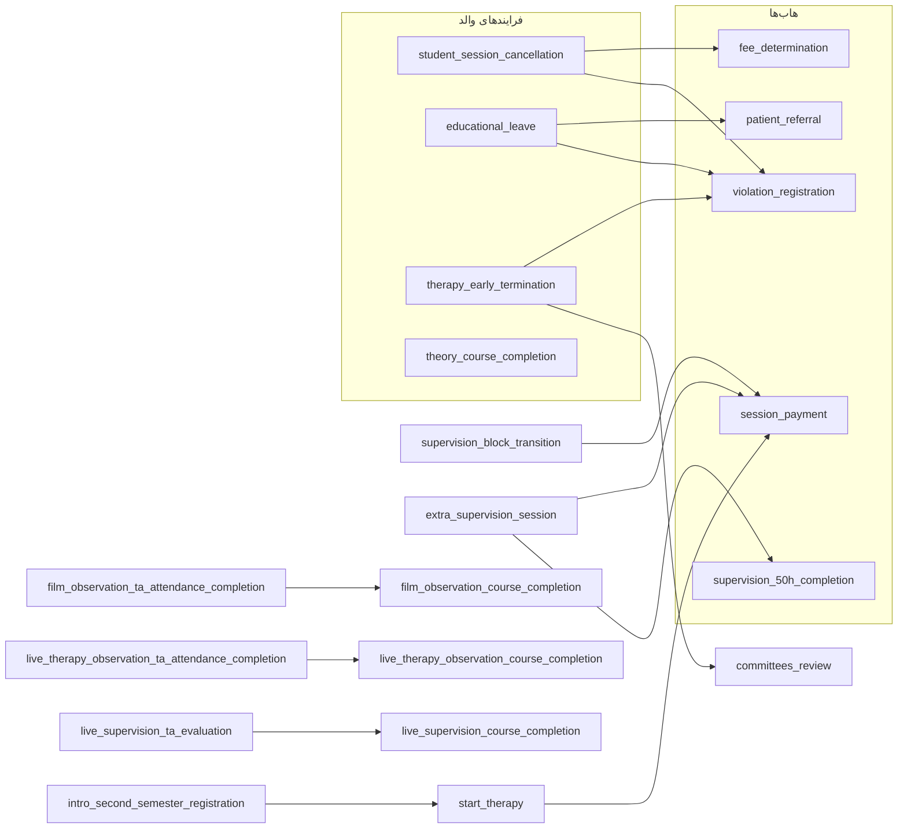

# ممیزی گردش کار بین‌فرایندی و نواقص اتوماسیون

**نسخه:** 1.0  
**تاریخ:** 2026-07-18  
**هدف:** نقشه جامع گردش کار، ارتباط بین‌فرایندی، وظایف هر نقش در پنل‌ها، و چک‌لیست نواقص — از آماده‌سازی ترم تا فارغ‌التحصیلی.

**مکمل (نه جایگزین):**
- [`docs/student_lifecycle_ui_gaps_automation.md`](student_lifecycle_ui_gaps_automation.md) — تمرکز UI مسیر دانشجو
- [`metadata/process_registry/GAPS.json`](../metadata/process_registry/GAPS.json) — وضعیت فنی رسمی
- [`reports/customer_acceptance_audit.md`](../reports/customer_acceptance_audit.md) — ممیزی پذیرش (Readiness ~91.8%)

---

## بخش ۰ — راهنما و نمادها

### نحوه استفاده

هر بلوک فرایند در **بخش ۲** یک واحد قابل‌تحویل است. پس از رفع هر نقص:
1. چک‌باکس همان بند را تیک بزنید
2. در صورت نیاز `04_status.md` همان فرایند را به‌روز کنید
3. `GAPS.json` / `INDEX.json` را هماهنگ نگه دارید (قانون process-registry)
4. `python scripts/audit_customer_acceptance.py` را اجرا کنید

### نماد وضعیت

| نماد | معنی |
|------|------|
| ✅ | کامل — گردش کار، پنل، و handoff مشخص و عملیاتی |
| 🟡 | جزئی — UI/workflow/chaining ناقص اما workaround دارد |
| 🔴 | ناقص — مسیر مسدود یا audit=user_can_complete NO |
| ⚪ | سیستمی — اقدام انسانی در پنل لازم نیست (scheduler/backend) |
| ❓ | نیاز به بررسی دستی — هنوز ارزیابی نشده |

### نقشه پنل‌ها (خلاصه)

| نقش | پنل / مسیر |
|------|------------|
| student | [`StudentPortal.jsx`](../admin-ui/src/pages/StudentPortal.jsx) |
| therapist | [`TherapistPortal.jsx`](../admin-ui/src/pages/TherapistPortal.jsx) |
| supervisor | [`SupervisorPortal.jsx`](../admin-ui/src/pages/SupervisorPortal.jsx) |
| interviewer | [`InterviewerPortal.jsx`](../admin-ui/src/pages/InterviewerPortal.jsx) |
| site_manager | [`SiteManagerPortal.jsx`](../admin-ui/src/pages/SiteManagerPortal.jsx) |
| staff lanes | [`StaffPortal.jsx`](../admin-ui/src/pages/StaffPortal.jsx) — admissions / instruction / content-ops / therapy-coord / course-committee |
| committees | [`CommitteePortal.jsx`](../admin-ui/src/pages/CommitteePortal.jsx) — progress / education / supervision / therapy |
| semester prep | [`SemesterPrepWorkbenchPage.jsx`](../admin-ui/src/pages/SemesterPrepWorkbenchPage.jsx) |
| finance | [`FinancialDashboard.jsx`](../admin-ui/src/pages/FinancialDashboard.jsx) — بدون process inbox |
| applicant | مسیر عمومی ثبت‌نام — بدون portal اختصاصی |
| system | خودکار — [`engine.py`](../app/core/engine.py) + scheduler |

**Deep-link:** [`operatorFollowupDeepLinks.js`](../admin-ui/src/utils/operatorFollowupDeepLinks.js) — fallback نهایی: `StudentTracker`

---

## بخش ۱ — نقشه چرخه حیات (فازها)

### فهرست فرایندها به تفکیک فاز

- **فاز ۰ — آماده‌سازی ترم:** `fall_semester_preparation`, `winter_semester_preparation`

- **فاز ۱ — پذیرش و ثبت‌نام:** `introductory_course_registration`, `comprehensive_course_registration`

- **فاز ۲ — ترم‌های آشنایی:** `introductory_term_end`, `intro_second_semester_registration`, `introductory_course_completion`, `lesson_start_per_term`

- **فاز ۳ — چرخه جامع:** `comprehensive_term_end`, `comprehensive_term_start`, `student_non_registration`

- **فاز ۴ — درمان آموزشی:** `therapy_changes`, `extra_session`, `session_payment`, `attendance_tracking`, `fee_determination`, `therapy_completion`, `therapy_session_increase`, `therapy_session_reduction`, `therapy_early_termination`, `specialized_commission_review`, `committees_review`, `therapist_session_cancellation`, `unannounced_absence_reaction`, `therapy_interruption`, `student_session_cancellation`, `start_therapy`

- **فاز ۵ — سوپرویژن:** `supervision_block_transition`, `supervision_50h_completion`, `supervision_session_increase`, `extra_supervision_session`, `supervision_session_reduction`, `student_supervision_cancellation`, `supervisor_session_cancellation`, `unannounced_supervision_absence_reaction`, `supervision_interruption`

- **فاز ۶ — مرخصی و بازگشت:** `process_merged_to_one`, `full_education_leave`, `return_to_full_education`, `educational_leave`

- **فاز ۷ — کمک‌مدرس / مدرس / تخلف:** `ta_conceptual_questions`, `ta_student_consultation`, `ta_essay_upload`, `ta_blog_content`, `upgrade_to_ta`, `mentor_private_sessions`, `ta_to_assistant_faculty`, `ta_to_instructor_auto`, `ta_track_change`, `ta_track_completion`, `ta_instructor_leave`, `class_attendance`, `violation_registration`, `class_session_cancellation`, `student_instructor_evaluation`

- **فاز ۸ — کارورزی و ارجاع بیمار:** `internship_readiness_consultation`, `internship_12month_conditional_review`, `intern_hours_increase`, `live_therapy_observation_session_prep`, `live_supervision_session_prep`, `intern_bulk_patient_referral`, `patient_referral`

- **فاز ۹ — تکمیل دروس و فارغ‌التحصیلی:** `theory_course_completion`, `group_supervision_course_completion`, `skills_course_completion`, `film_observation_course_completion`, `live_therapy_observation_course_completion`, `live_supervision_course_completion`, `article_writing_completion`, `thesis_defense_request`, `upgrade_to_educational_therapist`, `live_supervision_ta_evaluation`, `live_therapy_observation_ta_attendance_completion`, `film_observation_ta_attendance_completion`

---

## بخش ۲ — ماتریس فرایند × نقش × پنل × handoff

**تعداد فرایندها:** 74 (شامل زیرفرایند `patient_referral`)

### فاز ۰ — آماده‌سازی ترم

#### `fall_semester_preparation` (SOP 29) — 🟡

- **نام:** آادساز تر پاز
- **فاز:** P0_prep
- **وضعیت اولیه:** `calendar_entry` | **نقش اولیه:** `None`
- **تعداد state:** 9
- **رجیستری:** 01_input=False | 04_status=False | sop_mapping=False

**نقش‌ها و پنل:**
- `course_committee_executive` → StaffPortal / course-committee + SemesterPrep | پنل: ProcessStepForms / OperatorProcessInstancePanel / QuestCard
- `deputy_education` → CommitteePortal / education + SemesterPrep | پنل: SemesterPrepWorkbenchPage
- `course_committee_scientific` → StaffPortal / course-committee lane | پنل: ProcessStepForms / OperatorProcessInstancePanel / QuestCard
- `admissions_officer` → StaffPortal / admissions lane | پنل: ProcessStepForms / OperatorProcessInstancePanel / QuestCard
- `site_manager` → SiteManagerPortal | پنل: SemesterPrepWorkbenchPage (interview slots)
- `system` → — (automated; no human panel) | پنل: ProcessStepForms / OperatorProcessInstancePanel / QuestCard
- **Staff lane پیشنهادی:** `course-committee`

**ورودی (started_by):**
`lesson_start_per_term`, `winter_semester_preparation`

**خروجی (sub_process_refs / chaining):**
- — (leaf یا بدون زیرفرایند)

**گردش کار (state → نقش):**
- `calendar_entry` → `course_committee_executive` (initial) — هماهنگی اجرایی و ثبت تصمیم.
- `tuition_entry` → `deputy_education_director` (intermediate) — بررسی پرونده و ثبت تصمیم مدیریتی.
- `license_check` → `deputy_education_director` (intermediate) — بررسی پرونده و ثبت تصمیم مدیریتی.
- `course_list_creation` → `scientific_officer_course_committee` (intermediate) — بررسی علمی و ثبت نظر.
- `course_finalization` → `scientific_officer_course_committee` (intermediate) — بررسی علمی و ثبت نظر.
- `marketing_campaign` → `admissions_officer` (intermediate) — بررسی مدارک/پرونده؛ تأیید، نقص، یا ادامه.
- `interviewer_assignment` → `deputy_education_director` (intermediate) — بررسی پرونده و ثبت تصمیم مدیریتی.
- `interview_scheduling` → `site_manager` (intermediate) — نوع برگزاری را مشخص کنید، اسلات‌های قابل رزرو را ثبت کنید و فرم را ذخیره کنید.
- `published` → `system` (terminal)

**نواقص / یادداشت:**
- [ ] فاقد 04_status.md در رجیستری
- [ ] فاقد 01_input.md / 02_flowchart در رجیستری

#### `winter_semester_preparation` (SOP 30) — 🟡

- **نام:** آادساز تر زستا
- **فاز:** P0_prep
- **وضعیت اولیه:** `license_check` | **نقش اولیه:** `None`
- **تعداد state:** 7
- **رجیستری:** 01_input=False | 04_status=False | sop_mapping=False

**نقش‌ها و پنل:**
- `deputy_education` → CommitteePortal / education + SemesterPrep | پنل: ProcessStepForms / OperatorProcessInstancePanel / QuestCard
- `course_committee_scientific` → StaffPortal / course-committee lane | پنل: ProcessStepForms / OperatorProcessInstancePanel / QuestCard
- `admissions_officer` → StaffPortal / admissions lane | پنل: ProcessStepForms / OperatorProcessInstancePanel / QuestCard
- `site_manager` → SiteManagerPortal | پنل: ProcessStepForms / OperatorProcessInstancePanel / QuestCard
- `system` → — (automated; no human panel) | پنل: ProcessStepForms / OperatorProcessInstancePanel / QuestCard
- **Staff lane پیشنهادی:** `course-committee`

**ورودی (started_by):**
`lesson_start_per_term`

**خروجی (sub_process_refs / chaining):**
`fall_semester_preparation`

**گردش کار (state → نقش):**
- `license_check` → `deputy_education_director` (initial) — بررسی پرونده و ثبت تصمیم مدیریتی.
- `course_list_review` → `scientific_officer_course_committee` (intermediate) — بررسی علمی و ثبت نظر.
- `course_finalization` → `scientific_officer_course_committee` (intermediate) — بررسی علمی و ثبت نظر.
- `marketing_campaign` → `admissions_officer` (intermediate) — بررسی مدارک/پرونده؛ تأیید، نقص، یا ادامه.
- `interviewer_assignment` → `deputy_education_director` (intermediate) — بررسی پرونده و ثبت تصمیم مدیریتی.
- `interview_scheduling` → `site_manager` (intermediate) — نوع برگزاری را مشخص کنید، اسلات‌های قابل رزرو را ثبت کنید و فرم را ذخیره کنید.
- `published` → `system` (terminal)

**نواقص / یادداشت:**
- [ ] فاقد 04_status.md در رجیستری
- [ ] فاقد 01_input.md / 02_flowchart در رجیستری

### فاز ۱ — پذیرش و ثبت‌نام

#### `introductory_course_registration` (SOP 31) — ❓

- **نام:** فرایند ثبت‌نام دوره آشنایی
- **فاز:** P1_admission
- **وضعیت اولیه:** `application_submitted` | **نقش اولیه:** `None`
- **تعداد state:** 17
- **رجیستری:** 01_input=True | 04_status=True | sop_mapping=False

**نقش‌ها و پنل:**
- `applicant` → — (no dedicated portal; public registration) | پنل: ProcessStepForms / OperatorProcessInstancePanel / QuestCard
- `admissions_officer` → StaffPortal / admissions lane | پنل: StaffPortal/admissions + DocumentsReviewPanel
- `interviewer` → InterviewerPortal + StaffPortal/admissions | پنل: InterviewerResultPanel
- `system` → — (automated; no human panel) | پنل: ProcessStepForms / OperatorProcessInstancePanel / QuestCard
- **Staff lane پیشنهادی:** `admissions`

**ورودی (started_by):**
- دستی / scheduler / شروع اولیه مسیر

**خروجی (sub_process_refs / chaining):**
- — (leaf یا بدون زیرفرایند)

**گردش کار (state → نقش):**
- `application_submitted` → `applicant` (initial) — باید زمان مصاحبه را از مسیر اعلام‌شده در سایت یا پیامک پذیرش انتخاب کنید؛ پس از رزرو موفق، مرحلهٔ پرداخت هزینهٔ مصاحبه ب…
- `interview_scheduled` → `applicant` (intermediate) — باید هزینه مصاحبه را در درگاه پرداخت همین صفحه بپردازید؛ پس از پرداخت، مرحله بعد به‌صورت خودکار فعال می‌شود.
- `interview_payment` → `applicant` (intermediate) — باید هزینه مصاحبه را در درگاه پرداخت تکمیل کنید؛ در صورت خطا دوباره تلاش کنید تا تأیید پرداخت ثبت شود.
- `interview_payment_confirmed` → `system` (intermediate) — پرداخت شما ثبت شد و جزئیات زمان مصاحبه از طریق پیامک ارسال شده است. در زمان مقرر در مصاحبه حاضر شوید؛ پس از برگزاری مصاح…
- `interview_completed` → `interviewer` (intermediate) — منتظر ثبت نتیجه مصاحبه توسط مصاحبه‌گر باشید؛ اگر فرم یا اقدامی برای شما باز شد، آن را تکمیل کنید.
- `result_conditional_therapy` → `system` (intermediate) — پذیرش شما مشروط به شروع درمان شخصی است؛ مراحل بعد (آپلود مدارک و پرداخت) را طبق راهنمای پنل پیش ببرید.
- `result_single_course` → `system` (intermediate) — پذیرش شما محدود به درس(های) اعلام‌شده است؛ آپلود و پرداخت را طبق محدودیت‌های پنل انجام دهید (در صورت نیاز فقط پرداخت نقد…
- `result_full_admission` → `system` (intermediate) — پذیرش کامل دریافت شد؛ مراحل بعد را طبق پنل (آپلود مدارک، انتخاب درس و پرداخت) پیش ببرید.
- `rejected` → `system` (terminal) — پرونده شما در این دوره رد شده است؛ برای پرسش از طریق تیکت با بخش پذیرش تماس بگیرید.
- `documents_upload` → `applicant` (intermediate) — باید مدارک و تأییدیه‌های خواسته‌شده را در همین پورتال بارگذاری و ثبت کنید.
- `documents_review` → `admissions_officer` (intermediate) — در این مرحله بررسی توسط مسئول پذیرش انجام می‌شود؛ اگر فرمی برای شما باز است تکمیل کنید، در غیر این صورت بعداً صفحه را تا…
- `documents_incomplete` → `applicant` (intermediate) — باید کاستی‌های اعلام‌شده را برطرف و مدارک را دوباره بارگذاری کنید.
- … و 5 state دیگر

**نواقص / یادداشت:**
- [ ] — (نیاز به بررسی دستی)

#### `comprehensive_course_registration` (SOP 35) — 🟡

- **نام:** ثبتا در در جاع
- **فاز:** P1_admission
- **وضعیت اولیه:** `application_submitted` | **نقش اولیه:** `None`
- **تعداد state:** 16
- **رجیستری:** 01_input=False | 04_status=False | sop_mapping=False

**نقش‌ها و پنل:**
- `student` → StudentPortal (/panel/portal/student) | پنل: ProcessStepForms / OperatorProcessInstancePanel / QuestCard
- `supervision_committee` → CommitteePortal / supervision | پنل: ProcessStepForms / OperatorProcessInstancePanel / QuestCard
- `progress_committee_executive` → ? portal for progress_committee_executive | پنل: ProcessStepForms / OperatorProcessInstancePanel / QuestCard
- `progress_committee_scientific` → ? portal for progress_committee_scientific | پنل: ProcessStepForms / OperatorProcessInstancePanel / QuestCard
- `admissions_officer` → StaffPortal / admissions lane | پنل: ProcessStepForms / OperatorProcessInstancePanel / QuestCard
- `deputy_education` → CommitteePortal / education + SemesterPrep | پنل: ProcessStepForms / OperatorProcessInstancePanel / QuestCard
- `system` → — (automated; no human panel) | پنل: ProcessStepForms / OperatorProcessInstancePanel / QuestCard
- **Staff lane پیشنهادی:** `admissions`

**ورودی (started_by):**
- دستی / scheduler / شروع اولیه مسیر

**خروجی (sub_process_refs / chaining):**
- — (leaf یا بدون زیرفرایند)

**گردش کار (state → نقش):**
- `application_submitted` → `student` (initial)
- `supervision_committee_review` → `supervision_committee` (intermediate) — بررسی/صدور مجوز طبق دستور کار.
- `supervision_rejected` → `system` (terminal)
- `executive_review` → `progress_committee` (intermediate) — بررسی پرونده و ثبت تصمیم جلسه.
- `scientific_review` → `progress_committee` (intermediate) — بررسی پرونده و ثبت تصمیم جلسه.
- `scientific_rejected` → `system` (terminal)
- `document_upload` → `student` (intermediate)
- `interview_scheduled` → `student` (intermediate)
- `interview_payment` → `student` (intermediate) — از بخش پرداخت سپ همین صفحه استفاده کنید. پس از بازگشت از بانک، صفحه را یک‌بار تازه کنید.
- `interview_completed` → `progress_committee` (intermediate) — بررسی پرونده و ثبت تصمیم جلسه.
- `result_accepted` → `system` (intermediate)
- `result_rejected` → `system` (terminal)
- … و 4 state دیگر

**نواقص / یادداشت:**
- [ ] فاقد 04_status.md در رجیستری
- [ ] فاقد 01_input.md / 02_flowchart در رجیستری

### فاز ۲ — ترم‌های آشنایی

#### `introductory_term_end` (SOP 32) — 🟡

- **نام:** پاا ترا در آشا
- **فاز:** P2_intro_terms
- **وضعیت اولیه:** `grades_submitted` | **نقش اولیه:** `None`
- **تعداد state:** 8
- **رجیستری:** 01_input=False | 04_status=False | sop_mapping=False

**نقش‌ها و پنل:**
- `admissions_officer` → StaffPortal / admissions lane | پنل: ProcessStepForms / OperatorProcessInstancePanel / QuestCard
- `deputy_education` → CommitteePortal / education + SemesterPrep | پنل: ProcessStepForms / OperatorProcessInstancePanel / QuestCard
- `system` → — (automated; no human panel) | پنل: ProcessStepForms / OperatorProcessInstancePanel / QuestCard

**ورودی (started_by):**
- دستی / scheduler / شروع اولیه مسیر

**خروجی (sub_process_refs / chaining):**
- — (leaf یا بدون زیرفرایند)

**گردش کار (state → نقش):**
- `grades_submitted` → `system` (initial)
- `transcript_generated` → `system` (intermediate)
- `therapy_check` → `system` (intermediate)
- `therapy_blocked` → `system` (intermediate)
- `registration_notification_sent` → `system` (intermediate)
- `decline_list_generated` → `system` (intermediate)
- `followup_in_progress` → `admissions_officer` (intermediate) — بررسی مدارک/پرونده؛ تأیید، نقص، یا ادامه.
- `followup_complete` → `system` (terminal)

**نواقص / یادداشت:**
- [ ] فاقد 04_status.md در رجیستری
- [ ] فاقد 01_input.md / 02_flowchart در رجیستری
- [ ] staff lane در portalStaffLanes.js صریح تعریف نشده — ممکن است deep-link به StudentTracker برود

#### `intro_second_semester_registration` (SOP 33) — 🟡

- **نام:** ثبتا داشج برا تر د در آشا
- **فاز:** P2_intro_terms
- **وضعیت اولیه:** `eligibility_check` | **نقش اولیه:** `None`
- **تعداد state:** 9
- **رجیستری:** 01_input=False | 04_status=False | sop_mapping=False

**نقش‌ها و پنل:**
- `student` → StudentPortal (/panel/portal/student) | پنل: ProcessStepForms / OperatorProcessInstancePanel / QuestCard
- `system` → — (automated; no human panel) | پنل: ProcessStepForms / OperatorProcessInstancePanel / QuestCard

**ورودی (started_by):**
- دستی / scheduler / شروع اولیه مسیر

**خروجی (sub_process_refs / chaining):**
`start_therapy`

**گردش کار (state → نقش):**
- `eligibility_check` → `system` (initial)
- `therapy_check_failed` → `system` (terminal)
- `suspension_check_failed` → `system` (terminal)
- `course_selection` → `student` (intermediate)
- `payment_method` → `student` (intermediate)
- `payment_processing` → `student` (intermediate) — از بخش پرداخت سپ همین صفحه استفاده کنید. پس از بازگشت از بانک، صفحه را یک‌بار تازه کنید.
- `registration_complete` → `system` (intermediate)
- `installment_overdue` → `system` (intermediate)
- `term2_registration_closed` → `system` (terminal)

**نواقص / یادداشت:**
- [ ] بدون operator_gap rule برای CTA دستی ترم ۲ (اختیاری)
- [ ] فاقد 04_status.md در رجیستری
- [ ] فاقد 01_input.md / 02_flowchart در رجیستری

#### `introductory_course_completion` (SOP 34) — 🟡

- **نام:** خات در آشا
- **فاز:** P2_intro_terms
- **وضعیت اولیه:** `all_courses_passed` | **نقش اولیه:** `None`
- **تعداد state:** 6
- **رجیستری:** 01_input=False | 04_status=False | sop_mapping=False

**نقش‌ها و پنل:**
- `supervision_committee` → CommitteePortal / supervision | پنل: ProcessStepForms / OperatorProcessInstancePanel / QuestCard
- `system` → — (automated; no human panel) | پنل: ProcessStepForms / OperatorProcessInstancePanel / QuestCard

**ورودی (started_by):**
- دستی / scheduler / شروع اولیه مسیر

**خروجی (sub_process_refs / chaining):**
- — (leaf یا بدون زیرفرایند)

**گردش کار (state → نقش):**
- `all_courses_passed` → `system` (initial)
- `invitation_sent` → `system` (intermediate) — پیامک مهلت درخواست ورود به دوره جامع ارسال شده؛ در مهلت اعلام‌شده با بخش پذیرش تماس بگیرید.
- `certificate_draft_generated` → `system` (intermediate)
- `certificate_review` → `supervision_committee` (intermediate) — پیش‌نویس گواهی پایان دوره آشنایی را بررسی کنید؛ در صورت صحت «committee_approved_certificate» و در صورت نیاز به اصلاح «co…
- `certificate_approved` → `system` (intermediate)
- `process_complete` → `system` (terminal) — گواهی پایان دوره آماده است؛ از تب پروفایل → کارنامه‌ها دانلود کنید.

**نواقص / یادداشت:**
- [ ] فاقد 04_status.md در رجیستری
- [ ] فاقد 01_input.md / 02_flowchart در رجیستری
- [ ] فاقد نگاشت در sop_step_mappings.json

#### `lesson_start_per_term` (SOP 41) — 🟡

- **نام:** آغاز ر درس در ر تر
- **فاز:** P2_intro_terms
- **وضعیت اولیه:** `student_enrollment` | **نقش اولیه:** `None`
- **تعداد state:** 4
- **رجیستری:** 01_input=False | 04_status=True | sop_mapping=False

**نقش‌ها و پنل:**
- `student` → StudentPortal (/panel/portal/student) | پنل: ProcessStepForms / OperatorProcessInstancePanel / QuestCard
- `instructor` → StaffPortal / instruction lane | پنل: ProcessStepForms / OperatorProcessInstancePanel / QuestCard
- `teaching_assistant` → StaffPortal / instruction lane | پنل: ProcessStepForms / OperatorProcessInstancePanel / QuestCard
- `course_committee_executive` → StaffPortal / course-committee + SemesterPrep | پنل: ProcessStepForms / OperatorProcessInstancePanel / QuestCard
- `system` → — (automated; no human panel) | پنل: ProcessStepForms / OperatorProcessInstancePanel / QuestCard
- **Staff lane پیشنهادی:** `instruction`

**ورودی (started_by):**
- دستی / scheduler / شروع اولیه مسیر

**خروجی (sub_process_refs / chaining):**
`fall_semester_preparation`, `winter_semester_preparation`

**گردش کار (state → نقش):**
- `student_enrollment` → `student` (initial)
- `links_created` → `system` (intermediate)
- `attendance_list_ready` → `system` (intermediate)
- `lesson_active` → `instructor` (terminal) — ثبت نمره/حضور/تأیید TA.

**نواقص / یادداشت:**
- [ ] فقط scheduler — بدون CTA دستی اگر scheduler عقب بیفتد
- [ ] فاقد 01_input.md / 02_flowchart در رجیستری

### فاز ۳ — چرخه جامع

#### `comprehensive_term_end` (SOP 36) — 🟡

- **نام:** پاا ترا در جاع
- **فاز:** P3_comprehensive
- **وضعیت اولیه:** `grades_submitted` | **نقش اولیه:** `None`
- **تعداد state:** 6
- **رجیستری:** 01_input=False | 04_status=False | sop_mapping=False

**نقش‌ها و پنل:**
- `system` → — (automated; no human panel) | پنل: ProcessStepForms / OperatorProcessInstancePanel / QuestCard

**ورودی (started_by):**
- دستی / scheduler / شروع اولیه مسیر

**خروجی (sub_process_refs / chaining):**
- — (leaf یا بدون زیرفرایند)

**گردش کار (state → نقش):**
- `grades_submitted` → `system` (initial)
- `transcript_generated` → `system` (intermediate)
- `graduation_check` → `system` (intermediate)
- `completed_all_courses` → `system` (terminal)
- `registration_notification_sent` → `system` (intermediate)
- `process_complete` → `system` (terminal)

**نواقص / یادداشت:**
- [ ] فاقد 04_status.md در رجیستری
- [ ] فاقد 01_input.md / 02_flowchart در رجیستری

#### `comprehensive_term_start` (SOP 40) — 🟡

- **نام:** آغاز ترم‌های دوره جامع
- **فاز:** P3_comprehensive
- **وضعیت اولیه:** `eligibility_check` | **نقش اولیه:** `student`
- **تعداد state:** 6
- **رجیستری:** 01_input=False | 04_status=True | sop_mapping=False

**نقش‌ها و پنل:**
- `student` → StudentPortal (/panel/portal/student) | پنل: ProcessStepForms / OperatorProcessInstancePanel / QuestCard
- `instructor` → StaffPortal / instruction lane | پنل: ProcessStepForms / OperatorProcessInstancePanel / QuestCard
- `course_committee_executive` → StaffPortal / course-committee + SemesterPrep | پنل: ProcessStepForms / OperatorProcessInstancePanel / QuestCard
- `system` → — (automated; no human panel) | پنل: ProcessStepForms / OperatorProcessInstancePanel / QuestCard

**ورودی (started_by):**
- دستی / scheduler / شروع اولیه مسیر

**خروجی (sub_process_refs / chaining):**
- — (leaf یا بدون زیرفرایند)

**گردش کار (state → نقش):**
- `eligibility_check` → `system` (initial)
- `blocked` → `system` (terminal)
- `course_display` → `student` (intermediate) — دروس ثابت ترم را مشاهده کنید و پس از تأیید، به مرحلهٔ انتخاب روش پرداخت بروید.
- `payment_choice` → `student` (intermediate) — روش پرداخت (نقدی یا ۲ تا ۴ قسط) را انتخاب کنید.
- `payment_processing` → `student` (intermediate) — از بخش پرداخت سپ همین صفحه استفاده کنید. پس از بازگشت از بانک، صفحه را یک‌بار تازه کنید.
- `registration_complete` → `system` (terminal)

**نواقص / یادداشت:**
- [ ] فاقد 01_input.md / 02_flowchart در رجیستری
- [ ] staff lane در portalStaffLanes.js صریح تعریف نشده — ممکن است deep-link به StudentTracker برود

#### `student_non_registration` (SOP 42) — 🟡

- **نام:** عد ثبتا داشج برا تر بعد
- **فاز:** P3_comprehensive
- **وضعیت اولیه:** `list_generated` | **نقش اولیه:** `None`
- **تعداد state:** 9
- **رجیستری:** 01_input=False | 04_status=True | sop_mapping=False

**نقش‌ها و پنل:**
- `student` → StudentPortal (/panel/portal/student) | پنل: ProcessStepForms / OperatorProcessInstancePanel / QuestCard
- `supervision_committee` → CommitteePortal / supervision | پنل: ProcessStepForms / OperatorProcessInstancePanel / QuestCard
- `system` → — (automated; no human panel) | پنل: ProcessStepForms / OperatorProcessInstancePanel / QuestCard

**ورودی (started_by):**
- دستی / scheduler / شروع اولیه مسیر

**خروجی (sub_process_refs / chaining):**
`educational_leave`, `violation_registration`

**گردش کار (state → نقش):**
- `list_generated` → `system` (initial) — فرم تعیین جلسه را تکمیل کنید و دکمهٔ ثبت جلسه را بزنید.
- `meeting_scheduled` → `supervision_committee` (intermediate) — پس از ارسال دعوت‌نامه، در روز جلسه حاضر شوید؛ سپس «ارسال دعوت‌نامه» را بزنید تا مرحلهٔ ثبت نتیجه باز شود.
- `meeting_held` → `supervision_committee` (intermediate) — فرم نتیجه جلسه را ثبت کنید؛ سپس یکی از سه دکمهٔ تصمیم (ثبت‌نام / مرخصی / انصراف) را بزنید.
- `branch_register` → `student` (intermediate) — حداکثر ۲ روز فرصت دارید دروس ترم را اخذ و شهریه را پرداخت کنید. از بخش ثبت‌نام ترم در همین پنل اقدام کنید.
- `branch_leave` → `student` (intermediate) — حداکثر ۳ روز فرصت دارید یکی از فرایندهای مرخصی را از داشبورد شروع کنید.
- `branch_withdrawal` → `system` (terminal)
- `registration_completed` → `system` (terminal)
- `leave_started` → `system` (terminal)
- `withdrawal_triggered` → `system` (terminal)

**نواقص / یادداشت:**
- [ ] ۱۰ از ۱۷ گام SOP بدون نگاشت
- [ ] عمدتاً scheduler + committee
- [ ] فاقد 01_input.md / 02_flowchart در رجیستری

### فاز ۴ — درمان آموزشی

#### `therapy_changes` (SOP 3) — 🟡

- **نام:** درت تغرات درا آزش
- **فاز:** P4_therapy
- **وضعیت اولیه:** `change_request` | **نقش اولیه:** `None`
- **تعداد state:** 9
- **رجیستری:** 01_input=False | 04_status=False | sop_mapping=False

**نقش‌ها و پنل:**
- `student` → StudentPortal (/panel/portal/student) | پنل: ProcessStepForms / OperatorProcessInstancePanel / QuestCard
- `therapist` → TherapistPortal | پنل: ProcessStepForms / OperatorProcessInstancePanel / QuestCard
- `system` → — (automated; no human panel) | پنل: ProcessStepForms / OperatorProcessInstancePanel / QuestCard

**ورودی (started_by):**
- دستی / scheduler / شروع اولیه مسیر

**خروجی (sub_process_refs / chaining):**
- — (leaf یا بدون زیرفرایند)

**گردش کار (state → نقش):**
- `change_request` → `student` (initial) — نوع تغییر را انتخاب و دلیل کوتاه بنویسید؛ سپس یک‌بار دکمهٔ ادامه را بزنید تا درخواست به مسیر درست (کمیته یا درمانگر) برو…
- `restart_review` → `progress_committee` (intermediate) — بررسی پرونده و ثبت تصمیم جلسه.
- `therapist_change_review` → `progress_committee` (intermediate) — بررسی پرونده و ثبت تصمیم جلسه.
- `schedule_change_review` → `therapist` (intermediate) — بررسی درخواست؛ فرم را تکمیل و دکمه تصمیم را بزنید.
- `new_therapist_selection` → `student` (intermediate) — شناسهٔ درمانگر جدید را مطابق راهنمای انستیتو وارد کنید و تایید نهایی را بزنید.
- `new_schedule_confirmation` → `student` (intermediate) — ساعت پیشنهادی توسط درمانگر را بررسی کنید؛ در صورت تایید، دکمهٔ ادامه را بزنید تا ساعت روی جلسات آینده ثبت شود.
- `change_approved` → `system` (terminal)
- `change_rejected` → `system` (terminal)
- `restart_activated` → `system` (terminal)

**نواقص / یادداشت:**
- [ ] فاقد 04_status.md در رجیستری
- [ ] فاقد 01_input.md / 02_flowchart در رجیستری

#### `extra_session` (SOP 4) — ❓

- **نام:** برگزار جس اضاف درا آزش
- **فاز:** P4_therapy
- **وضعیت اولیه:** `extra_request` | **نقش اولیه:** `None`
- **تعداد state:** 8
- **رجیستری:** 01_input=True | 04_status=True | sop_mapping=False

**نقش‌ها و پنل:**
- `student` → StudentPortal (/panel/portal/student) | پنل: ProcessStepForms / OperatorProcessInstancePanel / QuestCard
- `therapist` → TherapistPortal | پنل: ProcessStepForms / OperatorProcessInstancePanel / QuestCard
- `system` → — (automated; no human panel) | پنل: ProcessStepForms / OperatorProcessInstancePanel / QuestCard

**ورودی (started_by):**
- دستی / scheduler / شروع اولیه مسیر

**خروجی (sub_process_refs / chaining):**
`attendance_tracking`

**گردش کار (state → نقش):**
- `extra_request` → `student` (initial) — تاریخ و ساعت پیشنهادی خود را در فرم همین صفحه وارد و ثبت کنید؛ سپس دکمهٔ ادامه را بزنید تا درمانگر بررسی کند.
- `therapist_review` → `therapist` (intermediate) — بررسی درخواست؛ فرم را تکمیل و دکمه تصمیم را بزنید.
- `student_response` → `student` (intermediate) — اگر زمان پیشنهادی درمانگر را می‌پذیرید، تاریخ و ساعت را در فرم تأیید کنید؛ در غیر این صورت زمان جدید پیشنهاد دهید و ثبت …
- `payment_required` → `student` (intermediate) — ابتدا از بخش پرداخت درگاه همین صفحه مبلغ جلسه اضافی را بپردازید؛ پس از تأیید بانک، مرحلهٔ بعد به‌صورت خودکار ثبت می‌شود.
- `extra_session_confirmed` → `system` (intermediate) — جلسه در سیستم ثبت شده است؛ لینک جلسه در همین مسیر یا پیامک آمده است. در زمان مقرر حاضر شوید.
- `extra_session_completed` → `therapist` (terminal) — بررسی درخواست؛ فرم را تکمیل و دکمه تصمیم را بزنید.
- `extra_session_cancelled` → `system` (terminal)
- `extra_request_rejected` → `system` (terminal)

**نواقص / یادداشت:**
- [ ] — (نیاز به بررسی دستی)

#### `session_payment` (SOP 5) — 🟡

- **نام:** پرداخت برا جسات آت درا آزش
- **فاز:** P4_therapy
- **وضعیت اولیه:** `payment_due` | **نقش اولیه:** `None`
- **تعداد state:** 6
- **رجیستری:** 01_input=True | 04_status=True | sop_mapping=False

**نقش‌ها و پنل:**
- `student` → StudentPortal (/panel/portal/student) | پنل: ProcessStepForms / OperatorProcessInstancePanel / QuestCard
- `system` → — (automated; no human panel) | پنل: ProcessStepForms / OperatorProcessInstancePanel / QuestCard

**ورودی (started_by):**
`extra_supervision_session`, `supervision_block_transition`

**خروجی (sub_process_refs / chaining):**
- — (leaf یا بدون زیرفرایند)

**گردش کار (state → نقش):**
- `payment_due` → `student` (initial) — دکمهٔ «ادامه به انتخاب جلسات و تسویه» را بزنید. اگر بدهی جلسهٔ قبلی دارید، در مرحلهٔ بعد آن را همراه پرداخت انتخاب کنید.
- `payment_selection` → `student` (intermediate) — فرم همین صفحه را تکمیل کنید؛ در صورت بدهی، گزینهٔ تسویه را فعال کنید. سپس دکمهٔ «ادامه و ثبت مرحله» را بزنید تا به درگاه…
- `awaiting_payment` → `student` (intermediate) — از بخش پرداخت سپ همین صفحه استفاده کنید. پس از بازگشت از بانک، صفحه را یک‌بار تازه کنید.
- `payment_confirmed` → `system` (terminal)
- `payment_failed` → `student` (intermediate) — می‌توانید دوباره تلاش کنید یا در صورت نیاز با پشتیبانی تماس بگیرید.
- `session_suspended` → `system` (terminal)

**نواقص / یادداشت:**
- [ ] ۵ از ۶ گام SOP بدون نگاشت

#### `attendance_tracking` (SOP 6) — ❓

- **نام:** تک شد ساعات درا آزش (حضر  غاب)
- **فاز:** P4_therapy
- **وضعیت اولیه:** `session_scheduled` | **نقش اولیه:** `None`
- **تعداد state:** 11
- **رجیستری:** 01_input=True | 04_status=True | sop_mapping=False

**نقش‌ها و پنل:**
- `therapist` → TherapistPortal | پنل: ProcessStepForms / OperatorProcessInstancePanel / QuestCard
- `site_manager` → SiteManagerPortal | پنل: ProcessStepForms / OperatorProcessInstancePanel / QuestCard
- `deputy_education` → CommitteePortal / education + SemesterPrep | پنل: ProcessStepForms / OperatorProcessInstancePanel / QuestCard
- `system` → — (automated; no human panel) | پنل: ProcessStepForms / OperatorProcessInstancePanel / QuestCard

**ورودی (started_by):**
`extra_session`, `therapist_session_cancellation`

**خروجی (sub_process_refs / chaining):**
`fee_determination`

**گردش کار (state → نقش):**
- `session_scheduled` → `system` (initial)
- `recording_closed` → `system` (terminal)
- `auto_absence_unpaid` → `system` (terminal)
- `therapist_recording` → `therapist` (intermediate) — بررسی درخواست؛ فرم را تکمیل و دکمه تصمیم را بزنید.
- `site_manager_pending` → `site_manager` (intermediate) — بررسی درخواست و ثبت تصمیم.
- `deputy_escalated` → `deputy_education` (terminal) — بررسی پرونده و تأیید یا ارجاع.
- `session_completed` → `system` (terminal)
- `absence_recorded` → `system` (intermediate)
- `excused_absence` → `system` (terminal)
- `unexcused_absence` → `system` (terminal)
- `quota_exceeded` → `system` (terminal)

**نواقص / یادداشت:**
- [ ] — (نیاز به بررسی دستی)

#### `fee_determination` (SOP 7) — 🟡

- **نام:** تع تکف ز جس درا آزش ا سپر فرد
- **فاز:** P4_therapy
- **وضعیت اولیه:** `triggered` | **نقش اولیه:** `None`
- **تعداد state:** 6
- **رجیستری:** 01_input=True | 04_status=True | sop_mapping=False

**نقش‌ها و پنل:**
- `student` → StudentPortal (/panel/portal/student) | پنل: ProcessStepForms / OperatorProcessInstancePanel / QuestCard
- `therapist` → TherapistPortal | پنل: ProcessStepForms / OperatorProcessInstancePanel / QuestCard
- `system` → — (automated; no human panel) | پنل: ProcessStepForms / OperatorProcessInstancePanel / QuestCard

**ورودی (started_by):**
`attendance_tracking`, `student_session_cancellation`, `student_supervision_cancellation`, `supervision_50h_completion`, `unannounced_supervision_absence_reaction`

**خروجی (sub_process_refs / chaining):**
- — (leaf یا بدون زیرفرایند)

**گردش کار (state → نقش):**
- `triggered` → `system` (initial)
- `excluded` → `system` (terminal)
- `scenario_1_credit_returned` → `system` (terminal)
- `scenario_2_no_action` → `system` (terminal)
- `scenario_3_forfeited` → `system` (terminal)
- `scenario_4_debt_created` → `system` (terminal)

**نواقص / یادداشت:**
- [ ] ۴ از ۵ گام SOP بدون نگاشت صریح
- [ ] زیرفرایند leaf — فقط از والد trigger می‌شود

#### `therapy_completion` (SOP 8) — ❓

- **نام:** تک  خات درا آزش
- **فاز:** P4_therapy
- **وضعیت اولیه:** `initiated` | **نقش اولیه:** `None`
- **تعداد state:** 3
- **رجیستری:** 01_input=True | 04_status=True | sop_mapping=False

**نقش‌ها و پنل:**
- `student` → StudentPortal (/panel/portal/student) | پنل: ProcessStepForms / OperatorProcessInstancePanel / QuestCard
- `therapist` → TherapistPortal | پنل: ProcessStepForms / OperatorProcessInstancePanel / QuestCard
- `system` → — (automated; no human panel) | پنل: ProcessStepForms / OperatorProcessInstancePanel / QuestCard

**ورودی (started_by):**
- دستی / scheduler / شروع اولیه مسیر

**خروجی (sub_process_refs / chaining):**
- — (leaf یا بدون زیرفرایند)

**گردش کار (state → نقش):**
- `initiated` → `student` (initial) — ساعات درمان، بالینی و سوپرویژن را در باکس پایین با حدنصاب‌ها ببینید؛ اگر همهٔ شرایط احراز است، دکمهٔ «ادامه و ثبت مرحله»…
- `conditions_not_met` → `system` (terminal)
- `therapy_completed` → `system` (terminal)

**نواقص / یادداشت:**
- [ ] — (نیاز به بررسی دستی)

#### `therapy_session_increase` (SOP 9) — ❓

- **نام:** درخاست داشج برا افزاش جسات فتگ درا آزش
- **فاز:** P4_therapy
- **وضعیت اولیه:** `request_submitted` | **نقش اولیه:** `None`
- **تعداد state:** 5
- **رجیستری:** 01_input=True | 04_status=True | sop_mapping=False

**نقش‌ها و پنل:**
- `student` → StudentPortal (/panel/portal/student) | پنل: ProcessStepForms / OperatorProcessInstancePanel / QuestCard
- `therapist` → TherapistPortal | پنل: ProcessStepForms / OperatorProcessInstancePanel / QuestCard
- `system` → — (automated; no human panel) | پنل: ProcessStepForms / OperatorProcessInstancePanel / QuestCard

**ورودی (started_by):**
- دستی / scheduler / شروع اولیه مسیر

**خروجی (sub_process_refs / chaining):**
- — (leaf یا بدون زیرفرایند)

**گردش کار (state → نقش):**
- `request_submitted` → `student` (initial) — تاریخ نزدیک‌ترین جلسه و ساعت شروع را وارد کنید؛ فرم را ثبت کنید؛ سپس «ادامه و ثبت مرحله» را بزنید تا درمانگر بررسی کند. …
- `therapist_review` → `therapist` (intermediate) — بررسی درخواست؛ فرم را تکمیل و دکمه تصمیم را بزنید.
- `student_response` → `student` (intermediate) — اگر با زمان پیشنهادی درمانگر موافقید، دکمهٔ تأیید را بزنید. اگر زمان دیگری می‌خواهید، تاریخ و ساعت جدید را در فرم بنویسی…
- `session_added` → `system` (terminal) — تعداد جلسات هفتگی در پروندهٔ شما به‌روز شده است؛ جلسهٔ جدید در فهرست جلسات درمان دیده می‌شود.
- `request_rejected` → `system` (terminal) — درمانگر در حال حاضر امکان افزایش جلسات هفتگی را اعلام نکرده است؛ در صورت نیاز بعداً می‌توانید دوباره درخواست دهید.

**نواقص / یادداشت:**
- [ ] — (نیاز به بررسی دستی)

#### `therapy_session_reduction` (SOP 10) — ❓

- **نام:** درخاست داشج برا کاش جسات فتگ درا آزش
- **فاز:** P4_therapy
- **وضعیت اولیه:** `initiated` | **نقش اولیه:** `None`
- **تعداد state:** 6
- **رجیستری:** 01_input=True | 04_status=True | sop_mapping=False

**نقش‌ها و پنل:**
- `student` → StudentPortal (/panel/portal/student) | پنل: ProcessStepForms / OperatorProcessInstancePanel / QuestCard
- `system` → — (automated; no human panel) | پنل: ProcessStepForms / OperatorProcessInstancePanel / QuestCard
- `monitoring_committee_officer` → CommitteePortal / supervision | پنل: ProcessStepForms / OperatorProcessInstancePanel / QuestCard

**ورودی (started_by):**
- دستی / scheduler / شروع اولیه مسیر

**خروجی (sub_process_refs / chaining):**
`violation_registration`

**گردش کار (state → نقش):**
- `initiated` → `student` (initial) — دکمهٔ «ادامه و ثبت مرحله» را بزنید. اگر کمتر از ۲ جلسه در هفته دارید، در همین مسیر اعلام می‌شود.
- `blocked` → `system` (terminal)
- `session_selection` → `student` (intermediate) — تعداد جلسات هفتگی پس از کاهش و جلسات آتی مورد نظر برای لغو را در فرم مشخص کنید؛ سپس «ادامه و ثبت مرحله» را بزنید. حداقل …
- `violation_warning` → `student` (intermediate) — چک‌باکس را بزنید و سپس «ادامه و ثبت مرحله» را بزنید تا کاهش با ثبت تخلف اعمال شود.
- `reduction_completed` → `system` (terminal)
- `reduction_with_violation` → `system` (terminal)

**نواقص / یادداشت:**
- [ ] — (نیاز به بررسی دستی)

#### `therapy_early_termination` (SOP 11) — ❓

- **نام:** طع زدرس درا آزش تسط دراگر آزش
- **فاز:** P4_therapy
- **وضعیت اولیه:** `reason_selection` | **نقش اولیه:** `None`
- **تعداد state:** 6
- **رجیستری:** 01_input=True | 04_status=True | sop_mapping=False

**نقش‌ها و پنل:**
- `therapist` → TherapistPortal | پنل: ProcessStepForms / OperatorProcessInstancePanel / QuestCard
- `student` → StudentPortal (/panel/portal/student) | پنل: ProcessStepForms / OperatorProcessInstancePanel / QuestCard
- `system` → — (automated; no human panel) | پنل: ProcessStepForms / OperatorProcessInstancePanel / QuestCard
- `monitoring_committee_officer` → CommitteePortal / supervision | پنل: ProcessStepForms / OperatorProcessInstancePanel / QuestCard

**ورودی (started_by):**
- دستی / scheduler / شروع اولیه مسیر

**خروجی (sub_process_refs / chaining):**
`committees_review`, `specialized_commission_review`, `violation_registration`

**گردش کار (state → نقش):**
- `reason_selection` → `therapist` (initial) — بررسی درخواست؛ فرم را تکمیل و دکمه تصمیم را بزنید.
- `awaiting_student_restart` → `student` (intermediate)
- `restart_completed` → `system` (terminal)
- `violation_no_restart` → `system` (terminal)
- `scientific_referred` → `system` (terminal)
- `disciplinary_referred` → `system` (terminal)

**نواقص / یادداشت:**
- [ ] — (نیاز به بررسی دستی)

#### `specialized_commission_review` (SOP 12) — ❓

- **نام:** بررس کس تخصص (زرفراد اف)
- **فاز:** P4_therapy
- **وضعیت اولیه:** `commission_review` | **نقش اولیه:** `None`
- **تعداد state:** 5
- **رجیستری:** 01_input=True | 04_status=True | sop_mapping=False

**نقش‌ها و پنل:**
- `specialized_commission` → CommitteePortal / supervision | پنل: ProcessStepForms / OperatorProcessInstancePanel / QuestCard
- `student` → StudentPortal (/panel/portal/student) | پنل: ProcessStepForms / OperatorProcessInstancePanel / QuestCard
- `system` → — (automated; no human panel) | پنل: ProcessStepForms / OperatorProcessInstancePanel / QuestCard
- `monitoring_committee_officer` → CommitteePortal / supervision | پنل: ProcessStepForms / OperatorProcessInstancePanel / QuestCard

**ورودی (started_by):**
`therapy_early_termination`

**خروجی (sub_process_refs / chaining):**
`committees_review`, `violation_registration`

**گردش کار (state → نقش):**
- `commission_review` → `specialized_commission` (initial) — بررسی پرونده و ثبت رأی.
- `awaiting_student_restart` → `student` (intermediate)
- `restart_completed` → `system` (terminal)
- `violation_no_restart` → `system` (terminal)
- `referred_to_committees` → `system` (terminal)

**نواقص / یادداشت:**
- [ ] — (نیاز به بررسی دستی)

#### `committees_review` (SOP 13) — ❓

- **نام:** بررس کتا ظارت  آزش (زرفراد ب)
- **فاز:** P4_therapy
- **وضعیت اولیه:** `supervision_review` | **نقش اولیه:** `None`
- **تعداد state:** 6
- **رجیستری:** 01_input=True | 04_status=True | sop_mapping=False

**نقش‌ها و پنل:**
- `supervision_committee` → CommitteePortal / supervision | پنل: ProcessStepForms / OperatorProcessInstancePanel / QuestCard
- `education_committee` → CommitteePortal / education | پنل: ProcessStepForms / OperatorProcessInstancePanel / QuestCard
- `student` → StudentPortal (/panel/portal/student) | پنل: ProcessStepForms / OperatorProcessInstancePanel / QuestCard
- `system` → — (automated; no human panel) | پنل: ProcessStepForms / OperatorProcessInstancePanel / QuestCard
- `deputy_education` → CommitteePortal / education + SemesterPrep | پنل: ProcessStepForms / OperatorProcessInstancePanel / QuestCard
- `monitoring_committee_officer` → CommitteePortal / supervision | پنل: ProcessStepForms / OperatorProcessInstancePanel / QuestCard

**ورودی (started_by):**
`specialized_commission_review`, `therapy_early_termination`

**خروجی (sub_process_refs / chaining):**
`patient_referral`, `violation_registration`

**گردش کار (state → نقش):**
- `supervision_review` → `supervision_committee` (initial) — بررسی/صدور مجوز طبق دستور کار.
- `education_review` → `education_committee` (intermediate) — بررسی پرونده در جلسه کمیته آموزش.
- `awaiting_student_restart` → `student` (intermediate)
- `restart_completed` → `system` (terminal)
- `violation_no_restart` → `system` (terminal)
- `education_terminated` → `system` (terminal)

**نواقص / یادداشت:**
- [ ] — (نیاز به بررسی دستی)

#### `therapist_session_cancellation` (SOP 14) — ❓

- **نام:** کس کرد جس از س دراگر آزش
- **فاز:** P4_therapy
- **وضعیت اولیه:** `session_selection` | **نقش اولیه:** `None`
- **تعداد state:** 8
- **رجیستری:** 01_input=True | 04_status=True | sop_mapping=False

**نقش‌ها و پنل:**
- `therapist` → TherapistPortal | پنل: ProcessStepForms / OperatorProcessInstancePanel / QuestCard
- `student` → StudentPortal (/panel/portal/student) | پنل: ProcessStepForms / OperatorProcessInstancePanel / QuestCard
- `system` → — (automated; no human panel) | پنل: ProcessStepForms / OperatorProcessInstancePanel / QuestCard

**ورودی (started_by):**
- دستی / scheduler / شروع اولیه مسیر

**خروجی (sub_process_refs / chaining):**
`attendance_tracking`

**گردش کار (state → نقش):**
- `session_selection` → `therapist` (initial) — بررسی درخواست؛ فرم را تکمیل و دکمه تصمیم را بزنید.
- `make_up_choice` → `therapist` (intermediate) — بررسی درخواست؛ فرم را تکمیل و دکمه تصمیم را بزنید.
- `cancelled_no_make_up` → `system` (terminal)
- `make_up_proposed` → `student` (intermediate)
- `therapist_review_alternative` → `therapist` (intermediate) — بررسی درخواست؛ فرم را تکمیل و دکمه تصمیم را بزنید.
- `payment_required` → `student` (intermediate) — از بخش پرداخت سپ همین صفحه استفاده کنید. پس از بازگشت از بانک، صفحه را یک‌بار تازه کنید.
- `make_up_confirmed` → `system` (terminal)
- `cancelled_student_declined` → `system` (terminal)

**نواقص / یادداشت:**
- [ ] — (نیاز به بررسی دستی)

#### `unannounced_absence_reaction` (SOP 15) — ❓

- **نام:** اکش استت ب غبت بد اطاع در جس آد
- **فاز:** P4_therapy
- **وضعیت اولیه:** `identified` | **نقش اولیه:** `None`
- **تعداد state:** 10
- **رجیستری:** 01_input=True | 04_status=True | sop_mapping=False

**نقش‌ها و پنل:**
- `site_manager` → SiteManagerPortal | پنل: ProcessStepForms / OperatorProcessInstancePanel / QuestCard
- `therapy_committee_chair` → CommitteePortal / therapy | پنل: ProcessStepForms / OperatorProcessInstancePanel / QuestCard
- `therapy_committee_executor` → CommitteePortal / therapy | پنل: ProcessStepForms / OperatorProcessInstancePanel / QuestCard
- `system` → — (automated; no human panel) | پنل: ProcessStepForms / OperatorProcessInstancePanel / QuestCard

**ورودی (started_by):**
- دستی / scheduler / شروع اولیه مسیر

**خروجی (sub_process_refs / chaining):**
`violation_registration`

**گردش کار (state → نقش):**
- `identified` → `system` (initial)
- `stopped_on_leave` → `system` (terminal)
- `first_absence_handled` → `system` (terminal)
- `site_manager_review` → `site_manager` (intermediate) — بررسی درخواست و ثبت تصمیم.
- `option_1_violation` → `system` (terminal)
- `committee_pending` → `therapy_committee_chair` (intermediate) — بررسی پرونده درمان و ثبت تصمیم.
- `committee_executor_review` → `therapy_committee_executor` (intermediate) — اجرا و پیگیری تصمیم کمیته درمان.
- `ambiguous_3week_wait` → `system` (intermediate)
- `student_returned` → `system` (terminal)
- `violation_reported` → `system` (terminal)

**نواقص / یادداشت:**
- [ ] — (نیاز به بررسی دستی)

#### `therapy_interruption` (SOP 16) — ❓

- **نام:** ف در درا آزش تسط داشج
- **فاز:** P4_therapy
- **وضعیت اولیه:** `request_submitted` | **نقش اولیه:** `None`
- **تعداد state:** 8
- **رجیستری:** 01_input=True | 04_status=True | sop_mapping=False

**نقش‌ها و پنل:**
- `student` → StudentPortal (/panel/portal/student) | پنل: ProcessStepForms / OperatorProcessInstancePanel / QuestCard
- `progress_committee` → CommitteePortal / progress | پنل: ProcessStepForms / OperatorProcessInstancePanel / QuestCard
- `system` → — (automated; no human panel) | پنل: ProcessStepForms / OperatorProcessInstancePanel / QuestCard

**ورودی (started_by):**
- دستی / scheduler / شروع اولیه مسیر

**خروجی (sub_process_refs / chaining):**
`patient_referral`, `violation_registration`

**گردش کار (state → نقش):**
- `request_submitted` → `student` (initial)
- `committee_scheduling` → `progress_committee` (intermediate) — بررسی پرونده و ثبت تصمیم جلسه.
- `meeting_held` → `progress_committee` (intermediate) — بررسی پرونده و ثبت تصمیم جلسه.
- `rejected` → `system` (terminal)
- `awaiting_return` → `system` (intermediate)
- `returned_successfully` → `system` (terminal)
- `no_return_resources_freed` → `system` (terminal)
- `long_interruption_applied` → `system` (terminal)

**نواقص / یادداشت:**
- [ ] — (نیاز به بررسی دستی)

#### `student_session_cancellation` (SOP 17) — ❓

- **نام:** کس کرد جسات درا آزش تسط داشج
- **فاز:** P4_therapy
- **وضعیت اولیه:** `calendar_displayed` | **نقش اولیه:** `None`
- **تعداد state:** 6
- **رجیستری:** 01_input=True | 04_status=True | sop_mapping=False

**نقش‌ها و پنل:**
- `student` → StudentPortal (/panel/portal/student) | پنل: ProcessStepForms / OperatorProcessInstancePanel / QuestCard
- `system` → — (automated; no human panel) | پنل: ProcessStepForms / OperatorProcessInstancePanel / QuestCard

**ورودی (started_by):**
- دستی / scheduler / شروع اولیه مسیر

**خروجی (sub_process_refs / chaining):**
`fee_determination`, `violation_registration`

**گردش کار (state → نقش):**
- `calendar_displayed` → `student` (initial) — جلسات مورد نظر را در فرم زیر تیک بزنید، فرم را ثبت کنید، سپس «ادامه و ثبت مرحله» را بزنید.
- `consecutive_blocked` → `system` (terminal)
- `sessions_selected` → `student` (intermediate) — خلاصهٔ انتخاب و درصد کنسلی را در باکس بالا ببینید. در صورت هشدار، تأیید را بزنید و «ادامه و ثبت مرحله» را انتخاب کنید.
- `cancellation_applied` → `system` (terminal)
- `warning_and_applied` → `system` (terminal)
- `violation_and_applied` → `system` (terminal)

**نواقص / یادداشت:**
- [ ] — (نیاز به بررسی دستی)

#### `start_therapy` (بدون شماره SOP) — 🟡

- **نام:** آغاز درا آزش
- **فاز:** P4_therapy
- **وضعیت اولیه:** `eligibility_check` | **نقش اولیه:** `None`
- **تعداد state:** 10
- **رجیستری:** 01_input=True | 04_status=True | sop_mapping=False

**نقش‌ها و پنل:**
- `student` → StudentPortal (/panel/portal/student) | پنل: ProcessStepForms / OperatorProcessInstancePanel / QuestCard
- `therapist` → TherapistPortal | پنل: ProcessStepForms / OperatorProcessInstancePanel / QuestCard
- `system` → — (automated; no human panel) | پنل: ProcessStepForms / OperatorProcessInstancePanel / QuestCard

**ورودی (started_by):**
`intro_second_semester_registration`

**خروجی (sub_process_refs / chaining):**
- — (leaf یا بدون زیرفرایند)

**گردش کار (state → نقش):**
- `eligibility_check` → `system` (initial)
- `already_completed` → `system` (terminal)
- `therapist_selection` → `student` (intermediate) — درمانگر آموزشی و برنامهٔ هفتگی (مثلاً ۲ جلسه در هفته برای دوره جامع) را در فرم زیر مشخص کنید؛ سپس دکمهٔ ادامه را بزنید ت…
- `therapist_confirmation` → `therapist` (intermediate) — بررسی درخواست؛ فرم را تکمیل و دکمه تصمیم را بزنید.
- `schedule_first_session` → `student` (intermediate) — تاریخ شروع اولین جلسه را ثبت کنید؛ سامانه قانون ۲۴ ساعت را اعمال می‌کند و در صورت نیاز تاریخ را به هفتهٔ بعد موکول می‌کن…
- `first_session_24h_check` → `system` (intermediate) — این مرحله معمولاً به‌صورت خودکار طی چند ثانیه تکمیل می‌شود. اگر متوقف ماند، صفحه را تازه کنید.
- `payment_pending` → `student` (intermediate) — هزینهٔ جلسهٔ اول را از طریق درگاه بانک همین صفحه بپردازید. پس از تأیید بانک، درمان در پروندهٔ شما فعال می‌شود و به مرحله…
- `therapy_active` → `system` (terminal)
- `ineligible` → `system` (terminal)
- `week9_blocked` → `system` (terminal)

**نواقص / یادداشت:**
- [ ] UI توضیحی ضعیف برای week9_blocked
- [ ] ۳ گام SOP بدون نگاشت در audit

### فاز ۵ — سوپرویژن

#### `supervision_block_transition` (SOP 18) — ❓

- **نام:** درت تغرات سپر فرد (آغاز جدد تغر سپرازر تغر ساعت)
- **فاز:** P5_supervision
- **وضعیت اولیه:** `payment_intent_50th` | **نقش اولیه:** `None`
- **تعداد state:** 6
- **رجیستری:** 01_input=True | 04_status=True | sop_mapping=False

**نقش‌ها و پنل:**
- `student` → StudentPortal (/panel/portal/student) | پنل: ProcessStepForms / OperatorProcessInstancePanel / QuestCard
- `system` → — (automated; no human panel) | پنل: ProcessStepForms / OperatorProcessInstancePanel / QuestCard

**ورودی (started_by):**
- دستی / scheduler / شروع اولیه مسیر

**خروجی (sub_process_refs / chaining):**
`session_payment`

**گردش کار (state → نقش):**
- `payment_intent_50th` → `student` (initial)
- `not_at_50th` → `system` (terminal)
- `supervisor_slots_displayed` → `student` (intermediate)
- `slot_selected` → `student` (intermediate)
- `new_block_first_paid` → `system` (intermediate)
- `both_paid_completed` → `system` (terminal)

**نواقص / یادداشت:**
- [ ] — (نیاز به بررسی دستی)

#### `supervision_50h_completion` (SOP 20) — ❓

- **نام:** تک درا ۵۰ ساعت سپر فرد
- **فاز:** P5_supervision
- **وضعیت اولیه:** `session_scheduled` | **نقش اولیه:** `None`
- **تعداد state:** 11
- **رجیستری:** 01_input=True | 04_status=True | sop_mapping=False

**نقش‌ها و پنل:**
- `student` → StudentPortal (/panel/portal/student) | پنل: ProcessStepForms / OperatorProcessInstancePanel / QuestCard
- `supervisor` → SupervisorPortal | پنل: ProcessStepForms / OperatorProcessInstancePanel / QuestCard
- `site_manager` → SiteManagerPortal | پنل: ProcessStepForms / OperatorProcessInstancePanel / QuestCard
- `system` → — (automated; no human panel) | پنل: ProcessStepForms / OperatorProcessInstancePanel / QuestCard

**ورودی (started_by):**
`extra_supervision_session`, `supervision_session_increase`, `supervisor_session_cancellation`

**خروجی (sub_process_refs / chaining):**
`fee_determination`, `violation_registration`

**گردش کار (state → نقش):**
- `session_scheduled` → `system` (initial)
- `recording_closed` → `system` (terminal)
- `auto_absence_unpaid` → `system` (terminal)
- `supervisor_recording` → `supervisor` (intermediate) — ثبت/بررسی جلسه سوپرویژن؛ سپس دکمه تأیید.
- `site_manager_pending` → `site_manager` (intermediate) — بررسی درخواست و ثبت تصمیم.
- `deputy_escalated` → `deputy_education` (terminal) — بررسی پرونده و تأیید یا ارجاع.
- `session_completed` → `system` (terminal)
- `absence_recorded` → `system` (intermediate)
- `evaluation_pending` → `supervisor` (intermediate) — ثبت/بررسی جلسه سوپرویژن؛ سپس دکمه تأیید.
- `evaluation_completed` → `system` (terminal)
- `evaluation_sla_breach` → `system` (terminal)

**نواقص / یادداشت:**
- [ ] — (نیاز به بررسی دستی)

#### `supervision_session_increase` (SOP 21) — ❓

- **نام:** درخاست داشج برا افزاش جسات فتگ سپر
- **فاز:** P5_supervision
- **وضعیت اولیه:** `request_submitted` | **نقش اولیه:** `None`
- **تعداد state:** 5
- **رجیستری:** 01_input=True | 04_status=True | sop_mapping=False

**نقش‌ها و پنل:**
- `student` → StudentPortal (/panel/portal/student) | پنل: ProcessStepForms / OperatorProcessInstancePanel / QuestCard
- `supervisor` → SupervisorPortal | پنل: ProcessStepForms / OperatorProcessInstancePanel / QuestCard
- `system` → — (automated; no human panel) | پنل: ProcessStepForms / OperatorProcessInstancePanel / QuestCard

**ورودی (started_by):**
- دستی / scheduler / شروع اولیه مسیر

**خروجی (sub_process_refs / chaining):**
`supervision_50h_completion`

**گردش کار (state → نقش):**
- `request_submitted` → `student` (initial) — تاریخ نزدیک‌ترین جلسه و ساعت شروع جلسهٔ سوپرویژن جدید را وارد کنید؛ فرم را ثبت کنید؛ سپس «ادامه و ثبت مرحله» را بزنید تا…
- `supervisor_review` → `supervisor` (intermediate) — زمان پیشنهادی دانشجو را بررسی کنید؛ در صورت «پیشنهاد جایگزین» تاریخ و ساعت جایگزین را وارد و دکمهٔ تصمیم را بزنید.
- `student_response` → `student` (intermediate) — اگر با زمان پیشنهادی سوپروایزر موافقید، دکمهٔ تأیید را بزنید. اگر زمان دیگری می‌خواهید، تاریخ و ساعت جدید را در فرم بنوی…
- `session_added` → `system` (terminal) — جلسهٔ هفتگی سوپرویژن جدید به برنامهٔ شما اضافه شد و مشمول فرایند تکمیل دوره‌های ۵۰ ساعتهٔ سوپرویژن است.
- `request_rejected` → `system` (terminal) — سوپروایزر در حال حاضر امکان افزایش جلسات هفتگی سوپرویژن را اعلام نکرده است؛ در صورت نیاز بعداً می‌توانید دوباره درخواست …

**نواقص / یادداشت:**
- [ ] — (نیاز به بررسی دستی)

#### `extra_supervision_session` (SOP 22) — ❓

- **نام:** درخاست داشج برا برگزار جس اضاف سپر
- **فاز:** P5_supervision
- **وضعیت اولیه:** `extra_request` | **نقش اولیه:** `None`
- **تعداد state:** 7
- **رجیستری:** 01_input=True | 04_status=True | sop_mapping=False

**نقش‌ها و پنل:**
- `student` → StudentPortal (/panel/portal/student) | پنل: ProcessStepForms / OperatorProcessInstancePanel / QuestCard
- `supervisor` → SupervisorPortal | پنل: ProcessStepForms / OperatorProcessInstancePanel / QuestCard
- `system` → — (automated; no human panel) | پنل: ProcessStepForms / OperatorProcessInstancePanel / QuestCard

**ورودی (started_by):**
- دستی / scheduler / شروع اولیه مسیر

**خروجی (sub_process_refs / chaining):**
`session_payment`, `supervision_50h_completion`

**گردش کار (state → نقش):**
- `extra_request` → `student` (initial) — تاریخ و ساعت پیشنهادی جلسهٔ اضافی را در فرم همین صفحه وارد و ثبت کنید؛ سپس «ادامه و ثبت مرحله» را بزنید تا سوپروایزر برر…
- `supervisor_review` → `supervisor` (intermediate) — زمان پیشنهادی دانشجو را بررسی کنید؛ در صورت «پیشنهاد جایگزین» تاریخ و ساعت جایگزین را وارد و دکمهٔ تصمیم را بزنید.
- `student_response` → `student` (intermediate) — اگر زمان پیشنهادی سوپروایزر را می‌پذیرید، دکمهٔ تأیید را بزنید؛ در غیر این صورت تاریخ و ساعت جدید را در فرم بنویسید و «و…
- `payment_required` → `student` (intermediate) — ابتدا از بخش پرداخت درگاه همین صفحه مبلغ جلسه اضافی سوپرویژن را بپردازید؛ پس از تأیید بانک، مرحلهٔ بعد به‌صورت خودکار ثب…
- `extra_session_confirmed` → `system` (intermediate) — جلسه در سیستم ثبت شده است؛ لینک جلسه در همین مسیر یا پیامک آمده است. در زمان مقرر حاضر شوید.
- `extra_session_completed` → `supervisor` (terminal) — پس از برگزاری جلسه، دکمهٔ «جلسه برگزار شد» را بزنید تا ساعت به پروندهٔ سوپرویژن اضافه شود.
- `extra_request_rejected` → `system` (terminal) — سوپروایزر در حال حاضر امکان برگزاری جلسهٔ اضافی را اعلام نکرده است؛ در صورت نیاز بعداً می‌توانید دوباره درخواست دهید.

**نواقص / یادداشت:**
- [ ] — (نیاز به بررسی دستی)

#### `supervision_session_reduction` (SOP 24) — ❓

- **نام:** درخاست داشج برا کاش جسات فتگ سپر
- **فاز:** P5_supervision
- **وضعیت اولیه:** `initiated` | **نقش اولیه:** `None`
- **تعداد state:** 7
- **رجیستری:** 01_input=True | 04_status=True | sop_mapping=False

**نقش‌ها و پنل:**
- `student` → StudentPortal (/panel/portal/student) | پنل: ProcessStepForms / OperatorProcessInstancePanel / QuestCard
- `supervisor` → SupervisorPortal | پنل: ProcessStepForms / OperatorProcessInstancePanel / QuestCard
- `system` → — (automated; no human panel) | پنل: ProcessStepForms / OperatorProcessInstancePanel / QuestCard

**ورودی (started_by):**
- دستی / scheduler / شروع اولیه مسیر

**خروجی (sub_process_refs / chaining):**
- — (leaf یا بدون زیرفرایند)

**گردش کار (state → نقش):**
- `initiated` → `student` (initial) — دکمهٔ «ادامه و ثبت مرحله» را بزنید. اگر ۲ جلسه یا بیشتر در هفته دارید، جلسات مازاد را انتخاب می‌کنید؛ اگر ۱ جلسه دارید، …
- `session_selection` → `student` (intermediate) — جلسات سوپرویژنی که می‌خواهید حذف کنید را در فرم تیک بزنید؛ حداقل یک جلسه در هفته باید باقی بماند. سپس «ادامه و ثبت مرحله…
- `multi_reduction_completed` → `system` (terminal)
- `eligibility_blocked` → `system` (terminal)
- `structure_selection` → `student` (intermediate) — ابتدا با سوپروایزر هماهنگ کنید؛ سپس توالی (۲/۳/۴ هفته یک‌بار)، روز و ساعت را در فرم وارد کنید و «ادامه و ثبت مرحله» را ب…
- `supervisor_review` → `supervisor` (intermediate) — درخواست کاهش تواتر را ببینید؛ در صورت موافقت تأیید کنید، در غیر این صورت رد با توضیح.
- `frequency_reduction_completed` → `system` (terminal)

**نواقص / یادداشت:**
- [ ] — (نیاز به بررسی دستی)

#### `student_supervision_cancellation` (SOP 25) — 🟡

- **نام:** کس کرد جسات سپر تسط داشج  اکش استت
- **فاز:** P5_supervision
- **وضعیت اولیه:** `calendar_displayed` | **نقش اولیه:** `None`
- **تعداد state:** 6
- **رجیستری:** 01_input=False | 04_status=False | sop_mapping=False

**نقش‌ها و پنل:**
- `student` → StudentPortal (/panel/portal/student) | پنل: ProcessStepForms / OperatorProcessInstancePanel / QuestCard
- `supervisor` → SupervisorPortal | پنل: ProcessStepForms / OperatorProcessInstancePanel / QuestCard
- `system` → — (automated; no human panel) | پنل: ProcessStepForms / OperatorProcessInstancePanel / QuestCard

**ورودی (started_by):**
- دستی / scheduler / شروع اولیه مسیر

**خروجی (sub_process_refs / chaining):**
`fee_determination`, `violation_registration`

**گردش کار (state → نقش):**
- `calendar_displayed` → `student` (initial) — جلسات مورد نظر را در فرم زیر تیک بزنید، فرم را ثبت کنید، سپس «ادامه و ثبت مرحله» را بزنید.
- `consecutive_blocked` → `system` (terminal)
- `sessions_selected` → `student` (intermediate) — خلاصهٔ انتخاب و درصد کنسلی را در باکس بالا ببینید. در صورت هشدار، تأیید را بزنید و «ادامه و ثبت مرحله» را انتخاب کنید.
- `cancellation_applied` → `system` (terminal)
- `warning_and_applied` → `system` (terminal)
- `violation_and_applied` → `system` (terminal)

**نواقص / یادداشت:**
- [ ] فاقد 04_status.md در رجیستری
- [ ] فاقد 01_input.md / 02_flowchart در رجیستری

#### `supervisor_session_cancellation` (SOP 26) — 🟡

- **نام:** کس کرد جس از س سپرازر
- **فاز:** P5_supervision
- **وضعیت اولیه:** `session_selection` | **نقش اولیه:** `None`
- **تعداد state:** 9
- **رجیستری:** 01_input=False | 04_status=False | sop_mapping=False

**نقش‌ها و پنل:**
- `supervisor` → SupervisorPortal | پنل: ProcessStepForms / OperatorProcessInstancePanel / QuestCard
- `student` → StudentPortal (/panel/portal/student) | پنل: ProcessStepForms / OperatorProcessInstancePanel / QuestCard
- `system` → — (automated; no human panel) | پنل: ProcessStepForms / OperatorProcessInstancePanel / QuestCard

**ورودی (started_by):**
- دستی / scheduler / شروع اولیه مسیر

**خروجی (sub_process_refs / chaining):**
`supervision_50h_completion`

**گردش کار (state → نقش):**
- `session_selection` → `supervisor` (initial) — ثبت/بررسی جلسه سوپرویژن؛ سپس دکمه تأیید.
- `makeup_choice` → `supervisor` (intermediate) — ثبت/بررسی جلسه سوپرویژن؛ سپس دکمه تأیید.
- `cancelled_no_makeup` → `system` (terminal)
- `makeup_proposed` → `student` (intermediate)
- `supervisor_review_counter` → `supervisor` (intermediate) — ثبت/بررسی جلسه سوپرویژن؛ سپس دکمه تأیید.
- `payment_pending` → `student` (intermediate) — از بخش پرداخت سپ همین صفحه استفاده کنید. پس از بازگشت از بانک، صفحه را یک‌بار تازه کنید.
- `makeup_confirmed` → `system` (intermediate)
- `makeup_session_completed` → `supervisor` (terminal) — ثبت/بررسی جلسه سوپرویژن؛ سپس دکمه تأیید.
- `student_declined_makeup` → `system` (terminal)

**نواقص / یادداشت:**
- [ ] فاقد 04_status.md در رجیستری
- [ ] فاقد 01_input.md / 02_flowchart در رجیستری

#### `unannounced_supervision_absence_reaction` (SOP 27) — 🟡

- **نام:** اکش استت ب غبت بد اطاع در جس آد سپر فرد
- **فاز:** P5_supervision
- **وضعیت اولیه:** `identified` | **نقش اولیه:** `None`
- **تعداد state:** 10
- **رجیستری:** 01_input=False | 04_status=False | sop_mapping=False

**نقش‌ها و پنل:**
- `site_manager` → SiteManagerPortal | پنل: ProcessStepForms / OperatorProcessInstancePanel / QuestCard
- `therapy_committee_chair` → CommitteePortal / therapy | پنل: ProcessStepForms / OperatorProcessInstancePanel / QuestCard
- `therapy_committee_executor` → CommitteePortal / therapy | پنل: ProcessStepForms / OperatorProcessInstancePanel / QuestCard
- `deputy_education` → CommitteePortal / education + SemesterPrep | پنل: ProcessStepForms / OperatorProcessInstancePanel / QuestCard
- `system` → — (automated; no human panel) | پنل: ProcessStepForms / OperatorProcessInstancePanel / QuestCard

**ورودی (started_by):**
- دستی / scheduler / شروع اولیه مسیر

**خروجی (sub_process_refs / chaining):**
`fee_determination`, `patient_referral`, `violation_registration`

**گردش کار (state → نقش):**
- `identified` → `system` (initial)
- `stopped_on_leave` → `system` (terminal)
- `first_absence_handled` → `system` (terminal)
- `site_manager_review` → `site_manager` (intermediate) — بررسی درخواست و ثبت تصمیم.
- `option_1_violation` → `system` (terminal)
- `committee_pending` → `therapy_committee_chair` (intermediate) — بررسی پرونده درمان و ثبت تصمیم.
- `committee_executor_review` → `therapy_committee_executor` (intermediate) — اجرا و پیگیری تصمیم کمیته درمان.
- `ambiguous_3week_wait` → `system` (intermediate)
- `student_returned` → `system` (terminal)
- `violation_reported` → `system` (terminal)

**نواقص / یادداشت:**
- [ ] فاقد 04_status.md در رجیستری
- [ ] فاقد 01_input.md / 02_flowchart در رجیستری

#### `supervision_interruption` (SOP 28) — 🟡

- **نام:** ف در سپر فرد تسط داشج
- **فاز:** P5_supervision
- **وضعیت اولیه:** `request_submitted` | **نقش اولیه:** `None`
- **تعداد state:** 9
- **رجیستری:** 01_input=False | 04_status=False | sop_mapping=False

**نقش‌ها و پنل:**
- `student` → StudentPortal (/panel/portal/student) | پنل: ProcessStepForms / OperatorProcessInstancePanel / QuestCard
- `progress_committee` → CommitteePortal / progress | پنل: ProcessStepForms / OperatorProcessInstancePanel / QuestCard
- `system` → — (automated; no human panel) | پنل: ProcessStepForms / OperatorProcessInstancePanel / QuestCard

**ورودی (started_by):**
- دستی / scheduler / شروع اولیه مسیر

**خروجی (sub_process_refs / chaining):**
`patient_referral`, `violation_registration`

**گردش کار (state → نقش):**
- `request_submitted` → `student` (initial)
- `committee_scheduling` → `progress_committee` (intermediate) — بررسی پرونده و ثبت تصمیم جلسه.
- `meeting_held` → `progress_committee` (intermediate) — بررسی پرونده و ثبت تصمیم جلسه.
- `rejected` → `system` (terminal)
- `approved_short_pause` → `system` (intermediate)
- `approved_long_pause` → `system` (terminal)
- `monitoring_return` → `system` (intermediate)
- `returned_successfully` → `system` (terminal)
- `absent_resources_released` → `system` (terminal)

**نواقص / یادداشت:**
- [ ] فاقد 04_status.md در رجیستری
- [ ] فاقد 01_input.md / 02_flowchart در رجیستری

### فاز ۶ — مرخصی و بازگشت

#### `process_merged_to_one` (SOP 58) — 🔴

- **نام:** تشد ب فراد شار ۱
- **فاز:** P6_leave
- **وضعیت اولیه:** `merged` | **نقش اولیه:** `system`
- **تعداد state:** 1
- **رجیستری:** 01_input=False | 04_status=False | sop_mapping=False

**نقش‌ها و پنل:**
- `system` → — (automated; no human panel) | پنل: ProcessStepForms / OperatorProcessInstancePanel / QuestCard

**ورودی (started_by):**
- دستی / scheduler / شروع اولیه مسیر

**خروجی (sub_process_refs / chaining):**
`educational_leave`

**گردش کار (state → نقش):**
- `merged` → `system` (initial)

**نواقص / یادداشت:**
- [ ] استاب — ادغام در educational_leave
- [ ] user_can_complete: NO در audit
- [ ] بدون ترنزیشن عملیاتی
- [ ] فاقد 04_status.md در رجیستری
- [ ] فاقد 01_input.md / 02_flowchart در رجیستری
- [ ] audit user_can_complete: NO — —

#### `full_education_leave` (SOP 59) — 🟡

- **نام:** رخص ت از ک آزش
- **فاز:** P6_leave
- **وضعیت اولیه:** `leave_request` | **نقش اولیه:** `student`
- **تعداد state:** 11
- **رجیستری:** 01_input=False | 04_status=True | sop_mapping=False

**نقش‌ها و پنل:**
- `student` → StudentPortal (/panel/portal/student) | پنل: ProcessStepForms / OperatorProcessInstancePanel / QuestCard
- `progress_committee` → CommitteePortal / progress | پنل: ProcessStepForms / OperatorProcessInstancePanel / QuestCard
- `deputy_education` → CommitteePortal / education + SemesterPrep | پنل: ProcessStepForms / OperatorProcessInstancePanel / QuestCard
- `therapy_education_coordinator` → StaffPortal / therapy-coord lane | پنل: ProcessStepForms / OperatorProcessInstancePanel / QuestCard
- `monitoring_committee_officer` → CommitteePortal / supervision | پنل: ProcessStepForms / OperatorProcessInstancePanel / QuestCard
- `system` → — (automated; no human panel) | پنل: ProcessStepForms / OperatorProcessInstancePanel / QuestCard

**ورودی (started_by):**
`return_to_full_education`

**خروجی (sub_process_refs / chaining):**
`patient_referral`, `return_to_full_education`, `violation_registration`

**گردش کار (state → نقش):**
- `leave_request` → `student` (initial) — مدت مرخصی (۱ یا ۲ ترم) را انتخاب و درخواست را ارسال کنید. با اجرای این فرایند تمامی فعالیت‌های آموزشی به‌جز درمان آموزشی…
- `committee_review` → `progress_committee` (intermediate) — بررسی پرونده و ثبت زمان جلسه (حداکثر ۷ روز).
- `deputy_alerted` → `deputy_education` (intermediate) — بررسی پرونده و ثبت جلسه.
- `session_scheduled` → `progress_committee` (intermediate) — زمان و نحوهٔ برگزاری جلسه در همین صفحه نمایش داده می‌شود؛ در روز مقرر طبق اعلام کمیته حاضر شوید.
- `committee_decision` → `progress_committee` (intermediate) — پس از جلسه، تأیید یا رد درخواست را ثبت کنید.
- `leave_rejected` → `system` (terminal) — شرح توافقات و علت رد در همین صفحه نمایش داده می‌شود.
- `therapist_assignment` → `therapy_education_coordinator` (intermediate) — تعیین تکلیف وقت درمانگر (مهلت ۴ روز).
- `on_leave` → `system` (intermediate) — ثبت‌نام دروس و فعالیت‌های آموزشی مسدود است. برای بازگشت، فرایند «بازگشت به کل آموزش» (فرایند ۶۰) را آغاز کنید.
- `return_reminder_sent` → `system` (intermediate) — مهلت بازگشت فرا رسیده است. فرایند «بازگشت به کل آموزش پس از مرخصی» (فرایند ۶۰) را آغاز و تکمیل کنید.
- `leave_complete` → `system` (terminal)
- `violation_registered` → `system` (terminal)

**نواقص / یادداشت:**
- [ ] audit: ۳ گام SOP بدون نگاشت
- [ ] UI دانشجو مشابه educational_leave — نیاز به تفکیک واضح‌تر
- [ ] فاقد 01_input.md / 02_flowchart در رجیستری

#### `return_to_full_education` (SOP 60) — 🟡

- **نام:** بازگشت دبار ب ک آزش پس از رخص از ک آزش
- **فاز:** P6_leave
- **وضعیت اولیه:** `return_request` | **نقش اولیه:** `student`
- **تعداد state:** 11
- **رجیستری:** 01_input=False | 04_status=True | sop_mapping=False

**نقش‌ها و پنل:**
- `student` → StudentPortal (/panel/portal/student) | پنل: ProcessStepForms / OperatorProcessInstancePanel / QuestCard
- `system` → — (automated; no human panel) | پنل: ProcessStepForms / OperatorProcessInstancePanel / QuestCard

**ورودی (started_by):**
`full_education_leave`

**خروجی (sub_process_refs / chaining):**
`full_education_leave`

**گردش کار (state → نقش):**
- `return_request` → `student` (initial) — پس از مرخصی از کل آموزش، برای بازگشت به کلاس‌ها و سوپرویژن ابتدا درمانگر آموزشی خود را انتخاب و جلسهٔ اول را پرداخت کنید…
- `therapist_selection` → `student` (intermediate) — درمانگر آموزشی و تعداد جلسات هفتگی را انتخاب کنید (دوره جامع: دقیقاً ۲ ساعت؛ دوره آشنایی: ۱ تا ۲ ساعت). سپس دکمهٔ ادامه …
- `therapy_24h_scheduled` → `system` (intermediate) — این مرحله معمولاً خودکار طی چند ثانیه تکمیل می‌شود. اگر متوقف ماند، صفحه را تازه کنید.
- `therapy_payment_pending` → `student` (intermediate) — هزینهٔ جلسهٔ اول درمان آموزشی را از درگاه بانک همین صفحه بپردازید. پس از تأیید بانک به مرحلهٔ بعد هدایت می‌شوید.
- `therapy_completed` → `system` (intermediate) — درمان آموزشی شما ثبت شد. در صورت انترن بودن، مرحلهٔ انتخاب سوپروایزر باز می‌شود.
- `supervisor_selection` → `student` (intermediate) — از فهرست سوپروایزرهای دارای وقت آزاد، یک سوپروایزر و زمان جلسه (۱ ساعت در هفته) انتخاب کنید.
- `supervision_24h_scheduled` → `system` (intermediate) — این مرحله معمولاً خودکار تکمیل می‌شود.
- `supervision_payment_pending` → `student` (intermediate) — هزینهٔ جلسهٔ اول سوپرویژن را از درگاه بانک همین صفحه بپردازید.
- `registration_unlocked` → `system` (intermediate) — محدودیت ثبت‌نام دروس برداشته شد. می‌توانید در ترم جدید ثبت‌نام کنید.
- `return_complete` → `system` (terminal)
- `return_rejected` → `system` (terminal)

**نواقص / یادداشت:**
- [ ] فاقد 01_input.md / 02_flowchart در رجیستری

#### `educational_leave` (بدون شماره SOP) — ❓

- **نام:** رخص آزش ت از ثبتا در کاسا
- **فاز:** P6_leave
- **وضعیت اولیه:** `request_form` | **نقش اولیه:** `None`
- **تعداد state:** 13
- **رجیستری:** 01_input=True | 04_status=True | sop_mapping=False

**نقش‌ها و پنل:**
- `student` → StudentPortal (/panel/portal/student) | پنل: ProcessStepForms / OperatorProcessInstancePanel / QuestCard
- `progress_committee` → CommitteePortal / progress | پنل: ProcessStepForms / OperatorProcessInstancePanel / QuestCard
- `deputy_education` → CommitteePortal / education + SemesterPrep | پنل: ProcessStepForms / OperatorProcessInstancePanel / QuestCard
- `monitoring_committee_officer` → CommitteePortal / supervision | پنل: ProcessStepForms / OperatorProcessInstancePanel / QuestCard

**ورودی (started_by):**
`process_merged_to_one`, `student_non_registration`

**خروجی (sub_process_refs / chaining):**
`patient_referral`, `violation_registration`

**گردش کار (state → نقش):**
- `request_form` → `student` (initial)
- `committee_review` → `progress_committee` (intermediate) — بررسی پرونده و ثبت تصمیم جلسه.
- `deputy_alerted` → `deputy_education` (intermediate) — بررسی پرونده و تأیید یا ارجاع.
- `session_scheduled` → `progress_committee` (intermediate) — بررسی پرونده و ثبت تصمیم جلسه.
- `committee_decision` → `progress_committee` (intermediate) — بررسی پرونده و ثبت تصمیم جلسه.
- `rejected` → `system` (terminal) — علت رد درخواست در همین صفحه نمایش داده می‌شود. در صورت پرسش با کمیته پیشرفت یا پذیرش تماس بگیرید.
- `approved_non_intern` → `student` (intermediate) — با دکمهٔ «تأیید نهایی: فعال‌سازی مرخصی…» وقفه را در سامانه فعال کنید؛ پس از آن ثبت‌نام کلاس برای شما تا زمان بازگشت مسدو…
- `approved_intern_1term` → `student` (intermediate) — با دکمهٔ «تأیید نهایی: فعال‌سازی مرخصی…» وقفه را فعال کنید؛ سوپرویژن و درمان طبق مصوبه ادامه می‌یابد.
- `approved_intern_2term` → `student` (intermediate) — با دکمهٔ «تأیید نهایی: فعال‌سازی مرخصی…» وقفه را فعال کنید؛ پس از آن وضعیت انترنی و سوپروایزر طبق مصوبه به‌روز می‌شود.
- `on_leave` → `system` (intermediate) — ثبت‌نام دروس کلاس تا اعلام بازگشت در سامانه برای شما مسدود است. زمان تقریبی یادآوری بازگشت و مهلت اعلام ثبت‌نام ترم در ج…
- `return_reminder_sent` → `system` (intermediate) — پس از ثبت‌نام واقعی دروس ترم آینده در سامانه، فرم تأیید بازگشت را پر کنید و دکمهٔ «ثبت بازگشت» را بزنید.
- `returned` → `system` (terminal)
- … و 1 state دیگر

**نواقص / یادداشت:**
- [ ] — (نیاز به بررسی دستی)

### فاز ۷ — کمک‌مدرس / مدرس / تخلف

#### `ta_conceptual_questions` (SOP 43) — 🟡

- **نام:** ثبت ۳ سا تستف (ککدرس)
- **فاز:** P7_ta
- **وضعیت اولیه:** `session_ended` | **نقش اولیه:** `None`
- **تعداد state:** 6
- **رجیستری:** 01_input=False | 04_status=True | sop_mapping=False

**نقش‌ها و پنل:**
- `teaching_assistant` → StaffPortal / instruction lane | پنل: ProcessStepForms / OperatorProcessInstancePanel / QuestCard
- `instructor` → StaffPortal / instruction lane | پنل: ProcessStepForms / OperatorProcessInstancePanel / QuestCard
- `deputy_education` → CommitteePortal / education + SemesterPrep | پنل: ProcessStepForms / OperatorProcessInstancePanel / QuestCard
- `system` → — (automated; no human panel) | پنل: ProcessStepForms / OperatorProcessInstancePanel / QuestCard
- **Staff lane پیشنهادی:** `instruction`

**ورودی (started_by):**
- دستی / scheduler / شروع اولیه مسیر

**خروجی (sub_process_refs / chaining):**
`violation_registration`

**گردش کار (state → نقش):**
- `session_ended` → `system` (initial)
- `ta_upload` → `teaching_assistant` (intermediate) — قالب را دانلود کنید؛ سه فایل PDF سوال را آپلود و ارسال کنید (مهلت ۲۴ ساعت).
- `upload_late` → `teaching_assistant` (intermediate) — مهلت ۲۴ ساعت گذشته؛ تخلف ثبت شده. همچنان می‌توانید آپلود کنید.
- `instructor_review` → `instructor` (intermediate) — هر سه سوال را بررسی کنید؛ برای هر سوال «قابل قبول» یا «غیر قابل قبول» ثبت کنید.
- `question_rejected` → `teaching_assistant` (intermediate) — بازخورد مدرس را ببینید؛ سوال(های) ردشده را اصلاح و PDF جدید آپلود کنید.
- `questions_approved` → `system` (terminal)

**نواقص / یادداشت:**
- [ ] فاقد 01_input.md / 02_flowchart در رجیستری

#### `ta_student_consultation` (SOP 44) — 🟡

- **نام:** شاسا تش  شرت آزش (ککدرس)
- **فاز:** P7_ta
- **وضعیت اولیه:** `session_5_10_15` | **نقش اولیه:** `None`
- **تعداد state:** 4
- **رجیستری:** 01_input=False | 04_status=False | sop_mapping=False

**نقش‌ها و پنل:**
- `teaching_assistant` → StaffPortal / instruction lane | پنل: ProcessStepForms / OperatorProcessInstancePanel / QuestCard
- `progress_committee` → CommitteePortal / progress | پنل: ProcessStepForms / OperatorProcessInstancePanel / QuestCard
- `system` → — (automated; no human panel) | پنل: ProcessStepForms / OperatorProcessInstancePanel / QuestCard

**ورودی (started_by):**
- دستی / scheduler / شروع اولیه مسیر

**خروجی (sub_process_refs / chaining):**
- — (leaf یا بدون زیرفرایند)

**گردش کار (state → نقش):**
- `session_5_10_15` → `system` (initial)
- `ta_form_fill` → `teaching_assistant` (intermediate) — دانشجویان نیازمند تشویق یا مشورت را با دکمه «افزودن دانشجو» ثبت کنید؛ مهلت ۴ روز پس از جلسه milestone.
- `form_locked` → `system` (terminal)
- `form_submitted` → `system` (terminal)

**نواقص / یادداشت:**
- [ ] فاقد 04_status.md در رجیستری
- [ ] فاقد 01_input.md / 02_flowchart در رجیستری
- [ ] staff lane در portalStaffLanes.js صریح تعریف نشده — ممکن است deep-link به StudentTracker برود

#### `ta_essay_upload` (SOP 45) — 🔴

- **نام:** آپد جستار  دا تخب ف (ککدرس)
- **فاز:** P7_ta
- **وضعیت اولیه:** `session_ended` | **نقش اولیه:** `None`
- **تعداد state:** 7
- **رجیستری:** 01_input=False | 04_status=True | sop_mapping=False

**نقش‌ها و پنل:**
- `teaching_assistant` → StaffPortal / instruction lane | پنل: ProcessStepForms / OperatorProcessInstancePanel / QuestCard
- `instructor` → StaffPortal / instruction lane | پنل: ProcessStepForms / OperatorProcessInstancePanel / QuestCard
- `reference_center` → StaffPortal / content-ops lane | پنل: ProcessStepForms / OperatorProcessInstancePanel / QuestCard
- `marketing` → StaffPortal / content-ops lane | پنل: ProcessStepForms / OperatorProcessInstancePanel / QuestCard
- `deputy_education` → CommitteePortal / education + SemesterPrep | پنل: ProcessStepForms / OperatorProcessInstancePanel / QuestCard
- `system` → — (automated; no human panel) | پنل: ProcessStepForms / OperatorProcessInstancePanel / QuestCard
- **Staff lane پیشنهادی:** `content-ops / instruction`

**ورودی (started_by):**
- دستی / scheduler / شروع اولیه مسیر

**خروجی (sub_process_refs / chaining):**
`violation_registration`

**گردش کار (state → نقش):**
- `session_ended` → `system` (initial)
- `ta_upload` → `teaching_assistant` (intermediate) — قالب خام را دانلود کنید؛ جستار و دقایق منتخب را در Word بنویسید و هر دو فرمت Word و PDF را آپلود کنید.
- `instructor_review` → `instructor` (intermediate) — فایل‌های آپلودشده را بررسی کنید؛ «قابل قبول» یا «غیر قابل قبول» (با توضیح اجباری در صورت رد).
- `rejected_revision` → `teaching_assistant` (intermediate) — بازخورد مدرس را ببینید؛ فایل‌ها را اصلاح و مجدداً آپلود کنید.
- `reference_center_editing` → `reference_center` (intermediate) — ویرایش ادبی متن جستار؛ استخراج دقیق‌تر دقایق از فیلم کلاس؛ آپلود Word نهایی و ارسال به مارکتینگ.
- `marketing_publication` → `marketing` (intermediate) — پلتفرم‌های انتشار را انتخاب کنید و تاریخ انتشار هر مورد را ثبت کنید.
- `content_published` → `system` (terminal)

**نواقص / یادداشت:**
- [ ] audit: user_can_complete NO — portal_missing برای marketing و reference_center
- [ ] ۸ گام SOP بدون نگاشت
- [ ] فاقد 01_input.md / 02_flowchart در رجیستری
- [ ] audit user_can_complete: NO — portal_missing:Role 'marketing' has no portal mapping; portal_missing:Role 'reference_center' has no

#### `ta_blog_content` (SOP 46) — 🟡

- **نام:** ثبت حتا باگ از حتا درس (ککدرس)
- **فاز:** P7_ta
- **وضعیت اولیه:** `session_ended` | **نقش اولیه:** `None`
- **تعداد state:** 5
- **رجیستری:** 01_input=False | 04_status=False | sop_mapping=False

**نقش‌ها و پنل:**
- `teaching_assistant` → StaffPortal / instruction lane | پنل: ProcessStepForms / OperatorProcessInstancePanel / QuestCard
- `instructor` → StaffPortal / instruction lane | پنل: ProcessStepForms / OperatorProcessInstancePanel / QuestCard
- `marketing` → StaffPortal / content-ops lane | پنل: ProcessStepForms / OperatorProcessInstancePanel / QuestCard
- `deputy_education` → CommitteePortal / education + SemesterPrep | پنل: ProcessStepForms / OperatorProcessInstancePanel / QuestCard
- `system` → — (automated; no human panel) | پنل: ProcessStepForms / OperatorProcessInstancePanel / QuestCard
- **Staff lane پیشنهادی:** `content-ops`

**ورودی (started_by):**
- دستی / scheduler / شروع اولیه مسیر

**خروجی (sub_process_refs / chaining):**
`violation_registration`

**گردش کار (state → نقش):**
- `session_ended` → `system` (initial)
- `ta_write` → `teaching_assistant` (intermediate) — خلاصهٔ کاربردی مباحث جلسه را مستقیماً در فیلد متنی بنویسید (حدود نیم صفحه A4). آپلود فایل مجاز نیست. مهلت ۲۴ ساعت.
- `instructor_review` → `instructor` (intermediate) — متن وبلاگ را فقط‌خواندنی ببینید؛ «قابل قبول» یا «غیر قابل قبول» (با توضیح اجباری در صورت رد).
- `rejected_revision` → `teaching_assistant` (intermediate) — بازخورد مدرس را ببینید؛ متن را اصلاح و مجدداً ارسال کنید.
- `approved_marketing_draft` → `system` (terminal)

**نواقص / یادداشت:**
- [ ] فاقد 04_status.md در رجیستری
- [ ] فاقد 01_input.md / 02_flowchart در رجیستری

#### `upgrade_to_ta` (SOP 47) — 🟡

- **نام:** ارتا ب ککدرس
- **فاز:** P7_ta
- **وضعیت اولیه:** `student_click` | **نقش اولیه:** `student`
- **تعداد state:** 10
- **رجیستری:** 01_input=False | 04_status=False | sop_mapping=False

**نقش‌ها و پنل:**
- `student` → StudentPortal (/panel/portal/student) | پنل: ProcessStepForms / OperatorProcessInstancePanel / QuestCard
- `supervision_committee` → CommitteePortal / supervision | پنل: ProcessStepForms / OperatorProcessInstancePanel / QuestCard
- `course_committee_scientific` → StaffPortal / course-committee lane | پنل: ProcessStepForms / OperatorProcessInstancePanel / QuestCard
- `course_committee_project` → ? portal for course_committee_project | پنل: ProcessStepForms / OperatorProcessInstancePanel / QuestCard
- `system` → — (automated; no human panel) | پنل: ProcessStepForms / OperatorProcessInstancePanel / QuestCard
- **Staff lane پیشنهادی:** `course-committee / supervision committee`

**ورودی (started_by):**
- دستی / scheduler / شروع اولیه مسیر

**خروجی (sub_process_refs / chaining):**
- — (leaf یا بدون زیرفرایند)

**گردش کار (state → نقش):**
- `student_click` → `student` (initial)
- `conditions_not_met` → `system` (terminal)
- `supervision_review` → `supervision_committee` (intermediate) — بررسی/صدور مجوز طبق دستور کار.
- `supervision_rejected` → `system` (terminal)
- `interview_scheduling` → `course_committee` (intermediate) — بررسی موضوع در کمیته دروس.
- `interview_held` → `course_committee` (intermediate) — بررسی موضوع در کمیته دروس.
- `course_committee_rejected` → `system` (terminal)
- `track_selection` → `course_committee` (intermediate) — بررسی موضوع در کمیته دروس.
- `commitment_signature` → `student` (intermediate)
- `ta_registered` → `system` (terminal)

**نواقص / یادداشت:**
- [ ] فاقد 04_status.md در رجیستری
- [ ] فاقد 01_input.md / 02_flowchart در رجیستری

#### `mentor_private_sessions` (SOP 48) — 🟡

- **نام:** ثبت تارخ ۲ جس تدرس خصص درس ب ککدرس
- **فاز:** P7_ta
- **وضعیت اولیه:** `instructor_click` | **نقش اولیه:** `instructor`
- **تعداد state:** 4
- **رجیستری:** 01_input=False | 04_status=False | sop_mapping=False

**نقش‌ها و پنل:**
- `instructor` → StaffPortal / instruction lane | پنل: ProcessStepForms / OperatorProcessInstancePanel / QuestCard
- `teaching_assistant` → StaffPortal / instruction lane | پنل: ProcessStepForms / OperatorProcessInstancePanel / QuestCard
- `course_committee_scientific` → StaffPortal / course-committee lane | پنل: ProcessStepForms / OperatorProcessInstancePanel / QuestCard
- `supervision_committee` → CommitteePortal / supervision | پنل: ProcessStepForms / OperatorProcessInstancePanel / QuestCard
- `system` → — (automated; no human panel) | پنل: ProcessStepForms / OperatorProcessInstancePanel / QuestCard

**ورودی (started_by):**
- دستی / scheduler / شروع اولیه مسیر

**خروجی (sub_process_refs / chaining):**
`violation_registration`

**گردش کار (state → نقش):**
- `instructor_click` → `instructor` (initial) — تاریخ و ساعت دو جلسهٔ تدریس خصوصی با کمک‌مدرس را در فرم ثبت کنید.
- `deadline_missed` → `system` (terminal)
- `sessions_registered` → `instructor` (intermediate) — جلسات ثبت شد؛ منتظر اطلاع‌رسانی و یادآوری سیستمی بمانید.
- `process_complete` → `system` (terminal)

**نواقص / یادداشت:**
- [ ] فاقد 04_status.md در رجیستری
- [ ] فاقد 01_input.md / 02_flowchart در رجیستری
- [ ] staff lane در portalStaffLanes.js صریح تعریف نشده — ممکن است deep-link به StudentTracker برود

#### `ta_to_assistant_faculty` (SOP 49) — 🟡

- **نام:** ارتا رتب از ککدرس ب دستار ئت ع
- **فاز:** P7_ta
- **وضعیت اولیه:** `auto_or_manual_trigger` | **نقش اولیه:** `None`
- **تعداد state:** 5
- **رجیستری:** 01_input=False | 04_status=True | sop_mapping=False

**نقش‌ها و پنل:**
- `teaching_assistant` → StaffPortal / instruction lane | پنل: ProcessStepForms / OperatorProcessInstancePanel / QuestCard
- `supervision_committee` → CommitteePortal / supervision | پنل: ProcessStepForms / OperatorProcessInstancePanel / QuestCard
- `course_committee_scientific` → StaffPortal / course-committee lane | پنل: ProcessStepForms / OperatorProcessInstancePanel / QuestCard
- `system` → — (automated; no human panel) | پنل: ProcessStepForms / OperatorProcessInstancePanel / QuestCard

**ورودی (started_by):**
- دستی / scheduler / شروع اولیه مسیر

**خروجی (sub_process_refs / chaining):**
- — (leaf یا بدون زیرفرایند)

**گردش کار (state → نقش):**
- `auto_or_manual_trigger` → `system` (initial)
- `already_assistant` → `system` (terminal)
- `supervision_review` → `supervision_committee` (intermediate) — بررسی/صدور مجوز طبق دستور کار.
- `supervision_rejected` → `system` (terminal)
- `upgrade_applied` → `system` (terminal)

**نواقص / یادداشت:**
- [ ] فاقد 01_input.md / 02_flowchart در رجیستری
- [ ] staff lane در portalStaffLanes.js صریح تعریف نشده — ممکن است deep-link به StudentTracker برود

#### `ta_to_instructor_auto` (SOP 50) — 🟡

- **نام:** تبد خدکار ککدرس ب درس در ر درس
- **فاز:** P7_ta
- **وضعیت اولیه:** `end_of_term_check` | **نقش اولیه:** `None`
- **تعداد state:** 3
- **رجیستری:** 01_input=False | 04_status=False | sop_mapping=False

**نقش‌ها و پنل:**
- `system` → — (automated; no human panel) | پنل: ProcessStepForms / OperatorProcessInstancePanel / QuestCard
- `course_committee_scientific` → StaffPortal / course-committee lane | پنل: ProcessStepForms / OperatorProcessInstancePanel / QuestCard
- `deputy_education` → CommitteePortal / education + SemesterPrep | پنل: ProcessStepForms / OperatorProcessInstancePanel / QuestCard

**ورودی (started_by):**
- دستی / scheduler / شروع اولیه مسیر

**خروجی (sub_process_refs / chaining):**
- — (leaf یا بدون زیرفرایند)

**گردش کار (state → نقش):**
- `end_of_term_check` → `system` (initial)
- `conditions_not_met` → `system` (terminal)
- `upgrade_applied` → `system` (terminal)

**نواقص / یادداشت:**
- [ ] فاقد 04_status.md در رجیستری
- [ ] فاقد 01_input.md / 02_flowchart در رجیستری

#### `ta_track_change` (SOP 51) — 🟡

- **نام:** تغر ا اضاف کرد رست ککدرس
- **فاز:** P7_ta
- **وضعیت اولیه:** `ta_click` | **نقش اولیه:** `teaching_assistant`
- **تعداد state:** 6
- **رجیستری:** 01_input=False | 04_status=False | sop_mapping=False

**نقش‌ها و پنل:**
- `teaching_assistant` → StaffPortal / instruction lane | پنل: ProcessStepForms / OperatorProcessInstancePanel / QuestCard
- `course_committee_scientific` → StaffPortal / course-committee lane | پنل: ProcessStepForms / OperatorProcessInstancePanel / QuestCard
- `system` → — (automated; no human panel) | پنل: ProcessStepForms / OperatorProcessInstancePanel / QuestCard
- **Staff lane پیشنهادی:** `course-committee`

**ورودی (started_by):**
- دستی / scheduler / شروع اولیه مسیر

**خروجی (sub_process_refs / chaining):**
- — (leaf یا بدون زیرفرایند)

**گردش کار (state → نقش):**
- `ta_click` → `teaching_assistant` (initial) — هماهنگی با مدرس؛ ثبت اطلاعات یا تأیید درخواست.
- `path_selected` → `system` (intermediate)
- `course_committee_review` → `course_committee_scientific` (intermediate) — بررسی علمی و ثبت نظر.
- `meeting_scheduled` → `course_committee_scientific` (intermediate) — بررسی علمی و ثبت نظر.
- `rejected` → `system` (terminal)
- `track_applied` → `system` (terminal)

**نواقص / یادداشت:**
- [ ] فاقد 04_status.md در رجیستری
- [ ] فاقد 01_input.md / 02_flowchart در رجیستری

#### `ta_track_completion` (SOP 52) — 🟡

- **نام:** خات ککدرس برا ر رست
- **فاز:** P7_ta
- **وضعیت اولیه:** `end_of_track_check` | **نقش اولیه:** `system`
- **تعداد state:** 2
- **رجیستری:** 01_input=False | 04_status=True | sop_mapping=False

**نقش‌ها و پنل:**
- `system` → — (automated; no human panel) | پنل: ProcessStepForms / OperatorProcessInstancePanel / QuestCard
- `course_committee_scientific` → StaffPortal / course-committee lane | پنل: ProcessStepForms / OperatorProcessInstancePanel / QuestCard
- `teaching_assistant` → StaffPortal / instruction lane | پنل: ProcessStepForms / OperatorProcessInstancePanel / QuestCard

**ورودی (started_by):**
- دستی / scheduler / شروع اولیه مسیر

**خروجی (sub_process_refs / chaining):**
- — (leaf یا بدون زیرفرایند)

**گردش کار (state → نقش):**
- `end_of_track_check` → `system` (initial)
- `track_completed` → `system` (terminal)

**نواقص / یادداشت:**
- [ ] ۵ از ۵ گام SOP بدون نگاشت — عمدتاً سیستمی
- [ ] فاقد 01_input.md / 02_flowchart در رجیستری
- [ ] staff lane در portalStaffLanes.js صریح تعریف نشده — ممکن است deep-link به StudentTracker برود

#### `ta_instructor_leave` (SOP 53) — 🟡

- **نام:** رخص ککدرس  درس
- **فاز:** P7_ta
- **وضعیت اولیه:** `leave_request` | **نقش اولیه:** `teaching_assistant_or_instructor`
- **تعداد state:** 6
- **رجیستری:** 01_input=False | 04_status=False | sop_mapping=False

**نقش‌ها و پنل:**
- `teaching_assistant` → StaffPortal / instruction lane | پنل: ProcessStepForms / OperatorProcessInstancePanel / QuestCard
- `instructor` → StaffPortal / instruction lane | پنل: ProcessStepForms / OperatorProcessInstancePanel / QuestCard
- `course_committee_scientific` → StaffPortal / course-committee lane | پنل: ProcessStepForms / OperatorProcessInstancePanel / QuestCard
- `system` → — (automated; no human panel) | پنل: ProcessStepForms / OperatorProcessInstancePanel / QuestCard

**ورودی (started_by):**
- دستی / scheduler / شروع اولیه مسیر

**خروجی (sub_process_refs / chaining):**
- — (leaf یا بدون زیرفرایند)

**گردش کار (state → نقش):**
- `leave_request` → `teaching_assistant_or_instructor` (initial) — بررسی و ثبت تصمیم طبق نقش شما (مدرس یا TA).
- `course_committee_review` → `course_committee_scientific` (intermediate) — بررسی علمی و ثبت نظر.
- `leave_rejected` → `system` (terminal)
- `substitute_assigned` → `course_committee_scientific` (intermediate) — بررسی علمی و ثبت نظر.
- `classes_cancelled` → `system` (terminal)
- `leave_approved` → `system` (terminal)

**نواقص / یادداشت:**
- [ ] فاقد 04_status.md در رجیستری
- [ ] فاقد 01_input.md / 02_flowchart در رجیستری
- [ ] staff lane در portalStaffLanes.js صریح تعریف نشده — ممکن است deep-link به StudentTracker برود

#### `class_attendance` (SOP 54) — 🟡

- **نام:** حضر  غاب در تا کاسا
- **فاز:** P7_ta
- **وضعیت اولیه:** `attendance_list_ready` | **نقش اولیه:** `instructor`
- **تعداد state:** 4
- **رجیستری:** 01_input=False | 04_status=False | sop_mapping=False

**نقش‌ها و پنل:**
- `instructor` → StaffPortal / instruction lane | پنل: ProcessStepForms / OperatorProcessInstancePanel / QuestCard
- `student` → StudentPortal (/panel/portal/student) | پنل: ProcessStepForms / OperatorProcessInstancePanel / QuestCard
- `teaching_assistant` → StaffPortal / instruction lane | پنل: ProcessStepForms / OperatorProcessInstancePanel / QuestCard
- `supervision_committee` → CommitteePortal / supervision | پنل: ProcessStepForms / OperatorProcessInstancePanel / QuestCard
- `system` → — (automated; no human panel) | پنل: ProcessStepForms / OperatorProcessInstancePanel / QuestCard
- **Staff lane پیشنهادی:** `instruction`

**ورودی (started_by):**
- دستی / scheduler / شروع اولیه مسیر

**خروجی (sub_process_refs / chaining):**
`violation_registration`

**گردش کار (state → نقش):**
- `attendance_list_ready` → `instructor` (initial) — ثبت نمره/حضور/تأیید TA.
- `session_recorded` → `system` (intermediate)
- `incomplete_triggered` → `system` (terminal)
- `article_violation_reported` → `system` (terminal)

**نواقص / یادداشت:**
- [ ] ۷ گام SOP بدون نگاشت
- [ ] دانشجو فقط ویجت N/۵ — بدون اقدام مستقیم
- [ ] فاقد 04_status.md در رجیستری
- [ ] فاقد 01_input.md / 02_flowchart در رجیستری

#### `violation_registration` (SOP 55) — 🟡

- **نام:** ثبت تخفات
- **فاز:** P7_ta
- **وضعیت اولیه:** `violation_reported` | **نقش اولیه:** `reporter`
- **تعداد state:** 9
- **رجیستری:** 01_input=False | 04_status=False | sop_mapping=False

**نقش‌ها و پنل:**
- `student` → StudentPortal (/panel/portal/student) | پنل: ProcessStepForms / OperatorProcessInstancePanel / QuestCard
- `supervision_committee` → CommitteePortal / supervision | پنل: ViolationRegistrationReviewPanel
- `education_committee` → CommitteePortal / education | پنل: ViolationRegistrationReviewPanel
- `deputy_education` → CommitteePortal / education + SemesterPrep | پنل: ProcessStepForms / OperatorProcessInstancePanel / QuestCard
- `system` → — (automated; no human panel) | پنل: ProcessStepForms / OperatorProcessInstancePanel / QuestCard

**ورودی (started_by):**
`article_writing_completion`, `class_attendance`, `class_session_cancellation`, `committees_review`, `educational_leave`, `film_observation_ta_attendance_completion`, `full_education_leave`, `group_supervision_course_completion`, `intern_hours_increase`, `internship_12month_conditional_review`, `internship_readiness_consultation`, `live_supervision_course_completion`, `live_supervision_ta_evaluation`, `live_therapy_observation_ta_attendance_completion`, `mentor_private_sessions`, `skills_course_completion`, `specialized_commission_review`, `student_non_registration`, `student_session_cancellation`, `student_supervision_cancellation`, `supervision_50h_completion`, `supervision_interruption`, `ta_blog_content`, `ta_conceptual_questions`, `ta_essay_upload`, `theory_course_completion`, `therapy_early_termination`, `therapy_interruption`, `therapy_session_reduction`, `thesis_defense_request`, `unannounced_absence_reaction`, `unannounced_supervision_absence_reaction`, `upgrade_to_educational_therapist`

**خروجی (sub_process_refs / chaining):**
- — (leaf یا بدون زیرفرایند)

**گردش کار (state → نقش):**
- `violation_reported` → `monitoring_committee_officer` (initial) — بررسی گزارش و ثبت اقدام اولیه (قابل بررسی بودن یا نبودن) ظرف ۳ روز.
- `review_status_set` → `supervision_committee` (intermediate) — نوع تخلف و نیاز به جلسه با دانشجو را ثبت کنید؛ سپس دکمهٔ متناسب را بزنید.
- `meeting_scheduled` → `supervision_committee` (intermediate) — پس از برگزاری جلسه، فرم حکم را تکمیل و «صدور حکم» را بزنید.
- `verdict_issued` → `supervision_committee` (intermediate) — در صورت شروط جبرانی، پیگیری پس از ۷ روز را انجام دهید.
- `suspension_next_term` → `supervision_committee` (intermediate) — پیگیری شروط جبرانی یا ارجاع به کمیته آموزش.
- `suspension_immediate` → `supervision_committee` (intermediate) — پیگیری شروط جبرانی یا ارجاع به کمیته آموزش.
- `referred_to_education_committee` → `education_committee` (intermediate) — بررسی پرونده در جلسه آنلاین کمیته آموزش و ثبت حکم نهایی.
- `closed` → `system` (terminal)
- `expelled` → `system` (terminal) — پورتال شما به حالت فقط‌خواندنی درآمده است. در صورت پرسش با دفتر انستیتو تماس بگیرید.

**نواقص / یادداشت:**
- [ ] فاقد 04_status.md در رجیستری
- [ ] فاقد 01_input.md / 02_flowchart در رجیستری

#### `class_session_cancellation` (SOP 56) — 🟡

- **نام:** کس کرد جسات کاسا درس
- **فاز:** P7_ta
- **وضعیت اولیه:** `cancellation_request` | **نقش اولیه:** `instructor`
- **تعداد state:** 2
- **رجیستری:** 01_input=False | 04_status=False | sop_mapping=False

**نقش‌ها و پنل:**
- `instructor` → StaffPortal / instruction lane | پنل: ProcessStepForms / OperatorProcessInstancePanel / QuestCard
- `course_committee_scientific` → StaffPortal / course-committee lane | پنل: ProcessStepForms / OperatorProcessInstancePanel / QuestCard
- `student` → StudentPortal (/panel/portal/student) | پنل: ProcessStepForms / OperatorProcessInstancePanel / QuestCard
- `teaching_assistant` → StaffPortal / instruction lane | پنل: ProcessStepForms / OperatorProcessInstancePanel / QuestCard
- `system` → — (automated; no human panel) | پنل: ProcessStepForms / OperatorProcessInstancePanel / QuestCard
- **Staff lane پیشنهادی:** `instruction`

**ورودی (started_by):**
- دستی / scheduler / شروع اولیه مسیر

**خروجی (sub_process_refs / chaining):**
`violation_registration`

**گردش کار (state → نقش):**
- `cancellation_request` → `instructor` (initial) — ثبت نمره/حضور/تأیید TA.
- `makeup_scheduled` → `system` (terminal)

**نواقص / یادداشت:**
- [ ] فاقد 04_status.md در رجیستری
- [ ] فاقد 01_input.md / 02_flowchart در رجیستری

#### `student_instructor_evaluation` (SOP 57) — 🟡

- **نام:** ارزاب داشج از درس
- **فاز:** P7_ta
- **وضعیت اولیه:** `evaluation_open` | **نقش اولیه:** `student`
- **تعداد state:** 2
- **رجیستری:** 01_input=False | 04_status=False | sop_mapping=False

**نقش‌ها و پنل:**
- `student` → StudentPortal (/panel/portal/student) | پنل: ProcessStepForms / OperatorProcessInstancePanel / QuestCard
- `instructor` → StaffPortal / instruction lane | پنل: ProcessStepForms / OperatorProcessInstancePanel / QuestCard
- `course_committee_scientific` → StaffPortal / course-committee lane | پنل: ProcessStepForms / OperatorProcessInstancePanel / QuestCard
- `system` → — (automated; no human panel) | پنل: ProcessStepForms / OperatorProcessInstancePanel / QuestCard

**ورودی (started_by):**
- دستی / scheduler / شروع اولیه مسیر

**خروجی (sub_process_refs / chaining):**
- — (leaf یا بدون زیرفرایند)

**گردش کار (state → نقش):**
- `evaluation_open` → `student` (initial)
- `evaluation_closed` → `system` (terminal)

**نواقص / یادداشت:**
- [ ] فاقد 04_status.md در رجیستری
- [ ] فاقد 01_input.md / 02_flowchart در رجیستری
- [ ] staff lane در portalStaffLanes.js صریح تعریف نشده — ممکن است deep-link به StudentTracker برود

### فاز ۸ — کارورزی و ارجاع بیمار

#### `internship_readiness_consultation` (SOP 37) — 🟡

- **نام:** شرت  تع آادگ برا آغاز اتر
- **فاز:** P8_internship
- **وضعیت اولیه:** `auto_trigger` | **نقش اولیه:** `None`
- **تعداد state:** 17
- **رجیستری:** 01_input=False | 04_status=False | sop_mapping=False

**نقش‌ها و پنل:**
- `student` → StudentPortal (/panel/portal/student) | پنل: ProcessStepForms / OperatorProcessInstancePanel / QuestCard
- `supervision_committee` → CommitteePortal / supervision | پنل: ProcessStepForms / OperatorProcessInstancePanel / QuestCard
- `progress_committee` → CommitteePortal / progress | پنل: ProcessStepForms / OperatorProcessInstancePanel / QuestCard
- `deputy_education` → CommitteePortal / education + SemesterPrep | پنل: ProcessStepForms / OperatorProcessInstancePanel / QuestCard
- `system` → — (automated; no human panel) | پنل: ProcessStepForms / OperatorProcessInstancePanel / QuestCard

**ورودی (started_by):**
- دستی / scheduler / شروع اولیه مسیر

**خروجی (sub_process_refs / chaining):**
`violation_registration`

**گردش کار (state → نقش):**
- `auto_trigger` → `system` (initial)
- `student_request` → `student` (intermediate)
- `supervision_committee_review` → `supervision_committee` (intermediate) — بررسی/صدور مجوز طبق دستور کار.
- `supervision_rejected` → `system` (terminal)
- `interview_scheduling` → `progress_committee_project` (intermediate) — بررسی پروژه و ثبت تصمیم کمیته پیشرفت.
- `interview_held` → `progress_committee` (intermediate) — بررسی پرونده و ثبت تصمیم جلسه.
- `interview_result_unconditional` → `system` (intermediate)
- `interview_result_conditional` → `system` (intermediate)
- `interview_result_retry` → `system` (terminal)
- `contract_practice` → `student` (intermediate)
- `contract_rules` → `student` (intermediate)
- `promissory_note` → `student` (intermediate) — سفته را حضوری تحویل دهید؛ پس از ثبت توسط کمیته پیشرفت مرحله بعد فعال می‌شود.
- … و 5 state دیگر

**نواقص / یادداشت:**
- [ ] تحویل سفته حضوری — فقط بنر دانشجو، بدون checkbox staff
- [ ] فاقد 04_status.md در رجیستری
- [ ] فاقد 01_input.md / 02_flowchart در رجیستری

#### `internship_12month_conditional_review` (SOP 38) — 🟡

- **نام:** ۱۲ ا پس از ب شرط در اتر
- **فاز:** P8_internship
- **وضعیت اولیه:** `month_12_trigger` | **نقش اولیه:** `None`
- **تعداد state:** 7
- **رجیستری:** 01_input=False | 04_status=False | sop_mapping=False

**نقش‌ها و پنل:**
- `student` → StudentPortal (/panel/portal/student) | پنل: ProcessStepForms / OperatorProcessInstancePanel / QuestCard
- `supervision_committee` → CommitteePortal / supervision | پنل: ProcessStepForms / OperatorProcessInstancePanel / QuestCard
- `progress_committee` → CommitteePortal / progress | پنل: ProcessStepForms / OperatorProcessInstancePanel / QuestCard
- `system` → — (automated; no human panel) | پنل: ProcessStepForms / OperatorProcessInstancePanel / QuestCard

**ورودی (started_by):**
- دستی / scheduler / شروع اولیه مسیر

**خروجی (sub_process_refs / chaining):**
`violation_registration`

**گردش کار (state → نقش):**
- `month_12_trigger` → `system` (initial)
- `supervision_review` → `supervision_committee` (intermediate) — بررسی/صدور مجوز طبق دستور کار.
- `supervision_rejected` → `system` (terminal)
- `interview_scheduling` → `progress_committee_project` (intermediate) — بررسی پروژه و ثبت تصمیم کمیته پیشرفت.
- `interview_held` → `progress_committee` (intermediate) — بررسی پرونده و ثبت تصمیم جلسه.
- `result_unrestricted` → `system` (terminal)
- `result_conditional` → `system` (terminal)

**نواقص / یادداشت:**
- [ ] فاقد 04_status.md در رجیستری
- [ ] فاقد 01_input.md / 02_flowchart در رجیستری

#### `intern_hours_increase` (SOP 39) — 🟡

- **نام:** اضاف شد حداکثر ساعتا ارائ درا اتر
- **فاز:** P8_internship
- **وضعیت اولیه:** `deadline_reached` | **نقش اولیه:** `None`
- **تعداد state:** 5
- **رجیستری:** 01_input=False | 04_status=False | sop_mapping=False

**نقش‌ها و پنل:**
- `supervision_committee` → CommitteePortal / supervision | پنل: ProcessStepForms / OperatorProcessInstancePanel / QuestCard
- `student` → StudentPortal (/panel/portal/student) | پنل: ProcessStepForms / OperatorProcessInstancePanel / QuestCard
- `system` → — (automated; no human panel) | پنل: ProcessStepForms / OperatorProcessInstancePanel / QuestCard

**ورودی (started_by):**
- دستی / scheduler / شروع اولیه مسیر

**خروجی (sub_process_refs / chaining):**
`violation_registration`

**گردش کار (state → نقش):**
- `deadline_reached` → `system` (initial)
- `supervision_review` → `supervision_committee` (intermediate) — بررسی/صدور مجوز طبق دستور کار.
- `rejected_referral` → `system` (terminal)
- `approved_time_coordination` → `supervision_committee` (intermediate) — بررسی/صدور مجوز طبق دستور کار.
- `hours_increased` → `system` (terminal)

**نواقص / یادداشت:**
- [ ] فاقد 04_status.md در رجیستری
- [ ] فاقد 01_input.md / 02_flowchart در رجیستری

#### `live_therapy_observation_session_prep` (SOP 66) — 🟡

- **نام:** دات برگزار جسات شاد زد درا
- **فاز:** P8_internship
- **وضعیت اولیه:** `patient_referral` | **نقش اولیه:** `admission_officer`
- **تعداد state:** 4
- **رجیستری:** 01_input=False | 04_status=True | sop_mapping=False

**نقش‌ها و پنل:**
- `admission_officer` → StaffPortal / admissions lane | پنل: ProcessStepForms / OperatorProcessInstancePanel / QuestCard
- `therapy_education_coordinator` → StaffPortal / therapy-coord lane | پنل: ProcessStepForms / OperatorProcessInstancePanel / QuestCard
- `system` → — (automated; no human panel) | پنل: ProcessStepForms / OperatorProcessInstancePanel / QuestCard
- **Staff lane پیشنهادی:** `therapy-coord`

**ورودی (started_by):**
- دستی / scheduler / شروع اولیه مسیر

**خروجی (sub_process_refs / chaining):**
- — (leaf یا بدون زیرفرایند)

**گردش کار (state → نقش):**
- `patient_referral` → `admission_officer` (initial) — ثبت اطلاعات بیمار متقاضی مشاهده زنده درمان و ارجاع به مسئول هماهنگی.
- `coordination_pending` → `therapy_education_coordinator` (intermediate) — هماهنگی چهارجانبه (بیمار، درمانگر، مدرس، برنامه کلاسی) و ثبت نتیجه در LMS.
- `session_scheduled` → `system` (terminal)
- `coordination_closed` → `system` (terminal)

**نواقص / یادداشت:**
- [ ] ۳ از ۴ گام SOP بدون نگاشت
- [ ] handoff بین admissions و therapy-coord lane
- [ ] فاقد 01_input.md / 02_flowchart در رجیستری

#### `live_supervision_session_prep` (SOP 68) — 🟡

- **نام:** دات برگزار جسات سپر زد
- **فاز:** P8_internship
- **وضعیت اولیه:** `patient_referral` | **نقش اولیه:** `admission_officer`
- **تعداد state:** 4
- **رجیستری:** 01_input=False | 04_status=True | sop_mapping=False

**نقش‌ها و پنل:**
- `admission_officer` → StaffPortal / admissions lane | پنل: ProcessStepForms / OperatorProcessInstancePanel / QuestCard
- `therapy_education_coordinator` → StaffPortal / therapy-coord lane | پنل: ProcessStepForms / OperatorProcessInstancePanel / QuestCard
- `system` → — (automated; no human panel) | پنل: ProcessStepForms / OperatorProcessInstancePanel / QuestCard
- **Staff lane پیشنهادی:** `therapy-coord`

**ورودی (started_by):**
- دستی / scheduler / شروع اولیه مسیر

**خروجی (sub_process_refs / chaining):**
- — (leaf یا بدون زیرفرایند)

**گردش کار (state → نقش):**
- `patient_referral` → `admission_officer` (initial) — بررسی مدارک/پرونده؛ تأیید، نقص، یا ادامه.
- `coordination_pending` → `therapy_education_coordinator` (intermediate) — هماهنگی آموزش درمان و ثبت اطلاعات.
- `session_scheduled` → `system` (terminal)
- `coordination_closed` → `system` (terminal)

**نواقص / یادداشت:**
- [ ] ۳ از ۴ گام SOP بدون نگاشت
- [ ] فاقد 01_input.md / 02_flowchart در رجیستری

#### `intern_bulk_patient_referral` (SOP 72) — 🟡

- **نام:** ارجاع ک بارا اتر ب دراگرا دگر
- **فاز:** P8_internship
- **وضعیت اولیه:** `supervision_start` | **نقش اولیه:** `supervision_committee`
- **تعداد state:** 6
- **رجیستری:** 01_input=False | 04_status=True | sop_mapping=False

**نقش‌ها و پنل:**
- `student` → StudentPortal (/panel/portal/student) | پنل: ProcessStepForms / OperatorProcessInstancePanel / QuestCard
- `supervision_committee` → CommitteePortal / supervision | پنل: ProcessStepForms / OperatorProcessInstancePanel / QuestCard
- `therapy_committee_executor` → CommitteePortal / therapy | پنل: ProcessStepForms / OperatorProcessInstancePanel / QuestCard
- `therapy_education_coordinator` → StaffPortal / therapy-coord lane | پنل: ProcessStepForms / OperatorProcessInstancePanel / QuestCard
- `deputy_education` → CommitteePortal / education + SemesterPrep | پنل: ProcessStepForms / OperatorProcessInstancePanel / QuestCard
- `system` → — (automated; no human panel) | پنل: ProcessStepForms / OperatorProcessInstancePanel / QuestCard
- **Staff lane پیشنهادی:** `therapy committee + supervision`

**ورودی (started_by):**
- دستی / scheduler / شروع اولیه مسیر

**خروجی (sub_process_refs / chaining):**
`patient_referral`

**گردش کار (state → نقش):**
- `supervision_start` → `supervision_committee` (initial) — جلسه کمیته نظارت، شرایط ارجاع و لیست بیماران را ثبت کنید.
- `referral_conditions_set` → `system` (intermediate)
- `student_patient_log` → `student` (intermediate) — برای هر بیمار تیک «صحبت انجام شد» را بزنید و نتیجهٔ تماس را بنویسید؛ سپس دکمهٔ ثبت را بزنید.
- `general_therapy_committee_review` → `therapy_committee_executor` (intermediate) — یادداشت‌های دانشجو را ببینید و برای هر بیمار اطلاعات ارجاع را تکمیل کنید.
- `coordination_followup` → `therapy_education_coordinator` (intermediate) — برای هر بیمار تیک پیگیری را بزنید؛ حداکثر ۳ روز مهلت دارید.
- `completed` → `system` (terminal)

**نواقص / یادداشت:**
- [ ] فاقد 01_input.md / 02_flowchart در رجیستری

#### `patient_referral` (بدون شماره SOP) — 🟡

- **نام:** ارجاع بیماران انترن به درمانگران دیگر
- **فاز:** P8_internship
- **وضعیت اولیه:** `referral_triggered` | **نقش اولیه:** `None`
- **تعداد state:** 5
- **رجیستری:** 01_input=False | 04_status=False | sop_mapping=False

**نقش‌ها و پنل:**
- `monitoring_committee_officer` → ? | پنل: ProcessStepForms / OperatorProcessInstancePanel / QuestCard
- `system` → ? | پنل: ProcessStepForms / OperatorProcessInstancePanel / QuestCard

**ورودی (started_by):**
`committees_review`, `educational_leave`, `full_education_leave`, `intern_bulk_patient_referral`, `supervision_interruption`, `therapy_interruption`, `unannounced_supervision_absence_reaction`

**خروجی (sub_process_refs / chaining):**
- — (leaf یا بدون زیرفرایند)

**گردش کار (state → نقش):**
- `referral_triggered` → `system` (initial)
- `patients_listed` → `monitoring_committee_officer` (intermediate)
- `therapists_assigned` → `monitoring_committee_officer` (intermediate)
- `notifications_sent` → `system` (intermediate)
- `closed` → `system` (terminal)

**نواقص / یادداشت:**
- [ ] فاقد پوشه رجیستری در metadata/process_registry/processes/
- [ ] فاقد 04_status.md
- [ ] نگاشت SOP↔state↔UI ندارد
- [ ] فاقد 04_status.md در رجیستری
- [ ] فاقد پوشه process_registry

### فاز ۹ — تکمیل دروس و فارغ‌التحصیلی

#### `theory_course_completion` (SOP 61) — 🔴

- **نام:** خات درس تئر
- **فاز:** P9_completion
- **وضعیت اولیه:** `awaiting_session_18` | **نقش اولیه:** `system`
- **تعداد state:** 10
- **رجیستری:** 01_input=False | 04_status=True | sop_mapping=True

**نقش‌ها و پنل:**
- `student` → StudentPortal (/panel/portal/student) | پنل: StudentTheoryCourseCompletionPanel
- `instructor` → StaffPortal / instruction lane | پنل: TheoryCourseCompletionPanel (instruction lane)
- `teaching_assistant` → StaffPortal / instruction lane | پنل: ProcessStepForms / OperatorProcessInstancePanel / QuestCard
- `course_committee_scientific` → StaffPortal / course-committee lane | پنل: ProcessStepForms / OperatorProcessInstancePanel / QuestCard
- `monitoring_committee_officer` → CommitteePortal / supervision | پنل: ProcessStepForms / OperatorProcessInstancePanel / QuestCard
- `system` → — (automated; no human panel) | پنل: ProcessStepForms / OperatorProcessInstancePanel / QuestCard
- **Staff lane پیشنهادی:** `instruction`

**ورودی (started_by):**
- دستی / scheduler / شروع اولیه مسیر

**خروجی (sub_process_refs / chaining):**
`violation_registration`

**گردش کار (state → نقش):**
- `awaiting_session_18` → `system` (initial) — با رسیدن تقویم به جلسه ۱۸، ثبت مشارکت و انتخاب پک آزمون باز می‌شود.
- `session_18_entry` → `instructor` (intermediate) — مشارکت (۰–۱۰) را برای هر دانشجو ثبت کنید و پک آزمون تستی را تأیید کنید. مهلت: ۲۴:۰۰ همان روز جلسه ۱۸.
- `final_exam_open` → `student` (intermediate) — آزمون تستی آنلاین (۸۲ نمره) در پورتال برگزار می‌شود.
- `grades_computed` → `system` (intermediate) — سیستم در حال محاسبه جمع نمره و وضعیت PASS/FAIL/Incomplete.
- `borderline_student_choice` → `student` (intermediate) — نمره شما در بازه مرزی (۶۴–۷۳) است. امتحان مجدد یا دوباره گذراندن درس را انتخاب کنید.
- `retake_exam_open` → `student` (intermediate) — پس از پرداخت، آزمون مجدد با پک جدید برگزار می‌شود.
- `qualitative_eval_pending` → `instructor` (intermediate) — فرم ارزیابی کیفی (سوال ۷ و ۸) را برای تک‌تک دانشجویان تکمیل کنید.
- `grades_locked` → `system` (terminal)
- `session_18_delay` → `system` (terminal)
- `qualitative_eval_delay` → `system` (terminal)

**نواقص / یادداشت:**
- [ ] audit: user_can_complete NO — action_missing start_sub_process
- [ ] stuck_state: grades_computed بدون خروجی
- [ ] فاقد 01_input.md / 02_flowchart در رجیستری
- [ ] audit user_can_complete: NO — action_missing:Action type 'start_sub_process' has no handler; stuck_state:Non-terminal state 'grade

#### `group_supervision_course_completion` (SOP 62) — 🔴

- **نام:** خات ر درس سپر گر
- **فاز:** P9_completion
- **وضعیت اولیه:** `awaiting_session_18` | **نقش اولیه:** `system`
- **تعداد state:** 8
- **رجیستری:** 01_input=False | 04_status=True | sop_mapping=True

**نقش‌ها و پنل:**
- `student` → StudentPortal (/panel/portal/student) | پنل: StudentGroupSupervisionCourseCompletionPanel
- `instructor` → StaffPortal / instruction lane | پنل: GroupSupervisionCourseCompletionPanel
- `teaching_assistant` → StaffPortal / instruction lane | پنل: ProcessStepForms / OperatorProcessInstancePanel / QuestCard
- `course_committee_scientific` → StaffPortal / course-committee lane | پنل: ProcessStepForms / OperatorProcessInstancePanel / QuestCard
- `monitoring_committee_officer` → CommitteePortal / supervision | پنل: ProcessStepForms / OperatorProcessInstancePanel / QuestCard
- `system` → — (automated; no human panel) | پنل: ProcessStepForms / OperatorProcessInstancePanel / QuestCard
- **Staff lane پیشنهادی:** `instruction`

**ورودی (started_by):**
- دستی / scheduler / شروع اولیه مسیر

**خروجی (sub_process_refs / chaining):**
`violation_registration`

**گردش کار (state → نقش):**
- `awaiting_session_18` → `system` (initial) — با رسیدن تقویم به جلسه ۱۸، ثبت Pass/Fail برای دانشجویان باز می‌شود.
- `session_18_pass_fail_entry` → `instructor` (intermediate) — وضعیت مشارکت هر دانشجو را Pass یا Fail ثبت کنید. مهلت: ۲۴:۰۰ همان روز جلسه ۱۸. Pass → +۳۳.۳ ساعت سوپرویژن گروهی.
- `pass_fail_applied` → `system` (intermediate) — سیستم در حال اعمال Pass/Fail و افزودن ساعات سوپرویژن گروهی است.
- `ta_evaluation_entry` → `instructor` (intermediate) — نمره حضور (۰–۸) و وظایف کمک‌مدرس را بررسی و ثبت کنید. ≥ ۷۴ PASS.
- `qualitative_eval_pending` → `instructor` (intermediate) — فرم ارزیابی کیفی (سوال ۷ و ۸) را برای تک‌تک دانشجویان تکمیل کنید.
- `grades_locked` → `system` (terminal)
- `session_18_delay` → `system` (terminal)
- `qualitative_eval_delay` → `system` (terminal)

**نواقص / یادداشت:**
- [ ] audit: user_can_complete NO — action_missing start_sub_process
- [ ] فاقد 01_input.md / 02_flowchart در رجیستری
- [ ] audit user_can_complete: NO — action_missing:Action type 'start_sub_process' has no handler

#### `skills_course_completion` (SOP 63) — 🔴

- **نام:** خات درس تکک تر ارتا
- **فاز:** P9_completion
- **وضعیت اولیه:** `awaiting_session_17` | **نقش اولیه:** `system`
- **تعداد state:** 10
- **رجیستری:** 01_input=False | 04_status=True | sop_mapping=True

**نقش‌ها و پنل:**
- `student` → StudentPortal (/panel/portal/student) | پنل: StudentSkillsCourseCompletionPanel
- `instructor` → StaffPortal / instruction lane | پنل: SkillsCourseCompletionPanel
- `teaching_assistant` → StaffPortal / instruction lane | پنل: ProcessStepForms / OperatorProcessInstancePanel / QuestCard
- `course_committee_scientific` → StaffPortal / course-committee lane | پنل: ProcessStepForms / OperatorProcessInstancePanel / QuestCard
- `monitoring_committee_officer` → CommitteePortal / supervision | پنل: ProcessStepForms / OperatorProcessInstancePanel / QuestCard
- `system` → — (automated; no human panel) | پنل: ProcessStepForms / OperatorProcessInstancePanel / QuestCard
- **Staff lane پیشنهادی:** `instruction`

**ورودی (started_by):**
- دستی / scheduler / شروع اولیه مسیر

**خروجی (sub_process_refs / chaining):**
`violation_registration`

**گردش کار (state → نقش):**
- `awaiting_session_17` → `system` (initial) — با رسیدن تقویم به جلسه ۱۷، فیلدهای نمره‌دهی باز می‌شود.
- `session_17_grades_entry` → `instructor` (intermediate) — مشارکت (۰–۱۰) و امتحان عملی را برای هر دانشجو ثبت کنید. مهلت: ۲۴:۰۰ همان روز جلسه ۱۷.
- `awaiting_session_18` → `system` (intermediate) — پس از جلسه ۱۷، منتظر برگزاری آزمون تستی در جلسه ۱۸.
- `session_18_grades_entry` → `instructor` (intermediate) — نمره آزمون تستی را برای هر دانشجو ثبت کنید. حضور و غیاب به‌صورت خودکار محاسبه می‌شود.
- `grades_computed` → `system` (intermediate) — سیستم در حال محاسبه جمع نمره و وضعیت PASS/FAIL/Incomplete.
- `ta_evaluation_entry` → `instructor` (intermediate) — نمره حضور و وظایف کمک‌مدرس را بررسی و ثبت کنید.
- `qualitative_eval_pending` → `instructor` (intermediate) — فرم ارزیابی کیفی (سوال ۷ و ۸) را برای تک‌تک دانشجویان تکمیل کنید.
- `grades_locked` → `system` (terminal)
- `session_17_delay` → `system` (terminal)
- `qualitative_eval_delay` → `system` (terminal)

**نواقص / یادداشت:**
- [ ] audit: user_can_complete NO — action_missing + stuck_state
- [ ] فاقد 01_input.md / 02_flowchart در رجیستری
- [ ] audit user_can_complete: NO — action_missing:Action type 'start_sub_process' has no handler; stuck_state:Non-terminal state 'grade

#### `film_observation_course_completion` (SOP 64) — 🟡

- **نام:** خات ر درس ع کاربرد شاد فا  بخش آپد گزارش پاا
- **فاز:** P9_completion
- **وضعیت اولیه:** `grades_entry` | **نقش اولیه:** `instructor`
- **تعداد state:** 3
- **رجیستری:** 01_input=False | 04_status=True | sop_mapping=True

**نقش‌ها و پنل:**
- `student` → StudentPortal (/panel/portal/student) | پنل: StudentFilmObservationCourseCompletionPanel
- `instructor` → StaffPortal / instruction lane | پنل: FilmObservationCourseCompletionPanel
- `system` → — (automated; no human panel) | پنل: ProcessStepForms / OperatorProcessInstancePanel / QuestCard
- **Staff lane پیشنهادی:** `instruction`

**ورودی (started_by):**
`film_observation_ta_attendance_completion`

**خروجی (sub_process_refs / chaining):**
- — (leaf یا بدون زیرفرایند)

**گردش کار (state → نقش):**
- `grades_entry` → `instructor` (initial) — ثبت نمره/حضور/تأیید TA.
- `grades_locked` → `system` (terminal)
- `delay_reported` → `system` (terminal)

**نواقص / یادداشت:**
- [ ] فاقد 01_input.md / 02_flowchart در رجیستری

#### `live_therapy_observation_course_completion` (SOP 65) — 🟡

- **نام:** خات درس شاد زد درا  بخش آپد گزارش پاا
- **فاز:** P9_completion
- **وضعیت اولیه:** `grades_entry` | **نقش اولیه:** `instructor`
- **تعداد state:** 3
- **رجیستری:** 01_input=False | 04_status=True | sop_mapping=True

**نقش‌ها و پنل:**
- `student` → StudentPortal (/panel/portal/student) | پنل: StudentLiveTherapyObservationCourseCompletionPanel
- `instructor` → StaffPortal / instruction lane | پنل: LiveTherapyObservationCourseCompletionPanel
- `system` → — (automated; no human panel) | پنل: ProcessStepForms / OperatorProcessInstancePanel / QuestCard
- **Staff lane پیشنهادی:** `instruction`

**ورودی (started_by):**
`live_therapy_observation_ta_attendance_completion`

**خروجی (sub_process_refs / chaining):**
- — (leaf یا بدون زیرفرایند)

**گردش کار (state → نقش):**
- `grades_entry` → `instructor` (initial) — ثبت نمره/حضور/تأیید TA.
- `grades_locked` → `system` (terminal)
- `delay_reported` → `system` (terminal)

**نواقص / یادداشت:**
- [ ] فاقد 01_input.md / 02_flowchart در رجیستری

#### `live_supervision_course_completion` (SOP 67) — 🔴

- **نام:** خات درس سپر زد
- **فاز:** P9_completion
- **وضعیت اولیه:** `sessions_in_progress` | **نقش اولیه:** `instructor`
- **تعداد state:** 8
- **رجیستری:** 01_input=False | 04_status=True | sop_mapping=True

**نقش‌ها و پنل:**
- `student` → StudentPortal (/panel/portal/student) | پنل: StudentLiveSupervisionCoursePanel + MirrorWrite
- `instructor` → StaffPortal / instruction lane | پنل: LiveSupervisionCourseCompletionPanel
- `course_committee_scientific` → StaffPortal / course-committee lane | پنل: ProcessStepForms / OperatorProcessInstancePanel / QuestCard
- `monitoring_committee_officer` → CommitteePortal / supervision | پنل: ProcessStepForms / OperatorProcessInstancePanel / QuestCard
- `system` → — (automated; no human panel) | پنل: ProcessStepForms / OperatorProcessInstancePanel / QuestCard
- **Staff lane پیشنهادی:** `instruction`

**ورودی (started_by):**
`live_supervision_ta_evaluation`

**خروجی (sub_process_refs / chaining):**
`violation_registration`

**گردش کار (state → نقش):**
- `sessions_in_progress` → `instructor` (initial) — ثبت حضور دوگانه (عادی/پشت‌آینه) در هر جلسه؛ پیگیری پیشرفت ۱۵+۳ هر دانشجو.
- `mirror_implementation_pending` → `student` (intermediate) — فرم پیاده‌سازی جلسه پشت‌آینه را تکمیل کنید.
- `mirror_eval_pending` → `instructor` (intermediate) — فرم ارزیابی بالینی جلسات پشت‌آینه را تکمیل کنید.
- `final_eval_pending` → `instructor` (intermediate) — فرم ارزیابی نهایی (سوال ۷ و ۸) را تکمیل کنید.
- `completed` → `system` (terminal)
- `mirror_write_violation` → `system` (terminal)
- `mirror_eval_violation` → `system` (terminal)
- `final_eval_delay` → `system` (terminal)

**نواقص / یادداشت:**
- [ ] audit: user_can_complete NO — action_missing start_sub_process
- [ ] فاقد 01_input.md / 02_flowchart در رجیستری
- [ ] audit user_can_complete: NO — action_missing:Action type 'start_sub_process' has no handler

#### `article_writing_completion` (SOP 69) — 🟡

- **نام:** خات درس اس جت گزارش رد
- **فاز:** P9_completion
- **وضعیت اولیه:** `course_active` | **نقش اولیه:** `instructor`
- **تعداد state:** 7
- **رجیستری:** 01_input=False | 04_status=True | sop_mapping=False

**نقش‌ها و پنل:**
- `student` → StudentPortal (/panel/portal/student) | پنل: ProcessStepForms / OperatorProcessInstancePanel / QuestCard
- `instructor` → StaffPortal / instruction lane | پنل: ProcessStepForms / OperatorProcessInstancePanel / QuestCard
- `monitoring_committee_officer` → CommitteePortal / supervision | پنل: ProcessStepForms / OperatorProcessInstancePanel / QuestCard
- `course_committee_scientific` → StaffPortal / course-committee lane | پنل: ProcessStepForms / OperatorProcessInstancePanel / QuestCard
- `system` → — (automated; no human panel) | پنل: ProcessStepForms / OperatorProcessInstancePanel / QuestCard

**ورودی (started_by):**
`thesis_defense_request`

**خروجی (sub_process_refs / chaining):**
`violation_registration`

**گردش کار (state → نقش):**
- `course_active` → `instructor` (initial) — برای دانشجویی که کارش تمام شده، تیک تکمیل را ثبت کنید.
- `class_closed_student` → `student` (intermediate)
- `instructor_eval_pending` → `instructor` (intermediate) — فرم ارزیابی کیفی (سوال ۷ و ۸) را ظرف ۴ روز تکمیل کنید.
- `completed_to_defense` → `system` (terminal)
- `student_delay_violation` → `system` (terminal)
- `instructor_delay_violation` → `system` (terminal)
- `term3_violation` → `system` (terminal)

**نواقص / یادداشت:**
- [ ] CTA دانشجو فعال؛ ارزیابی مدرس فقط staff
- [ ] فاقد 01_input.md / 02_flowchart در رجیستری
- [ ] staff lane در portalStaffLanes.js صریح تعریف نشده — ممکن است deep-link به StudentTracker برود

#### `thesis_defense_request` (SOP 70) — 🟡

- **نام:** درخاست ثبت دفاع پااا
- **فاز:** P9_completion
- **وضعیت اولیه:** `eligibility_check` | **نقش اولیه:** `student`
- **تعداد state:** 16
- **رجیستری:** 01_input=False | 04_status=True | sop_mapping=False

**نقش‌ها و پنل:**
- `student` → StudentPortal (/panel/portal/student) | پنل: StudentThesisDefenseRequestPanel
- `progress_committee` → CommitteePortal / progress | پنل: ThesisDefenseProgressReviewPanel
- `supervision_committee` → CommitteePortal / supervision | پنل: ThesisDefenseSupervisionReviewPanel
- `education_committee` → CommitteePortal / education | پنل: ThesisDefenseEducationSchedulePanel
- `instructor` → StaffPortal / instruction lane | پنل: ProcessStepForms / OperatorProcessInstancePanel / QuestCard
- `system` → — (automated; no human panel) | پنل: ProcessStepForms / OperatorProcessInstancePanel / QuestCard

**ورودی (started_by):**
- دستی / scheduler / شروع اولیه مسیر

**خروجی (sub_process_refs / chaining):**
`article_writing_completion`, `violation_registration`

**گردش کار (state → نقش):**
- `eligibility_check` → `student` (initial)
- `conditions_not_met` → `system` (terminal)
- `progress_committee_review` → `progress_committee` (intermediate) — بررسی پرونده و ثبت تصمیم جلسه.
- `report_rejected` → `system` (terminal)
- `report_revision` → `student` (intermediate)
- `supervision_committee_review` → `supervision_committee` (intermediate) — بررسی/صدور مجوز طبق دستور کار.
- `defense_permit_denied` → `system` (terminal)
- `thesis_upload` → `student` (intermediate)
- `education_committee_scheduling` → `education_committee` (intermediate) — بررسی پرونده در جلسه کمیته آموزش.
- `first_defense_held` → `system` (intermediate)
- `defense_passed` → `system` (terminal)
- `revision_required` → `student` (intermediate)
- … و 4 state دیگر

**نواقص / یادداشت:**
- [ ] فاقد 01_input.md / 02_flowchart در رجیستری
- [ ] staff lane در portalStaffLanes.js صریح تعریف نشده — ممکن است deep-link به StudentTracker برود

#### `upgrade_to_educational_therapist` (SOP 71) — 🔴

- **نام:** ارتا ب دراگر آزش
- **فاز:** P9_completion
- **وضعیت اولیه:** `student_start` | **نقش اولیه:** `student`
- **تعداد state:** 20
- **رجیستری:** 01_input=False | 04_status=True | sop_mapping=False

**نقش‌ها و پنل:**
- `student` → StudentPortal (/panel/portal/student) | پنل: ProcessStepForms / OperatorProcessInstancePanel / QuestCard
- `supervision_committee` → CommitteePortal / supervision | پنل: ProcessStepForms / OperatorProcessInstancePanel / QuestCard
- `education_committee` → CommitteePortal / education | پنل: ProcessStepForms / OperatorProcessInstancePanel / QuestCard
- `system` → — (automated; no human panel) | پنل: ProcessStepForms / OperatorProcessInstancePanel / QuestCard

**ورودی (started_by):**
- دستی / scheduler / شروع اولیه مسیر

**خروجی (sub_process_refs / chaining):**
`violation_registration`

**گردش کار (state → نقش):**
- `student_start` → `student` (initial)
- `eligibility_failed` → `system` (terminal)
- `monitoring_review` → `supervision_committee` (intermediate) — بررسی/صدور مجوز طبق دستور کار.
- `monitoring_rejected` → `system` (terminal)
- `interview_scheduling` → `education_committee` (intermediate) — هماهنگی وقت مصاحبه با دانشجو و ثبت در LMS.
- `interview_held` → `education_committee` (intermediate) — بررسی پرونده در جلسه کمیته آموزش.
- `interview_rejected` → `system` (terminal)
- `therapy_readiness_check` → `system` (intermediate)
- `therapy_frequency_adjustment` → `student` (intermediate) — درمان شخصی را به حداقل یک جلسه در هفته افزایش دهید. مهلت: ۱۰ روز.
- `therapy_frequency_escalation` → `education_committee` (intermediate) — پیگیری عدم فعال‌سازی درمان هفتگی در مهلت ۱۰ روز.
- `personal_therapy_hours` → `student` (intermediate) — ۵۰ ساعت دیگر درمان شخصی را دریافت کنید؛ قوانین سختگیرانه غیبت/کنسلی اعمال نمی‌شود.
- `therapist_selection` → `student` (intermediate) — از شیت وقت‌های آزاد درمانگران، درمانگر پیشنهادی خود را انتخاب کنید.
- … و 8 state دیگر

**نواقص / یادداشت:**
- [ ] audit: user_can_complete NO — stuck_state therapy_frequency_escalation
- [ ] فاقد نگاشت sop_step_mappings
- [ ] فاقد 01_input.md / 02_flowchart در رجیستری
- [ ] audit user_can_complete: NO — stuck_state:Non-terminal state 'therapy_frequency_escalation'

#### `live_supervision_ta_evaluation` (SOP 73) — 🟡

- **نام:** ارزاب ککدرس درس سپر زد
- **فاز:** P9_completion
- **وضعیت اولیه:** `session_18_completed` | **نقش اولیه:** `system`
- **تعداد state:** 4
- **رجیستری:** 01_input=False | 04_status=False | sop_mapping=False

**نقش‌ها و پنل:**
- `teaching_assistant` → StaffPortal / instruction lane | پنل: ProcessStepForms / OperatorProcessInstancePanel / QuestCard
- `instructor` → StaffPortal / instruction lane | پنل: ProcessStepForms / OperatorProcessInstancePanel / QuestCard
- `course_committee_scientific` → StaffPortal / course-committee lane | پنل: ProcessStepForms / OperatorProcessInstancePanel / QuestCard
- `system` → — (automated; no human panel) | پنل: ProcessStepForms / OperatorProcessInstancePanel / QuestCard

**ورودی (started_by):**
- دستی / scheduler / شروع اولیه مسیر

**خروجی (sub_process_refs / chaining):**
`live_supervision_course_completion`, `violation_registration`

**گردش کار (state → نقش):**
- `session_18_completed` → `system` (initial)
- `evaluation_computed` → `system` (intermediate)
- `passed` → `system` (terminal)
- `failed` → `system` (terminal)

**نواقص / یادداشت:**
- [ ] handoff به live_supervision_course_completion
- [ ] فاقد 04_status.md در رجیستری
- [ ] فاقد 01_input.md / 02_flowchart در رجیستری
- [ ] staff lane در portalStaffLanes.js صریح تعریف نشده — ممکن است deep-link به StudentTracker برود

#### `live_therapy_observation_ta_attendance_completion` (SOP 74) — 🟡

- **نام:** خات درس شاد زد درا  بخش کک درس  ر حضر  غاب  شارکت
- **فاز:** P9_completion
- **وضعیت اولیه:** `grades_entry` | **نقش اولیه:** `instructor`
- **تعداد state:** 3
- **رجیستری:** 01_input=False | 04_status=False | sop_mapping=False

**نقش‌ها و پنل:**
- `student` → StudentPortal (/panel/portal/student) | پنل: ProcessStepForms / OperatorProcessInstancePanel / QuestCard
- `instructor` → StaffPortal / instruction lane | پنل: ProcessStepForms / OperatorProcessInstancePanel / QuestCard
- `teaching_assistant` → StaffPortal / instruction lane | پنل: ProcessStepForms / OperatorProcessInstancePanel / QuestCard
- `course_committee_scientific` → StaffPortal / course-committee lane | پنل: ProcessStepForms / OperatorProcessInstancePanel / QuestCard
- `monitoring_committee_officer` → CommitteePortal / supervision | پنل: ProcessStepForms / OperatorProcessInstancePanel / QuestCard
- `system` → — (automated; no human panel) | پنل: ProcessStepForms / OperatorProcessInstancePanel / QuestCard

**ورودی (started_by):**
- دستی / scheduler / شروع اولیه مسیر

**خروجی (sub_process_refs / chaining):**
`live_therapy_observation_course_completion`, `violation_registration`

**گردش کار (state → نقش):**
- `grades_entry` → `instructor` (initial) — ثبت نمره/حضور/تأیید TA.
- `grades_locked` → `system` (terminal)
- `delay_reported` → `system` (terminal)

**نواقص / یادداشت:**
- [ ] فاقد نگاشت sop_step_mappings
- [ ] handoff به live_therapy_observation_course_completion — نیاز به تأیید end-to-end
- [ ] فاقد 04_status.md در رجیستری
- [ ] فاقد 01_input.md / 02_flowchart در رجیستری
- [ ] staff lane در portalStaffLanes.js صریح تعریف نشده — ممکن است deep-link به StudentTracker برود

#### `film_observation_ta_attendance_completion` (SOP 75) — 🟡

- **نام:** خات ر درس ع کاربرد شاد فا  بخش کک درس  ر حضر  غاب  شارکت
- **فاز:** P9_completion
- **وضعیت اولیه:** `grades_entry` | **نقش اولیه:** `instructor`
- **تعداد state:** 3
- **رجیستری:** 01_input=False | 04_status=False | sop_mapping=False

**نقش‌ها و پنل:**
- `student` → StudentPortal (/panel/portal/student) | پنل: ProcessStepForms / OperatorProcessInstancePanel / QuestCard
- `instructor` → StaffPortal / instruction lane | پنل: ProcessStepForms / OperatorProcessInstancePanel / QuestCard
- `teaching_assistant` → StaffPortal / instruction lane | پنل: ProcessStepForms / OperatorProcessInstancePanel / QuestCard
- `course_committee_scientific` → StaffPortal / course-committee lane | پنل: ProcessStepForms / OperatorProcessInstancePanel / QuestCard
- `monitoring_committee_officer` → CommitteePortal / supervision | پنل: ProcessStepForms / OperatorProcessInstancePanel / QuestCard
- `system` → — (automated; no human panel) | پنل: ProcessStepForms / OperatorProcessInstancePanel / QuestCard

**ورودی (started_by):**
- دستی / scheduler / شروع اولیه مسیر

**خروجی (sub_process_refs / chaining):**
`film_observation_course_completion`, `violation_registration`

**گردش کار (state → نقش):**
- `grades_entry` → `instructor` (initial) — ثبت نمره/حضور/تأیید TA.
- `grades_locked` → `system` (terminal)
- `delay_reported` → `system` (terminal)

**نواقص / یادداشت:**
- [ ] handoff به film_observation_course_completion — نیاز به تأیید end-to-end
- [ ] فاقد 04_status.md در رجیستری
- [ ] فاقد 01_input.md / 02_flowchart در رجیستری
- [ ] staff lane در portalStaffLanes.js صریح تعریف نشده — ممکن است deep-link به StudentTracker برود

---

## بخش ۳ — نقشه ارتباط بین‌فرایندی (Chaining Map)

### دیاگرام هاب‌ها

### هاب‌های مرکزی

- `violation_registration` — هاب تخلف — ~۲۵ فرایند والد
- `fee_determination` — هاب مالی جلسه — attendance، cancellation، supervision
- `patient_referral` — هاب ارجاع بیمار — leave، interruption، intern
- `session_payment` — پرداخت جلسه — start_therapy، supervision_block، extra_supervision
- `supervision_50h_completion` — تکمیل ۵۰h — increase، extra، supervisor cancellation
- `attendance_tracking` — حضور درمان — extra_session، therapist cancellation
- `committees_review` — کمیته‌ها — early termination، specialized reject
- `educational_leave` — مرخصی — non_registration، process_merged_to_one

### جدول handoff (منبع → مکانیزم → مقصد)

| منبع | مکانیزم | مقصد | یادداشت |
|------|---------|------|---------|
| `article_writing_completion` | transition action (metadata) | `violation_registration` |  |
| `attendance_tracking` | transition action (metadata) | `fee_determination` |  |
| `class_attendance` | transition action (metadata) | `violation_registration` |  |
| `class_session_cancellation` | transition action (metadata) | `violation_registration` |  |
| `committees_review` | transition action (metadata) | `patient_referral` |  |
| `committees_review` | transition action (metadata) | `violation_registration` |  |
| `comprehensive_term_start / intro_second_semester_registration` | post-transition | `courses_selected` |  |
| `educational_leave` | transition action (metadata) | `patient_referral` |  |
| `educational_leave` | transition action (metadata) | `violation_registration` |  |
| `educational_leave / full_education_leave` | start_process hook | `leave_process_started` |  |
| `extra_session` | transition action (metadata) | `attendance_tracking` |  |
| `extra_supervision_session` | transition action (metadata) | `session_payment` |  |
| `extra_supervision_session` | transition action (metadata) | `supervision_50h_completion` |  |
| `film_observation_ta_attendance_completion` | transition action (metadata) | `film_observation_course_completion` |  |
| `film_observation_ta_attendance_completion` | transition action (metadata) | `violation_registration` |  |
| `full_education_leave` | transition action (metadata) | `patient_referral` |  |
| `full_education_leave` | transition action (metadata) | `return_to_full_education` |  |
| `full_education_leave` | transition action (metadata) | `violation_registration` |  |
| `group_supervision_course_completion` | transition action (metadata) | `violation_registration` |  |
| `intern_bulk_patient_referral` | engine hook | `patient_list_published` |  |
| `intern_bulk_patient_referral` | transition action (metadata) | `patient_referral` |  |
| `intern_hours_increase` | transition action (metadata) | `violation_registration` |  |
| `internship_12month_conditional_review` | transition action (metadata) | `violation_registration` |  |
| `internship_readiness_consultation` | transition action (metadata) | `violation_registration` |  |
| `intro_second_semester_registration` | transition action (metadata) | `start_therapy` |  |
| `introductory_course_registration` | engine hook | `proceed_to_documents` |  |
| `introductory_course_registration` | terminal hook | `registration_complete` |  |
| `lesson_start_per_term` | transition action (metadata) | `fall_semester_preparation` |  |
| `lesson_start_per_term` | engine hook | `links_placed → ready` |  |
| `lesson_start_per_term` | transition action (metadata) | `winter_semester_preparation` |  |
| `live_supervision_course_completion` | transition action (metadata) | `violation_registration` |  |
| `live_supervision_ta_evaluation` | transition action (metadata) | `live_supervision_course_completion` |  |
| `live_supervision_ta_evaluation` | transition action (metadata) | `violation_registration` |  |
| `live_therapy_observation_ta_attendance_completion` | transition action (metadata) | `live_therapy_observation_course_completion` |  |
| `live_therapy_observation_ta_attendance_completion` | transition action (metadata) | `violation_registration` |  |
| `mentor_private_sessions` | transition action (metadata) | `violation_registration` |  |
| `process_merged_to_one` | transition action (metadata) | `educational_leave` |  |
| `process_scheduler` | lms_session_hooks | `class_attendance` | حضور کلاس |
| `process_scheduler` | academic_term_batch | `comprehensive_term_start` | ثبت‌نام ترم جامع |
| `process_scheduler` | student_milestones | `intern_hours_increase` | افزایش ساعات کارورزی |
| `process_scheduler` | student_milestones | `internship_12month_conditional_review` | بررسی ۱۲ ماهه انترن |
| `process_scheduler` | academic_term_batch | `lesson_start_per_term` | شروع درس هر ترم |
| `process_scheduler` | lms_session_hooks | `mentor_private_sessions` | جلسات خصوصی منتور |
| `process_scheduler` | calendar dispatch | `skills_course_completion` | جلسات ۱۷/۱۸ |
| `process_scheduler` | start_therapy_week9 | `start_therapy` | دسته هفته ۹ |
| `process_scheduler` | academic_term_batch | `student_instructor_evaluation` | پنجره ارزیابی استاد |
| `process_scheduler` | academic_term_batch | `student_non_registration` | عدم ثبت‌نام |
| `process_scheduler` | lms_session_hooks | `ta_student_consultation` | مشاوره دانشجو با TA |
| `process_scheduler` | student_milestones | `ta_to_assistant_faculty` | ارتقای TA→دستیار آموزشی |
| `process_scheduler` | student_milestones | `ta_to_instructor_auto` | ارتقای خودکار TA→مدرس |
| `process_scheduler` | calendar dispatch | `theory_course_completion` | جلسه ۱۸ |
| `return_to_full_education` | transition action (metadata) | `full_education_leave` |  |
| `return_to_full_education` | post-transition | `therapy payment / unlock` |  |
| `session_payment` | terminal hook | `completed` |  |
| `skills_course_completion` | transition action (metadata) | `violation_registration` |  |
| `specialized_commission_review` | transition action (metadata) | `committees_review` |  |
| `specialized_commission_review` | transition action (metadata) | `violation_registration` |  |
| `start_therapy` | terminal hook | `therapy_active` |  |
| `student_non_registration` | transition action (metadata) | `educational_leave` |  |
| `student_non_registration` | engine hook | `invitation_sent / branch deadlines` |  |
| `student_non_registration` | transition action (metadata) | `violation_registration` |  |
| `student_session_cancellation` | transition action (metadata) | `fee_determination` |  |
| `student_session_cancellation` | transition action (metadata) | `violation_registration` |  |
| `student_supervision_cancellation` | transition action (metadata) | `fee_determination` |  |
| `student_supervision_cancellation` | transition action (metadata) | `violation_registration` |  |
| `supervision_50h_completion` | transition action (metadata) | `fee_determination` |  |
| `supervision_50h_completion` | transition action (metadata) | `violation_registration` |  |
| `supervision_block_transition` | transition action (metadata) | `session_payment` |  |
| `supervision_interruption` | transition action (metadata) | `patient_referral` |  |
| `supervision_interruption` | transition action (metadata) | `violation_registration` |  |
| `supervision_session_increase` | transition action (metadata) | `supervision_50h_completion` |  |
| `supervisor_session_cancellation` | transition action (metadata) | `supervision_50h_completion` |  |
| `ta_blog_content` | transition action (metadata) | `violation_registration` |  |
| `ta_conceptual_questions` | transition action (metadata) | `violation_registration` |  |
| `ta_essay_upload` | transition action (metadata) | `violation_registration` |  |
| `ta_to_assistant_faculty` | post-transition | `—` |  |
| `ta_track_change` | engine hook | `request_sent` |  |
| `theory_course_completion` | transition action (metadata) | `violation_registration` |  |
| `therapist_session_cancellation` | transition action (metadata) | `attendance_tracking` |  |
| `therapy_changes` | engine hook | `propagate to absence/termination parents` |  |
| `therapy_early_termination` | transition action (metadata) | `committees_review` |  |
| `therapy_early_termination` | transition action (metadata) | `specialized_commission_review` |  |
| `therapy_early_termination` | transition action (metadata) | `violation_registration` |  |
| `therapy_interruption` | transition action (metadata) | `patient_referral` |  |
| `therapy_interruption` | transition action (metadata) | `violation_registration` |  |
| `therapy_session_reduction` | transition action (metadata) | `violation_registration` |  |
| `thesis_defense_request` | transition action (metadata) | `article_writing_completion` |  |
| `thesis_defense_request` | transition action (metadata) | `violation_registration` |  |
| `unannounced_absence_reaction` | transition action (metadata) | `violation_registration` |  |
| `unannounced_supervision_absence_reaction` | transition action (metadata) | `fee_determination` |  |
| `unannounced_supervision_absence_reaction` | transition action (metadata) | `patient_referral` |  |
| `unannounced_supervision_absence_reaction` | transition action (metadata) | `violation_registration` |  |
| `upgrade_to_educational_therapist` | transition action (metadata) | `violation_registration` |  |
| `upgrade_to_ta` | post-transition | `ta_registered` |  |
| `winter_semester_preparation` | transition action (metadata) | `fall_semester_preparation` |  |

### حلقه‌های مشکوک / گمشده (نیاز به بررسی)

- [ ] `patient_referral` — JSON اجرایی دارد اما پوشه `process_registry` ندارد
- [ ] `process_merged_to_one` — استاب؛ همه مسیرها باید به `educational_leave` هدایت شوند
- [ ] `start_sub_process` — audit گزارش action_missing برای theory/skills/group/live_supervision completion
- [ ] `grades_computed` stuck_state — theory و skills completion
- [ ] `therapy_frequency_escalation` stuck_state — upgrade_to_educational_therapist
- [ ] فرایندهای فقط-scheduler بدون CTA دستی: lesson_start_per_term، comprehensive_term_start، class_attendance
- [ ] deep-link fallback به StudentTracker برای فرایندهای بدون staff_lane
- [ ] نقش‌های marketing / reference_center — portal اختصاصی ندارند (ta_essay_upload)
- [ ] finance — بدون process inbox؛ فقط FinancialDashboard
- [ ] applicant — بدون portal؛ تبدیل به student پس از ثبت‌نام
- [ ] LMS بیرونی — extra_data داخلی واقعی است؛ sync دوطرفه اختیاری (GAPS.json)
- [ ] TA attendance completion → course completion — end-to-end دستی تأیید شود

---

## بخش ۴ — کاتالوگ نواقص (اولویت‌دار)

### ۴.۱ شکاف پوشش پنل / نقش

| اولویت | نقص | فرایند / نقش | اقدام پیشنهادی |
|--------|-----|--------------|----------------|
| بالا | portal_missing | ta_essay_upload → marketing, reference_center | lane content-ops یا نقش staff |
| بالا | بدون portal | applicant | مسیر عمومی + تبدیل نقش پس از پذیرش |
| متوسط | inbox ندارد | finance | اتصال process inbox یا deep-link مالی |
| متوسط | deep-link نامطمئن | فرایندهای بدون staff_lane | گسترش portalStaffLanes.js |
| متوسط | تفکیک UI ضعیف | full_education_leave | هم‌تراز با educational_leave + audit |
| پایین | توضیح block | start_therapy week9_blocked | بنر/راهنمای علت مسدودیت |

### ۴.۲ شکاف اتوماسیون / chaining

| اولویت | نقص | جزئیات |
|--------|-----|--------|
| بالا | action_missing | start_sub_process در ۴ فرایند course completion |
| بالا | stuck_state | grades_computed، therapy_frequency_escalation |
| بالا | استاب | process_merged_to_one |
| متوسط | scheduler-only | lesson_start، term_start، class_attendance — بدون CTA دستی |
| متوسط | silent pass | edge paths در scheduler/chaining — لاگ و retry |
| پایین | payment callback | BUILD_TODO § و — session_payment از gateway |

### ۴.۳ شکاف نگاشت SOP ↔ state ↔ UI

- فقط **۶** فرایند در [`sop_step_mappings.json`](../metadata/process_registry/sop_step_mappings.json)
- **22** فرایند دارای `01_input.md`
- **43** فرایند دارای `04_status.md`
- فرایندهای با بیشترین SOP unmapped (از audit): student_non_registration، film_observation_ta_attendance_completion، ta_instructor_leave

### ۴.۴ شکاف SLA / اعلان

- BUILD_TODO § ج-۲ — قالب SLA deputy_education در sla_monitor
- BUILD_TODO § ب — activate_therapy، block_class_access در action_handler
- BUILD_TODO § د — قوانین hours/week در engine context

### ۴.۵ شکاف داده / LMS

- همگام‌سازی دوطرفه LMS بیرونی (GAPS.json remaining_gaps)
- قوانین وابسته به extra_data واقعی دانشجو — پر بودن پروفایل

### ۴.۶ فرایندهای audit=user_can_complete NO

- [ ] `group_supervision_course_completion` — action_missing:Action type 'start_sub_process' has no handler
- [ ] `live_supervision_course_completion` — action_missing:Action type 'start_sub_process' has no handler
- [ ] `process_merged_to_one` — —
- [ ] `skills_course_completion` — action_missing:Action type 'start_sub_process' has no handler; stuck_state:Non-terminal state 'grades_computed' has no outgoi
- [ ] `ta_essay_upload` — portal_missing:Role 'marketing' has no portal mapping; portal_missing:Role 'reference_center' has no portal mapping; 8 SOP unmapped
- [ ] `theory_course_completion` — action_missing:Action type 'start_sub_process' has no handler; stuck_state:Non-terminal state 'grades_computed' has no outgoi
- [ ] `upgrade_to_educational_therapist` — stuck_state:Non-terminal state 'therapy_frequency_escalation'

### ۴.۷ اولویت پیشنهادی تکمیل (ترتیب کار)

| # | کار | تلاش | اثر |
|---|-----|------|-----|
| 1 | رفع start_sub_process + stuck_state در course completions | بالا | رفع ۴ فرایند NO |
| 2 | portal marketing/reference_center برای ta_essay_upload | متوسط | رفع NO |
| 3 | stuck_state upgrade_to_educational_therapist | متوسط | رفع NO |
| 4 | حذف/redirect process_merged_to_one | کم | پاکسازی مسیر |
| 5 | patient_referral registry folder + 04_status | کم | ثبات رجیستری |
| 6 | CTA دستی scheduler-only processes | متوسط | UX اپراتور |
| 7 | گسترش sop_step_mappings به فرایندهای پرتکرار | بالا | audit دقیق‌تر |
| 8 | سفته انترn — checkbox staff | کم | کارورزی |

---

## بخش ۵ — روال به‌روزرسانی

پس از رفع هر نقص در این سند:

1. [ ] چک‌باکس بند مربوطه در **بخش ۲** یا **بخش ۴**
2. [ ] به‌روزرسانی [`metadata/process_registry/processes/{code}/04_status.md`](../metadata/process_registry/processes/)
3. [ ] در صورت بسته شدن شکاف فنی: [`GAPS.json`](../metadata/process_registry/GAPS.json) → `resolved_*`
4. [ ] در صورت مسیر UI جدید: [`customer_acceptance_alternate_paths.json`](../metadata/customer_acceptance_alternate_paths.json)
5. [ ] اجرا: `python scripts/audit_customer_acceptance.py`
6. [ ] بررسی [`reports/customer_acceptance_audit.md`](../reports/customer_acceptance_audit.md)
7. [ ] در صورت تغییر deep-link: [`operatorFollowupDeepLinks.js`](../admin-ui/src/utils/operatorFollowupDeepLinks.js)
8. [ ] در صورت نقش/lane جدید: [`portalStaffLanes.js`](../admin-ui/src/utils/portalStaffLanes.js) + [`portalRoleNav.js`](../admin-ui/src/utils/portalRoleNav.js)

### منابع حقیقت

| منبع | مسیر |
|------|------|
| فهرست فرایندها | [`metadata/process_registry/INDEX.json`](../metadata/process_registry/INDEX.json) |
| state machine | [`metadata/processes/*.json`](../metadata/processes/) |
| موتور گردش کار | [`app/core/engine.py`](../app/core/engine.py) |
| chaining | [`app/services/*_chaining.py`](../app/services/) |
| scheduler | [`app/services/process_scheduler.py`](../app/services/process_scheduler.py) |
| API پنل | [`app/api/panel_routes.py`](../app/api/panel_routes.py) |
| ممیزی UI دانشجو | [`docs/student_lifecycle_ui_gaps_automation.md`](student_lifecycle_ui_gaps_automation.md) |

---

*تولید خودکار اولیه: `scripts/_gen_workflow_audit_doc.py` — 2026-07-18 — 74 فرایند*
